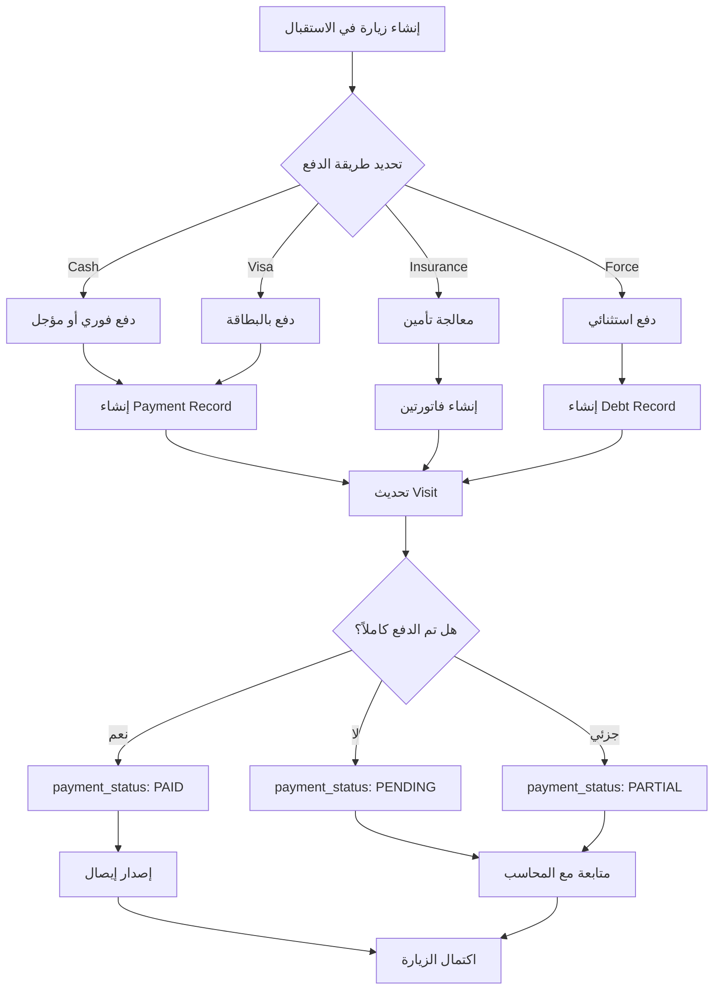

# 🏥 متطلبات وشروط النظام الطبي المتكامل
## Medical System Requirements & Business Rules

**تاريخ التحديث:** 12 أكتوبر 2025  
**النسخة:** 2.0  
**الحالة:** نشط - جاهز للتطبيق

---

## 📑 جدول المحتويات

1. [نظرة عامة](#نظرة-عامة)
2. [مركزية الاستقبال](#مركزية-الاستقبال)
3. [نظام الدفع](#نظام-الدفع)
4. [سيناريوهات المركز الطبي](#سيناريوهات-المركز-الطبي)
5. [الأدوار والصلاحيات](#الأدوار-والصلاحيات)
6. [قواعد العمل](#قواعد-العمل)
7. [التدقيق والمراجعة](#التدقيق-والمراجعة)

---

## 🎯 نظرة عامة

### الهدف الرئيسي
بناء نظام طبي متكامل يدير جميع عمليات المركز الطبي بكفاءة عالية مع التركيز على:
- **مركزية الاستقبال**: نقطة دخول موحدة للمرضى
- **شفافية الدفع**: نظام دفع واضح وشفاف
- **المحاسبة الدقيقة**: تتبع كل عملية مالية
- **الأمان**: حماية بيانات المرضى والعمليات المالية

### الفلسفة الأساسية
```
الاستقبال → بوابة واحدة لدخول المرضى
الدفع → واضح ومُحدد مسبقاً
المحاسب → مراقب ومُراجع وليس منفذ
الطبيب → يُعالج ولا يتعامل مع المال
```

---

## 🏢 مركزية الاستقبال

### القاعدة الذهبية
> **كل مريض يجب أن يمر عبر الاستقبال أولاً، بلا استثناءات (إلا الطوارئ)**

### مسؤوليات الاستقبال

#### 1️⃣ **إدارة المرضى**
- ✅ تسجيل المرضى الجدد
- ✅ تحديث بيانات المرضى الحاليين
- ✅ التحقق من الهوية الوطنية
- ✅ إدارة الملفات الطبية

#### 2️⃣ **إنشاء الزيارات**
- ✅ إنشاء زيارة جديدة لكل مريض
- ✅ تحديد نوع الزيارة:
  - `REGULAR`: زيارة عادية
  - `FOLLOW_UP`: متابعة
  - `CONSULTATION`: استشارة
  - `EMERGENCY`: طوارئ
- ✅ تحديد القسم المناسب
- ✅ تعيين الطبيب (إن أمكن)
- ✅ **تحديد طريقة الدفع مسبقاً**

#### 3️⃣ **إدارة طرق الدفع**
عند إنشاء الزيارة، يجب تحديد إحدى الطرق التالية:

##### أ) **دفع نقدي (Cash)**
```yaml
payment_method: "cash"
الإجراء:
  - يتم الدفع فوراً في الاستقبال أو
  - يتم الدفع لاحقاً عند المحاسب
  - يُصدر الإيصال مباشرة
المتطلبات:
  - لا يوجد
الحد الأدنى للصلاحية: reception
```

##### ب) **دفع ببطاقة (Visa/Card)**
```yaml
payment_method: "visa" أو "card"
الإجراء:
  - يتم تمرير البطاقة في الاستقبال أو المحاسب
  - حفظ آخر 4 أرقام من البطاقة
  - حفظ اسم حامل البطاقة
  - إصدار إيصال إلكتروني
المتطلبات:
  - جهاز POS متوفر
  - بطاقة ائتمان صالحة
الحد الأدنى للصلاحية: reception أو accountant
```

##### ج) **تأمين صحي (Insurance)**
```yaml
payment_method: "insurance"
الإجراء:
  1. تحديد مزود التأمين (insurance_provider)
  2. التحقق من صلاحية التأمين
  3. حساب نسبة التغطية
  4. حساب حصة المريض
  5. إصدار فاتورة للتأمين وأخرى للمريض
المتطلبات:
  - بطاقة تأمين صالحة
  - رقم البوليصة (insurance_policy_number)
  - التحقق من التغطية
الحد الأدنى للصلاحية: reception + manager (للموافقة)
```

##### د) **دفع قسري / استثنائي (Force Payment)**
```yaml
payment_method: "force"
is_force_payment: true
الإجراء:
  1. يتم السماح بدخول المريض بدون دفع
  2. تسجيل السبب (force_payment_reason)
  3. تتطلب موافقة المدير (force_payment_approved_by)
  4. يتم تتبع الدين لاحقاً
الحالات المسموحة:
  - حالات طوارئ حرجة
  - مرضى معروفين (ديون سابقة مسددة)
  - حالات إنسانية خاصة
  - موظفين وعائلاتهم
المتطلبات:
  - موافقة مدير أو super_admin
  - توثيق السبب
  - تحديد موعد سداد
الحد الأدنى للصلاحية: manager أو super_admin
```

#### 4️⃣ **إدارة الطوابير**
- ✅ إضافة المرضى للطوابير
- ✅ ترتيب حسب الأولوية (الطوارئ أولاً)
- ✅ إخطار الأقسام بالمرضى الجدد
- ✅ تتبع حالة كل مريض

#### 5️⃣ **المواعيد**
- ✅ حجز مواعيد مستقبلية
- ✅ تأكيد المواعيد
- ✅ إلغاء وتأجيل المواعيد
- ✅ إرسال تذكيرات

### ⚠️ **استثناءات مركزية الاستقبال**

الحالة الوحيدة المستثناة: **الطوارئ الحرجة**

```yaml
الشرط:
  - is_emergency: true
  - حالة حرجة تتطلب تدخل فوري
الإجراء:
  1. دخول مباشر لقسم الطوارئ
  2. يقوم قسم الطوارئ بإنشاء زيارة مؤقتة
  3. payment_method: "force" تلقائياً
  4. يتم استكمال البيانات لاحقاً من الاستقبال
  5. يتم ربط الزيارة بالمريض الصحيح
التوثيق:
  - يجب توثيق سبب تجاوز الاستقبال
  - يجب موافقة طبيب الطوارئ
```

---

## 💰 نظام الدفع

### القواعد الأساسية

#### القاعدة #1: الشفافية
> **كل عملية مالية يجب أن تُسجل وتُوثق بالكامل**

#### القاعدة #2: عدم التلاعب
> **لا يمكن تعديل أو حذف سجلات الدفع، فقط الإلغاء والتعويض**

#### القاعدة #3: الفصل بين المهام
> **من ينشئ الزيارة ليس بالضرورة من يستلم الدفع**

### دورة حياة الدفع



### نماذج البيانات المالية

#### 1. **Visit** (الزيارة)
```python
class Visit:
    # معلومات الدفع
    payment_status: str  # PENDING | PAID | PARTIAL | DEBT
    payment_method: str  # cash | visa | insurance | force
    total_amount: Decimal  # المبلغ الإجمالي
    paid_amount: Decimal  # المبلغ المدفوع
    remaining_amount: Decimal  # المتبقي (محسوب)
    
    # معلومات التأمين
    insurance_provider: str  # مزود التأمين
    insurance_policy_number: str  # رقم البوليصة
    insurance_coverage_percentage: float  # نسبة التغطية
    patient_share: Decimal  # حصة المريض
    
    # معلومات الدفع القسري
    is_force_payment: bool
    force_payment_reason: str
    force_payment_approved_by: int  # user_id
    force_payment_approved_at: datetime
    
    # معلومات البطاقة
    card_last_digits: str  # آخر 4 أرقام
    card_holder_name: str
    
    # الإيصال
    receipt_number: str
    receipt_printed: bool
    receipt_printed_at: datetime
    receipt_printed_by: int  # user_id
```

#### 2. **Payment** (الدفع)
```python
class Payment:
    visit_id: int  # ربط بالزيارة
    invoice_id: int  # ربط بالفاتورة (optional)
    
    method: str  # CASH | CARD | WIRE
    amount: Decimal  # المبلغ المدفوع
    currency: str  # العملة (ILS افتراضي)
    
    reference: str  # رقم مرجعي (للبطاقة أو التحويل)
    notes: str  # ملاحظات
    
    received_by: int  # من استلم الدفع (user_id)
    created_at: datetime  # وقت الدفع
    
    # لا يمكن التعديل أو الحذف!
```

#### 3. **Invoice** (الفاتورة)
```python
class Invoice:
    visit_id: int
    invoice_number: str  # رقم فريد
    
    total_amount: Decimal
    discount_amount: Decimal
    tax_amount: Decimal
    net_amount: Decimal
    
    payment_status: str  # PENDING | PAID | PARTIAL | CANCELLED
    
    # تفاصيل الخدمات
    services: list[InvoiceService]
    
    created_by: int
    created_at: datetime
```

#### 4. **Receipt** (السند/الإيصال)
```python
class Receipt:
    receipt_number: str  # رقم فريد
    visit_id: int
    patient_id: int
    
    total_amount: Decimal
    paid_amount: Decimal
    remaining_amount: Decimal
    
    payment_method: str
    payment_status: str
    
    # للتأمين
    insurance_type: str
    insurance_coverage: float
    insurance_amount: Decimal
    patient_share: Decimal
    
    # للديون
    is_debt: bool
    debt_reason: str
    debt_approved_by: int
    
    # للطباعة
    is_printed: bool
    printed_at: datetime
    printed_by: int
    
    # QR Code للتحقق
    qr_code: str
```

### سيناريوهات الدفع التفصيلية

#### سيناريو 1: دفع نقدي كامل
```
1. الاستقبال ينشئ زيارة
   - payment_method = "cash"
   - total_amount = 150 ILS (مثال)
   
2. المريض يدفع نقداً في الاستقبال
   - إنشاء Payment record
   - amount = 150
   - received_by = reception_user_id
   
3. تحديث الزيارة
   - paid_amount = 150
   - payment_status = "PAID"
   
4. إصدار إيصال
   - receipt_number = "RCP-20251012-001"
   - طباعة الإيصال
   
5. المريض يذهب للقسم
```

#### سيناريو 2: دفع بالبطاقة
```
1. الاستقبال ينشئ زيارة
   - payment_method = "visa"
   - total_amount = 200 ILS
   
2. تمرير البطاقة في POS
   - card_last_digits = "1234"
   - card_holder_name = "أحمد محمد"
   
3. إنشاء Payment record
   - method = "CARD"
   - amount = 200
   - reference = "TRX-20251012-123456" (من POS)
   
4. تحديث الزيارة وإصدار إيصال
   
5. المريض يذهب للقسم
```

#### سيناريو 3: تأمين صحي
```
1. الاستقبال ينشئ زيارة
   - payment_method = "insurance"
   - insurance_provider = "شركة التأمين الوطنية"
   - insurance_policy_number = "INS-12345"
   
2. التحقق من التأمين
   - استعلام عن صلاحية البوليصة
   - التأكد من التغطية
   - insurance_coverage_percentage = 80%
   
3. حساب التكاليف
   - total_amount = 300 ILS
   - insurance_amount = 240 ILS (80%)
   - patient_share = 60 ILS (20%)
   
4. المريض يدفع حصته (60 ILS)
   - إنشاء Payment للحصة
   - payment_status = "PARTIAL"
   
5. إصدار فاتورتين:
   - فاتورة للتأمين (240 ILS)
   - إيصال للمريض (60 ILS)
   
6. المريض يذهب للقسم
   
7. لاحقاً: المحاسب يتابع مع التأمين
   - عند استلام دفعة التأمين
   - payment_status = "PAID"
```

#### سيناريو 4: دفع قسري (حالة طوارئ)
```
1. مريض يصل في حالة حرجة
   - is_emergency = true
   - لا يوجد وقت للدفع
   
2. الاستقبال أو الطوارئ ينشئ زيارة
   - payment_method = "force"
   - is_force_payment = true
   - force_payment_reason = "حالة طوارئ حرجة - نزيف حاد"
   
3. طلب موافقة المدير (يمكن بعد العلاج)
   - force_payment_approved_by = manager_id
   - force_payment_approved_at = timestamp
   
4. المريض يدخل للعلاج فوراً
   - payment_status = "DEBT"
   - paid_amount = 0
   
5. بعد استقرار الحالة:
   - المحاسب يتواصل مع المريض/العائلة
   - ترتيب خطة سداد
   - متابعة الدين
   
6. عند السداد:
   - إنشاء Payment records
   - تحديث payment_status
   - إصدار إيصالات
```

#### سيناريو 5: دفع جزئي ومتابعة
```
1. الاستقبال ينشئ زيارة
   - total_amount = 500 ILS
   
2. المريض يدفع جزء فقط
   - paid_amount = 200 ILS
   - remaining_amount = 300 ILS
   - payment_status = "PARTIAL"
   
3. يتم تسجيل الدفع الأول
   - Payment #1: 200 ILS
   
4. المريض يستلم إيصال جزئي
   
5. المحاسب يتابع المتبقي
   - إرسال تذكير
   - ترتيب أقساط
   
6. عند دفعة ثانية:
   - Payment #2: 300 ILS
   - payment_status = "PAID"
   - إصدار إيصال نهائي
```

---

## 🎭 سيناريوهات المركز الطبي

### السيناريو الكامل: مريض جديد

```
📍 المرحلة 1: الوصول والتسجيل
-------------------------------------
المريض يصل → الاستقبال

الاستقبال يقوم بـ:
1. تسجيل بيانات المريض
   - الهوية الوطنية
   - الاسم الكامل (عربي + إنجليزي)
   - رقم الهاتف
   - العنوان
   - تاريخ الميلاد
   - الجنس
   
2. فتح ملف طبي جديد
   - رقم ملف فريد
   - ربط بالهوية الوطنية

📍 المرحلة 2: إنشاء الزيارة
-------------------------------------
الاستقبال يسأل:
- ما هو سبب الزيارة؟
- هل لديك تأمين صحي؟
- أي قسم تريد زيارته؟

ثم يقوم بـ:
1. إنشاء زيارة جديدة
   - visit_type: REGULAR
   - department_id: حسب التخصص
   - symptoms: الأعراض المبدئية
   
2. تحديد طريقة الدفع
   - إذا نقدي: الدفع الآن أو لاحقاً
   - إذا بطاقة: تمرير البطاقة
   - إذا تأمين: التحقق والموافقة
   - إذا حالة خاصة: طلب موافقة مدير

3. معالجة الدفع (إن وُجد)
   
4. إصدار رقم انتظار
   - ticket_number: "T-001"
   - القسم: العيادة الداخلية
   
5. إضافة للطابور
   - Queue position: 3
   - Estimated time: 30 دقيقة

📍 المرحلة 3: الانتظار
-------------------------------------
- المريض يجلس في صالة الانتظار
- شاشة العرض تُظهر الأرقام
- نظام الإخطار يُنبه عند الدور

📍 المرحلة 4: الكشف الطبي
-------------------------------------
الطبيب يستقبل المريض:

1. يفتح الملف الطبي
   - يرى بيانات المريض
   - يرى الأعراض المسجلة
   
2. يقوم بالفحص
   
3. يُسجل:
   - التشخيص (diagnosis)
   - خطة العلاج (treatment_plan)
   - الوصفة الطبية (prescription)
   
4. يطلب فحوصات (إن لزم):
   - تحاليل مختبر
   - أشعة
   - استشارة أخصائي
   
5. يُحدث حالة الزيارة
   - status: IN_PROGRESS → COMPLETED

📍 المرحلة 5: الفحوصات (إن وُجدت)
-------------------------------------
أ) المختبر:
- المريض يذهب للمختبر
- فني المختبر يستقبل الطلب
- يُجري التحاليل
- يُدخل النتائج في النظام
- الطبيب يستلم النتائج

ب) الأشعة:
- نفس العملية

📍 المرحلة 6: الخروج والمحاسبة
-------------------------------------
المريض يعود للمحاسب:

المحاسب يقوم بـ:
1. مراجعة الزيارة
   - التأكد من اكتمال الخدمات
   - مراجعة الفحوصات
   
2. حساب التكلفة النهائية
   - كشف طبي: 100 ILS
   - تحليل دم: 80 ILS
   - أشعة: 120 ILS
   - أدوية: 50 ILS
   - المجموع: 350 ILS
   
3. التعامل مع الدفع:
   أ) إذا كان دفع مسبق كافي:
      - تحديث: payment_status = "PAID"
      - إصدار فاتورة وإيصال نهائي
      
   ب) إذا كان دفع جزئي:
      - حساب المتبقي
      - استلام باقي المبلغ
      - إصدار إيصال نهائي
      
   ج) إذا كان تأمين:
      - إصدار فاتورة للتأمين
      - استلام حصة المريض
      - متابعة مع التأمين لاحقاً
   
4. طباعة المستندات:
   - الفاتورة التفصيلية
   - إيصال الدفع
   - تقرير طبي (إن طُلب)
   - الوصفة الطبية
   
5. إغلاق الزيارة
   - status: COMPLETED → ARCHIVED
   - archived_at: timestamp
   - archived_by: accountant_id

📍 المرحلة 7: المغادرة
-------------------------------------
- المريض يستلم كل المستندات
- الصيدلية (إن وُجدت): تصرف الأدوية
- المريض يغادر
```

### سيناريوهات خاصة

#### 🚨 حالة طوارئ
```
سيارة إسعاف → طوارئ مباشرة (تجاوز الاستقبال)
↓
طبيب الطوارئ يُنشئ زيارة طارئة:
- is_emergency: true
- payment_method: "force"
- status: "EMERGENCY"
↓
إسعافات أولية فورية
↓
استقرار الحالة
↓
الاستقبال يستكمل البيانات لاحقاً
↓
المحاسب يتابع الدفع
```

#### 👨‍⚕️ موظف يزور
```
موظف في المركز → الاستقبال
↓
الاستقبال يتعرف عليه:
- employee_visit: true
- payment_method: "force"
- force_payment_reason: "موظف - خصم 100%"
- force_payment_approved_by: manager_id
↓
العلاج مجاني (أو خصم)
↓
تسجيل الزيارة لأغراض إحصائية فقط
```

#### 🔄 زيارة متابعة
```
مريض سبق علاجه → الاستقبال
↓
الاستقبال يبحث عن الملف القديم
↓
إنشاء زيارة جديدة:
- visit_type: "FOLLOW_UP"
- related_to_visit_id: الزيارة السابقة
- discount: 50% (سياسة المركز)
↓
نفس السير السابق
```

---

## 👥 الأدوار والصلاحيات

### مصفوفة الصلاحيات

| الصلاحية | reception | doctor | nurse | lab | radiology | accountant | manager | super_admin |
|---------|:---------:|:------:|:-----:|:---:|:---------:|:----------:|:-------:|:-----------:|
| **المرضى** |
| إضافة مريض | ✅ | ❌ | ❌ | ❌ | ❌ | ❌ | ✅ | ✅ |
| تعديل مريض | ✅ | ❌ | ❌ | ❌ | ❌ | ❌ | ✅ | ✅ |
| حذف مريض | ❌ | ❌ | ❌ | ❌ | ❌ | ❌ | ✅ | ✅ |
| عرض مرضى | ✅ | ✅ | ✅ | ✅ | ✅ | ✅ | ✅ | ✅ |
| **الزيارات** |
| إنشاء زيارة | ✅ | ❌ | ❌ | ❌ | ❌ | ❌ | ✅ | ✅ |
| تعديل زيارة | ✅ | ✅ | ❌ | ❌ | ❌ | ✅ | ✅ | ✅ |
| إغلاق زيارة | ❌ | ✅ | ❌ | ❌ | ❌ | ✅ | ✅ | ✅ |
| حذف زيارة | ❌ | ❌ | ❌ | ❌ | ❌ | ❌ | ✅ | ✅ |
| **الدفع** |
| استلام دفع نقدي | ✅ | ❌ | ❌ | ❌ | ❌ | ✅ | ✅ | ✅ |
| استلام دفع بطاقة | ✅ | ❌ | ❌ | ❌ | ❌ | ✅ | ✅ | ✅ |
| معالجة تأمين | ✅* | ❌ | ❌ | ❌ | ❌ | ✅ | ✅ | ✅ |
| دفع قسري | ❌ | ❌ | ❌ | ❌ | ❌ | ❌ | ✅ | ✅ |
| إلغاء دفع | ❌ | ❌ | ❌ | ❌ | ❌ | ✅ | ✅ | ✅ |
| **المحاسبة** |
| إصدار فاتورة | ❌ | ❌ | ❌ | ❌ | ❌ | ✅ | ✅ | ✅ |
| إصدار إيصال | ✅** | ❌ | ❌ | ❌ | ❌ | ✅ | ✅ | ✅ |
| تقارير مالية | ❌ | ❌ | ❌ | ❌ | ❌ | ✅ | ✅ | ✅ |
| إغلاق يومي | ❌ | ❌ | ❌ | ❌ | ❌ | ✅ | ✅ | ✅ |

\* الاستقبال يمكنه البدء بالعملية فقط، المحاسب يُكملها  
\** الاستقبال يُصدر إيصالات مبدئية فقط

### تفصيل الأدوار

#### 1. **super_admin** (مدير النظام الأعلى)
```yaml
الصلاحيات:
  - كل شيء بلا استثناء
  - إدارة المستخدمين
  - إدارة الصلاحيات
  - الوصول لكل البيانات
  - تعديل الإعدادات
  - النسخ الاحتياطي
  
المسؤوليات:
  - إعداد النظام
  - إدارة الأمان
  - حل المشاكل التقنية
  - مراقبة الأداء
```

#### 2. **manager** (مدير المركز)
```yaml
الصلاحيات:
  - معظم الصلاحيات الإدارية
  - الموافقة على الدفع القسري
  - التقارير الإدارية
  - إدارة الموظفين (محدودة)
  
المسؤوليات:
  - الإشراف اليومي
  - متابعة الجودة
  - اتخاذ القرارات
  - حل النزاعات
```

#### 3. **reception** (الاستقبال)
```yaml
الصلاحيات:
  - إضافة/تعديل مرضى
  - إنشاء زيارات
  - استلام دفع نقدي/بطاقة
  - إدارة المواعيد
  - إدارة الطوابير
  
المسؤوليات:
  - نقطة الاتصال الأولى
  - تنظيم تدفق المرضى
  - ضمان دفع أولي
  - التواصل الجيد
  
القيود:
  - ❌ لا يمكن حذف بيانات
  - ❌ لا يمكن عمل دفع قسري
  - ❌ لا يصدر فواتير نهائية
  - ❌ لا يصل للتقارير المالية
```

#### 4. **doctor** (الطبيب)
```yaml
الصلاحيات:
  - عرض بيانات المرضى
  - تحديث الزيارة (طبياً فقط)
  - إضافة تشخيص وعلاج
  - طلب فحوصات
  - إصدار وصفات
  
المسؤوليات:
  - الفحص الطبي
  - التشخيص
  - العلاج
  - المتابعة
  
القيود:
  - ❌ لا يتعامل مع المال أبداً
  - ❌ لا يُنشئ زيارات
  - ❌ لا يُعدل بيانات المرضى الأساسية
```

#### 5. **nurse** (التمريض)
```yaml
الصلاحيات:
  - عرض بيانات المرضى
  - تسجيل العلامات الحيوية
  - تنفيذ الأدوية
  - متابعة التعليمات
  
المسؤوليات:
  - تنفيذ خطة العلاج
  - مراقبة المرضى
  - تسجيل الملاحظات
```

#### 6. **lab** (فني مختبر)
```yaml
الصلاحيات:
  - استقبال طلبات التحاليل
  - إجراء الفحوصات
  - إدخال النتائج
  - طباعة التقارير
  
المسؤوليات:
  - دقة التحاليل
  - سرعة الإنجاز
  - توثيق النتائج
```

#### 7. **radiology** (فني أشعة)
```yaml
الصلاحيات:
  - استقبال طلبات الأشعة
  - إجراء الفحوصات
  - رفع الصور
  - إضافة التقارير
  
المسؤوليات:
  - جودة الصور
  - سلامة المريض
  - توثيق النتائج
```

#### 8. **accountant** (المحاسب)
```yaml
الصلاحيات:
  - استلام كل أنواع الدفع
  - إصدار فواتير
  - إصدار إيصالات نهائية
  - إلغاء/تعديل دفعات (بشروط)
  - التقارير المالية
  - الإغلاق اليومي
  - متابعة الديون
  
المسؤوليات:
  - دقة المحاسبة
  - مطابقة الأرصدة
  - متابعة المستحقات
  - التوثيق المالي
  
القيود:
  - ❌ لا يُنشئ زيارات
  - ❌ لا يُعدل بيانات طبية
  - ❌ لا يحذف سجلات دفع
```

---

## 📜 قواعد العمل (Business Rules)

### قواعد الدفع

#### BR-PAY-001: الدفع قبل الخدمة
```
القاعدة:
  يجب دفع مبلغ مبدئي قبل تلقي الخدمة
  
الاستثناءات:
  - الطوارئ الحرجة
  - الدفع القسري المعتمد
  - التأمين الصحي المؤكد
  
العقوبة:
  - لا يمكن أرشفة الزيارة إذا لم يكتمل الدفع
```

#### BR-PAY-002: عدم التلاعب بالدفعات
```
القاعدة:
  لا يمكن تعديل أو حذف سجلات Payment
  
البديل:
  - إلغاء الدفع (يُنشئ سجل سلبي)
  - تعويض (يُنشئ سجل جديد)
  
المراقبة:
  - كل عملية إلغاء تُسجل في AuditTrail
  - تتطلب موافقة manager
```

#### BR-PAY-003: مطابقة المبالغ
```
القاعدة:
  paid_amount <= total_amount
  
التحقق:
  - عند كل دفع
  - قبل إصدار الإيصال
  - في الإغلاق اليومي
```

#### BR-PAY-004: الدفع القسري نادر
```
القاعدة:
  نسبة الدفع القسري يجب ألا تتجاوز 5% من الزيارات
  
المراقبة:
  - تقرير شهري
  - تنبيه تلقائي عند تجاوز 5%
  - مراجعة الحالات
```

### قواعد الزيارات

#### BR-VIS-001: زيارة واحدة نشطة
```
القاعدة:
  المريض لا يمكن أن يكون له أكثر من زيارة نشطة (status != ARCHIVED)
  
الاستثناء:
  - زيارات لأقسام مختلفة (تخصصات متعددة)
  
التحقق:
  - قبل إنشاء زيارة جديدة
```

#### BR-VIS-002: تسلسل الحالات
```
القاعدة:
  الحالات يجب أن تتبع التسلسل:
  PENDING → IN_PROGRESS → COMPLETED → ARCHIVED
  
الاستثناء:
  - CANCELLED (من أي حالة)
  - EMERGENCY (لها تسلسل خاص)
```

#### BR-VIS-003: الأرشفة النهائية
```
القاعدة:
  لا يمكن أرشفة الزيارة إلا إذا:
  1. status = COMPLETED
  2. payment_status = PAID أو DEBT (مع موافقة)
  3. كل الفحوصات مكتملة
  
المسؤول:
  - accountant أو manager
```

### قواعد التأمين

#### BR-INS-001: التحقق من صلاحية التأمين
```
القاعدة:
  يجب التحقق من صلاحية بوليصة التأمين قبل الموافقة
  
الإجراء:
  1. التحقق من رقم البوليصة
  2. التأكد من التغطية
  3. التحقق من الحدود
  4. الحصول على رقم موافقة
  
التوثيق:
  - approval_number
  - coverage_details
  - limitations
```

#### BR-INS-002: حصة المريض فورية
```
القاعدة:
  حصة المريض (patient_share) يجب دفعها فوراً
  
لا استثناءات:
  - حتى مع التأمين، المريض يدفع حصته
```

#### BR-INS-003: متابعة التأمين
```
القاعدة:
  يجب متابعة دفعات التأمين خلال 30 يوم
  
الإجراء:
  - إرسال الفاتورة للتأمين
  - متابعة كل 7 أيام
  - تصعيد بعد 30 يوم
```

### قواعد الأمان

#### BR-SEC-001: تسجيل كل شيء
```
القاعدة:
  كل عملية حساسة يجب تسجيلها في AuditTrail
  
العمليات الحساسة:
  - إنشاء/تعديل/حذف مريض
  - إنشاء/تعديل زيارة
  - استلام دفع
  - إصدار فاتورة/إيصال
  - الدفع القسري
  - الإلغاء/التعويض
  
البيانات المسجلة:
  - من قام بالعملية (user_id)
  - متى (timestamp)
  - ماذا (action)
  - القيم القديمة (old_values)
  - القيم الجديدة (new_values)
  - من أين (ip_address)
```

#### BR-SEC-002: حماية البيانات المالية
```
القاعدة:
  البيانات المالية لا تُحذف أبداً
  
البديل:
  - soft delete (is_deleted flag)
  - archiving (نقل لجداول أرشيف)
  
الاحتفاظ:
  - 7 سنوات على الأقل (قانون)
```

#### BR-SEC-003: فصل الصلاحيات
```
القاعدة:
  من ينشئ الزيارة لا يجب أن يكون هو من يوافق على الدفع القسري
  
التنفيذ:
  - created_by != force_payment_approved_by
  - التحقق في الكود
```

---

## 🔍 التدقيق والمراجعة

### نقاط التدقيق

#### 1. التدقيق اليومي
```yaml
المسؤول: accountant
الوقت: نهاية كل يوم عمل
الإجراءات:
  1. مطابقة الدفعات النقدية مع الإيصالات
  2. التأكد من معاملات البطاقات
  3. مراجعة الدفعات القسرية
  4. التحقق من الديون الجديدة
  5. إصدار تقرير إغلاق يومي
  
التقرير يشمل:
  - إجمالي الدفعات
  - توزيع طرق الدفع
  - الزيارات غير المكتملة
  - الديون الجديدة
  - الحالات الاستثنائية
```

#### 2. المراجعة الأسبوعية
```yaml
المسؤول: manager
الوقت: نهاية كل أسبوع
الإجراءات:
  1. مراجعة الأداء المالي
  2. تحليل نسبة الدفع القسري
  3. متابعة حالات التأمين
  4. مراجعة الديون المتأخرة
  5. تقييم كفاءة الموظفين
```

#### 3. التدقيق الشهري
```yaml
المسؤول: manager + accountant
الوقت: أول أسبوع من كل شهر
الإجراءات:
  1. مطابقة الأرصدة
  2. مراجعة كل الديون
  3. متابعة دفعات التأمين
  4. تحليل الاتجاهات
  5. إصدار تقرير مالي شامل
  6. تحديث السياسات (إن لزم)
```

### مؤشرات الأداء (KPIs)

#### KPI-001: نسبة التحصيل
```
الصيغة:
  collection_rate = (total_collected / total_billed) * 100

الهدف: >= 95%
تنبيه: < 90%
حرج: < 85%
```

#### KPI-002: نسبة الدفع القسري
```
الصيغة:
  force_payment_rate = (force_visits / total_visits) * 100

الهدف: <= 3%
تنبيه: > 5%
حرج: > 10%
```

#### KPI-003: متوسط وقت الدفع
```
الصيغة:
  avg_payment_time = average(payment_time - visit_creation_time)

الهدف: <= 2 ساعة
تنبيه: > 4 ساعات
حرج: > 8 ساعات
```

#### KPI-004: نسبة الديون المسددة
```
الصيغة:
  debt_recovery_rate = (paid_debts / total_debts) * 100

الهدف: >= 80% خلال 30 يوم
تنبيه: < 70%
حرج: < 50%
```

### التنبيهات التلقائية

#### ALERT-001: دفع قسري متكرر
```yaml
الشرط:
  نفس المريض > 3 دفعات قسرية في شهر واحد

الإجراء:
  - تنبيه للـ manager
  - مراجعة الحالة
  - قرار: موافقة/رفض المزيد
```

#### ALERT-002: دين متأخر
```yaml
الشرط:
  debt_created_at > 30 يوم ولم يُسدد

الإجراء:
  - تنبيه يومي للـ accountant
  - محاولة التواصل مع المريض
  - تصعيد للـ manager بعد 60 يوم
```

#### ALERT-003: تأمين متأخر
```yaml
الشرط:
  insurance_claim_submitted_at > 30 يوم ولم يُدفع

الإجراء:
  - تنبيه للـ accountant
  - متابعة مع التأمين
  - تصعيد بعد 45 يوم
```

---

## ✅ قائمة المراجعة (Checklist)

### عند تشغيل النظام

```markdown
## إعداد النظام
- [ ] تثبيت جميع المتطلبات (requirements.txt)
- [ ] إعداد قاعدة البيانات
- [ ] تشغيل migrations
- [ ] إنشاء مستخدم super_admin
- [ ] إنشاء الأقسام الأساسية
- [ ] إعداد أسعار الخدمات
- [ ] تفعيل نظام الدفع
- [ ] اختبار النظام

## إعداد المستخدمين
- [ ] إنشاء حسابات الموظفين
- [ ] تعيين الأدوار الصحيحة
- [ ] التدريب على النظام
- [ ] اختبار الصلاحيات

## إعداد المالية
- [ ] إعداد طرق الدفع
- [ ] ربط جهاز POS (للبطاقات)
- [ ] إعداد شركات التأمين
- [ ] تحديد الأسعار
- [ ] تحديد سياسات الخصم

## التشغيل اليومي
- [ ] فتح النظام
- [ ] التأكد من اتصال الإنترنت
- [ ] التأكد من عمل الطابعات
- [ ] التأكد من جهاز POS
- [ ] مراجعة الديون المتأخرة
- [ ] في نهاية اليوم: الإغلاق اليومي
```

### عند استقبال مريض

```markdown
## التسجيل
- [ ] التحقق من الهوية
- [ ] البحث عن الملف القديم
- [ ] إن لم يوجد: إنشاء ملف جديد
- [ ] تحديث البيانات (إن لزم)

## إنشاء الزيارة
- [ ] تحديد سبب الزيارة
- [ ] اختيار القسم المناسب
- [ ] تعيين الطبيب (إن أمكن)
- [ ] **تحديد طريقة الدفع**

## معالجة الدفع
- [ ] إن نقدي: استلام المال وإصدار إيصال
- [ ] إن بطاقة: تمرير البطاقة وتأكيد الدفع
- [ ] إن تأمين: التحقق من البوليصة وحساب الحصص
- [ ] إن قسري: طلب موافقة المدير وتوثيق السبب

## إضافة للطابور
- [ ] إنشاء رقم انتظار
- [ ] إضافة للطابور
- [ ] إخطار المريض بالوقت المتوقع
- [ ] توجيهه لصالة الانتظار
```

### عند الإغلاق اليومي

```markdown
## المراجعة
- [ ] عد النقد الفعلي
- [ ] مطابقة مع سجلات النظام
- [ ] مراجعة معاملات البطاقات
- [ ] التأكد من طباعة كل الإيصالات
- [ ] مراجعة الديون الجديدة

## التقرير
- [ ] إصدار تقرير الإغلاق اليومي
- [ ] مراجعة الحالات الاستثنائية
- [ ] توثيق أي مشاكل
- [ ] إرسال التقرير للمدير

## التأمين
- [ ] وضع النقد في الخزنة
- [ ] حفظ نسخة من التقرير
- [ ] إغلاق جميع الجلسات
- [ ] إيقاف النظام بشكل صحيح
```

---

## 📞 جهات الاتصال

```yaml
الدعم التقني:
  - الهاتف: +970-XXX-XXXX
  - البريد: support@medical-system.ps
  - ساعات العمل: 8:00 - 16:00 (الأحد - الخميس)

مشاكل الدفع:
  - المحاسب الرئيسي: accountant@medical-center.ps
  - المدير المالي: finance@medical-center.ps

الطوارئ:
  - المدير المناوب: manager@medical-center.ps
  - الطوارئ: emergency@medical-center.ps
```

---

## 📝 ملاحظات مهمة

### ⚠️ تحذيرات

1. **لا تشارك معلومات تسجيل الدخول** مع أي شخص
2. **لا تترك النظام مفتوحاً** عند الابتعاد عن الجهاز
3. **لا تحاول تعديل أو حذف** سجلات الدفع مباشرة من قاعدة البيانات
4. **لا تقبل دفع نقدي كبير** بدون إخطار المحاسب
5. **لا تمنح دفع قسري** بدون موافقة رسمية

### ✅ أفضل الممارسات

1. **دائماً تحقق من الهوية** قبل إنشاء زيارة
2. **اطلب رقم الهاتف محدثاً** في كل مرة
3. **اسأل عن التأمين** حتى لو لم يذكره المريض
4. **وثق كل شيء** - إذا حدث شيء غير عادي، اكتبه
5. **كن لطيفاً ومهنياً** - الاستقبال هو وجه المركز

---

**نهاية الوثيقة**

تاريخ آخر تحديث: 12 أكتوبر 2025  
المراجعة التالية: 12 يناير 2026  
الإصدار: 2.0  
الحالة: ✅ معتمد ونشط

