# خطة تطوير القوالب والواجهة الأمامية — AZAD Medical System

**اسم الخطة:** Frontend & Templates Development Plan  
**الإصدار:** v2.8  
**التاريخ:** 2026-06-23 (مرحلة 1 ✅ + مرحلة 2 ✅ — 2026-06-23)  
**النطاق السابق:** v2.7 — تحقق post UX1-005/006  
**منهجية:** اعتماد v2.8 → **§17** (موجات 0→14، بلا تناقض) → Gates — **§39–§40**

> **مبدأ الطباعة (v2.5+):** **شعار التينانت رئيسي** في الترويسة. **شعار ازاد + اسم الشركة + ©** ثانوي في **زاوية أسفل كل مطبوعة**. داخل النظام: **footer AZAD دائماً**.

> **هذه الخطة ليست إعادة بناء النظام.** النظام Full-Stack SaaS جاهز. المطلوب: توحيد الواجهة وتفعيل ما هو **موجود أصلاً** — بدون اختراع طبقات جديدة.

### فهرس سريع

| § | الموضوع | متى تقرأه |
|---|---------|-----------|
| **0** | أهداف + قواعد SaaS + منع هاردكود | أولاً |
| **1–2** | الوضع الحالي + المشاكل (أدلة من الكود) | قبل التنفيذ |
| **3** | **Clinical Clean** — tokens، خطوط، مكونات | مرجع التصميم |
| **4** | عدم كسر النظام | أثناء كل commit |
| **5, 10** | ⚠️ تاريخي — الترتيب في **§17** فقط | للتفاصيل الموضوعية |
| **13–14** | branding tenant + owner shell | مراحل 5–6 |
| **17** | **خارطة التنفيذ الوحيدة** (موجات 0→14 + Gates) | **المرجع التنفيذي** |
| **16** | سجل النواقص G-01…G-159 | مع §17.4، **§16.0** |
| **39–40** | تحقق الكود + **دليل المراحل التفصيلي** | قبل كل commit |

> **ترتيب أرقام الأقسام:** §12 و§16 و§17 و§33 في آخر الملف عمداً (سجل نواقص + تنفيذ). §5 و§10 **تاريخيان** — لا تُتبع أسابيعهما.

---

## 0. الهدف التنفيذي

تحويل النظام من **331 قالب HTML** عبر **15 وحدة** في `MODULE_REGISTRY` إلى **تجربة موحّدة واحدة**:
- واضحة للموظف الطبي تحت ضغط العمل اليومي
- بسيطة للمريض في البوابة
- قابلة للتخصيص **بدون كود (No-Code)** من لوحة إدارة كل Tenant (مدير المركز)
- لوحة **مالك المنصة (Owner)** مستقلة وشاملة لكل الوظائف الإدارية والمالية والتخصيصية على مستوى SaaS
- **لا تكسر** أي route أو form action أو CSRF أو صلاحية دور
- **تخصيص ثلاثي:** منصة (Owner) → مؤسسة (Tenant) → **فرد (كل مستخدم)** — §18
- **وضع ليلي + ثيمات + خطوط** — مدمج end-to-end — §20
- **طباعة موحّدة** (فواتير، إيصالات، تذاكر، تقارير، **روشتات**) — §21 + **§34**
- **ترويسات ديناميكية لكل tenant** من لوحة المدير — §34.3
- **نموذج أسطوري موحّد لكل نوع مستند** — §34.4–34.5
- **طباعة ثنائية الطبقة** — tenant أعلى + ختم AZAD زاوية في **كل** مطبوعة — §34.10
- **حيوية هادئة** مع احترام `prefers-reduced-motion` — §22
- **موبايل + PWA قابل للتثبيت** — §25
- **قوائم منسدلة وبحث ذكي موحّد** — §26
- **تحقق بيانات فوري عند الإدخال** — §27
- **لمس احترافي** (tablet/kiosk/touch PC) — §28
- **لوحة قيادة Command Center** تعكس دور كل مستخدم — §29
- **قوالب ديناميكية حسب الصلاحية** — sidebar + محتوى — §30
- **Navbar مميز Clinical** — §31
- **احتواء المحتوى — لا تكديس** — §32
- **دفع بطاقة (استقبال + صيدلية)** — ربط `PosTerminalService` الموجود — §35
- **رسائل وتنبيهات صديقة** — **كل الشاشات، كل الأدوار** — §35.5 + **§36**
- **واجهة الطبيب احترافية وذكية** — §36.4
- **لوحة مالك المنصة AZAD** — كاملة، منظمة، روابط سليمة — §37
- **اكتمال التنقل في كل الوحدات** — صفر روابط مكسورة/ناقصة — §37.6

### 0.4 معايير جودة المظهر (إلزامية في كل مرحلة)

| المعيار | القيمة / القاعدة | التحقق |
|---------|------------------|--------|
| **تباين النص** | WCAG AA ≥ 4.5:1 (نص عادي) | Lighthouse / axe على 3 صفحات عينة |
| **أهداف اللمس** | ≥ 44×44px (يفضّل 48px في touch mode) | §28 |
| **كثافة الواجهة** | `comfortable` افتراضي؛ `compact` من تفضيلات المستخدم فقط | §19 |
| **RTL** | محاذاة، أيقونات اتجاهية، `inset-inline-*` لا `left/right` خام | مراجعة يدوية |
| **لا hex في القوالب** | `var(--color-*)` فقط خارج `core.css` | `rg '#[0-9a-f]{3,6}' templates/` يتناقص |
| **لا inline `<style>`** | بعد مرحلة 3: partials = 0 | Gate 4 |
| **حالات UI موحّدة** | loading skeleton، empty state، error banner — نفس المكونات | §3.7 |
| **طباعة** | تينانت ترويسة؛ AZAD زاوية؛ IBM Plex | Gate 9 §34.10 |
| **أداء CSS** | ≤ 4 ملفات blocking في staff shell؛ خطان عربيان فقط | §3.3 |
| **حركة** | `prefers-reduced-motion` يوقف GSAP | §22 |

### 0.1 قواعد SaaS الحمراء — لا تُخالف (من الكود الفعلي)

هذه ليست اقتراحات — هذه حدود النظام كما بُني:

| # | القاعدة | المصدر في الكود |
|---|---------|-----------------|
| R1 | **عزل Tenant إلزامي** في SaaS — كل query تشغيلي يمر عبر `tenant_filter` | `app/shared/tenant_filter.py` |
| R2 | مسارات `/owner/*` و`/super-admin/*` و`/auth/*` **لا تأخذ** بادئة `/t/<slug>/` | `tenant_url_for()` في `app_factory.py` |
| R3 | كل blueprint تشغيلي محمي بـ **module guard** حسب `enabled_modules` | `_guard_factory()` + `MODULE_REGISTRY` |
| R4 | وضع standalone (`ENABLE_SAAS_MODE=false`) يجب أن يبقى يعمل | `middleware.py`, guards |
| R5 | **الاستقبال محور التحويل** — لا أزرار تحويل مباشرة بين الأقسام في الواجهة | `docs/NEAR_TERM_PLAN.md` |
| R6 | جداول في `_skip_table` **مقصودة** — لا تُزال من القائمة دون تحليل | `tenant_filter.py` سطر 34–44 |
| R7 | وحدة `owner` في MODULE_REGISTRY = مسارات **`/owner` + `/super-admin`** معاً | `app/core/module/registry.py` |
| R8 | دور المستخدم `owner` ≠ دور `super_admin` — لكن كلاهما قد يصل لبعض المسارات عبر decorators | `owner_required`, `super_admin_required` |

**ما يعنيه ذلك للخطة:**
- لا ننشئ نظام branding ثالث — نربط الواجهة بما هو موجود.
- لا ندمج `/owner` مع `/super-admin` في shell واحد — هما مستويان مختلفان.
- لا نغيّر `tenant_filter` إلا بهجرة واختبار SaaS كامل.
- التخصيص البصري = **قراءة/كتابة حقول موجودة**، ليس جدولاً جديداً.

### 0.3 سياسة منع الهاردكود (إلزامية)

| الطبقة | المصدر الوحيد | ممنوع |
|--------|---------------|-------|
| **حالات workflow** | `app/shared/enums.py` | قواميس `VISIT_STATUS = {...}` في قوالب أو `ui_filters.py` |
| **تسميات عربية** | `label_ar` على Enum أو `ENUM_LABELS_AR` في `enums.py` | `{{ visit.status }}` خام أو labels داخل macros |
| **ألوان UI** | `SystemTheme` → `Tenant` / `BrandingSettings` → حقن CSS vars | `#0f4c81` في 20 ملف؛ `theme-color` ثابت في كل قالب |
| **ثيم المنصة** | `SystemConfig` (`owner_platform_branding`, `ui_*`) | defaults مكررة في `inject_branding()` |
| **تفضيلات UI للعميل** | `Tenant.settings` JSON (`ui.*`) | أعمدة DB جديدة لكل خيار |
| **تفضيلات UI للفرد** | `User.preferences` JSON (هجرة واحدة) | localStorage فقط بدون sync |
| **تفعيل ميزات** | `TenantFeatureFlag` + `enabled_modules` | `if role == 'doctor'` فقط بدون module guard |
| **قوائم التنقل** | `MODULE_REGISTRY` (icon, name_ar, default_route) | 300 سطر روابط يدوية مكررة |
| **حزم المنتج** | `ProductBundle` (DB) | `_PRODUCT_PROFILE_SEED` في runtime UI |
| **إعدادات الوحدة** | `TenantModuleSetting.settings_json` | قيم افتراضية مكررة في القوالب |
| **تحقق الحقول** | `app/shared/validators.py` (مشترك) | قواعد مكررة في JS وPython |
| **بحث/قوائم** | `static/js/components/smart-select.js` | select2 CDN لكل صفحة |

**اتجاه حديث (Full-Stack SaaS — عملي):**
- **Backend:** طبقة رفيعة `resolve_branding_context()` تجمع النماذج؛ `context_processor` يحقن النتيجة فقط.
- **Frontend:** CSS **design tokens** (`var(--color-primary)`)؛ Jinja macros تستدعي `enum_label`؛ JS يقرأ `window.__ENUMS__` من نفس `enums.py`.
- **لا microservices ولا framework جديد** — Flask + Jinja + tokens كما هو الترند في SaaS B2B (Linear, Stripe Dashboard نمط config-driven UI).

### 0.2 مصفوفة الأدوار والمسارات (الصحيحة)

| دور المستخدم | النطاق | المسارات | الوحدة (module) |
|--------------|--------|----------|-----------------|
| **`owner`** | منصة SaaS (كل العملاء) | `/owner/*` | يفعّل module `owner` على مستوى tenant |
| **`super_admin`** | إدارة **tenant واحد** | `/super-admin/*` | نفس module `owner` (اسم الوحدة، ليس دور المنصة) |
| **`manager`** | تشغيل وإدارة مركز | `/manager/*` | module `reporting` |
| **`reception`, `doctor`, …** | عمل يومي | `/reception/*`, … | modules سريرية |

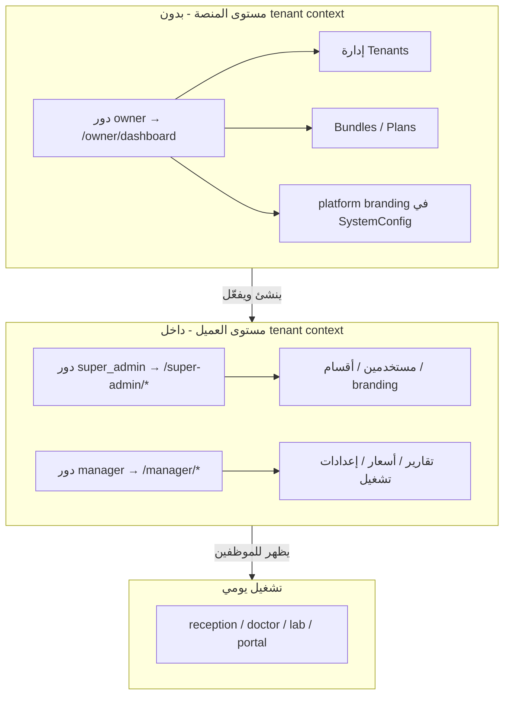

### مخرجات نجاح الخطة
| المؤشر | الحالة الحالية | الهدف |
|--------|----------------|-------|
| قوالب أساس (layout shells) | 4 نشطة (`base`, `dashboard_base`, `portal/base`, standalone) | 1 موظف + 1 مريض + 1 مالك |
| `extends base.html` | **264** صفحة (يشمل 16 owner خطأً) | ~248 موظف + owner منفصل |
| `extends dashboard_base` | **20** صفحة | **0** بعد مرحلة 3 |
| `extends portal/base` | **13** صفحة | 13 على shell Clinical (post UX1-006) |
| Partials ماكروهات | **7** ماكروهات، **0** استيراد partial؛ `macros/forms.html` **مفقود** لكن 4 قوالب تستورده | تفعيل G-14 + G-159 |
| sidebar على الموبايل | `base.html` ✅؛ `dashboard_base` ❌ | كل الـ shells |
| تنقل ديناميكي | `_sidebar.html` 54 سطر + حلقة `module_registry` | NavResolver كامل — §30 |
| `inject_branding()` | يحقن `branding` + `developer_*` فقط — **لا `ui.*`** | `branding_context.py` — مرحلة 2 |
| `branding_context.py` / `enum_labels.py` | **غير موجودين** | إنشاء في مرحلة 2 |
| `clinical.css` | موجود `static/css/` — **غير مربوط** | `design-tokens.css` مربوط في `base.html` فقط |
| owner في sidebar | رابط `/owner/dashboard` لدور `owner` فقط | `owner/base` + `_owner_sidebar` |
| BS4 legacy modals | `queue_management.html`: **5 BS4 + 1 BS5** | كل BS5 |
| **تفضيلات UI per-user** | ❌ لا حقل في `User` | `User.preferences` JSON + صفحة مظهر في الملف الشخصي |
| **وضع ليلي/نهاري** | CSS+localStorage نصف مكتمل | زر في navbar + تطبيق على كل shells |
| **ثيمات SystemTheme** | DB موجود؛ `selectTheme()` stub | حفظ فعلي + تطبيق tokens |
| **خطوط عربية** | 5 خطوط محمّلة؛ print=Arial | Cairo+Tajawal فقط؛ IBM Plex Arabic للطباعة |
| **طباعة موحّدة** | 5+ قوالب منفصلة بدون base | `print_base` + **نموذج لكل نوع** — §34 |
| **تقارير ديناميكية** | `ReportTemplate` في DB غير مستخدم | ربط report_builder + print — §34.6 |
| **ترويسات tenant** | `report_header_html` فقط جزئياً | استوديو طباعة — **tenant فقط** §34.10 |
| **هوية منصة في الطباعة** | `developer_*` مكرر في prescription | ختم زاوية + © — **كل المطبوعات** §34.10 |
| **footer النظام** | جزئي | **AZAD دائماً** في `_footer.html` — §34.10.5 |
| **روشتة طبيب** | inline CSS ألوان عشوائية | Rx موحّد طبي مذهل — §34.5 |
| **تذاكر طابور** | workflow فقط | `print/queue_ticket.html` |
| **حيوية UI** | GSAP جزئي | نظام motion + `prefers-reduced-motion` |
| **موبايل responsive** | layout.css جزئي؛ sidebar JS مكسور | mobile-first + bottom nav |
| **تطبيق موبايل (PWA)** | manifest + 2 SW متضاربان | PWA موحّد + تثبيت + offline |
| **بحث ذكي** | create_visit فقط | مكوّن موحّد كل النماذج |
| **قوائم منسدلة** | select2 في صفحة واحدة (CDN) | Tom Select موحّد + API |
| **تحقق إدخال** | security.js جزئي | طبقة موحّدة client+server |
| **لمس / tablet / kiosk** | waiting_display منفصل | وضع touch + targets 48px — §28 |
| **لوحة حسب الدور** | dashboard_new عام | Command Center — §29 |
| **تنقل ديناميكي** | sidebar يدوي ~358 سطر | NavResolver حسب صلاحية — §30 |
| **Navbar** | luxury inline CSS، ذهبي | Clinical App Bar — §31 |
| **دفع بطاقة استقبال** | UI موجود؛ route/صلاحية غير متطابقة | ربط `PosTerminalService` — §35.3 |
| **دفع صيدلية POS** | `pos_sell` نقد ضمني فقط | نقد/بطاقة عند توسيع backend صغير — §35.4 |
| **رسائل الأخطاء** | `alert()`، `str(e)`، enums خام — في كل الوحدات | طبقة عرض عربية عالمية — §36 |
| **شاشات الطبيب** | `patient_details` 688 سطر؛ `alert` في JS | سياق مريض + تبويبات ذكية — §36.4 |
| DataTables | `datatables-init.js` بدون `data-dt="1"` | قرار استراتيجي للجداول |

---

## 1. الوضع الحالي — ما يوجد فعلاً في المشروع

### 1.1 البنية التقنية للفرونت إند

| الطبقة | التقنية | المسار |
|--------|---------|--------|
| محرك القوالب | Flask + Jinja2 RTL | `templates/` |
| إطار CSS | Bootstrap 5.3.2 RTL (CDN) | `templates/base.html` |
| Design System | 4 ملفات + **design-tokens** | `core.css`, `layout.css`, `components.css`, `design-tokens.css` (مربوط في base) |
| طبقة clinical | `clinical.css` موجود — **غير مربوط** | `static/css/clinical.css` — G-10 |
| أيقونات | Font Awesome 6.5 | CDN في `base.html`؛ **غير محمّل** في `portal/base.html` |
| JS عالمي | `base.js` (sidebar), `app.js`, `events.js`, `security.js` | `static/js/` |
| JS dashboard | `pages/dashboard_base.js` | **يخفي `#pageLoader` فقط** — لا sidebar toggle |
| Build | **لا يوجد** | — |
| AdminLTE vendor | ~1700 ملف | مستخدم جزئياً: SweetAlert2، BS4 bundle في portal |

### 1.2 القوالب الأساسية (Layout Shells)

```
templates/  (331 ملف .html)
├── base.html              ← 264 extends (موظف + super_admin + manager + owner×16 + booking + landing)
├── dashboard_base.html    ← 20 extends (قائمة §17.2.3)
├── portal/base.html       ← 13 extends + shell standalone
├── auth/login.html        ← standalone
├── print/*.html           ← 5 standalone (بدون print_base)
├── main/landing.html      ← G-19 ✅
├── partials/              ← 12 ملف (7 ماكروهات — 0 مستورد)
└── errors/*.html          ← standalone
```

**الوضع الفعلي (v2.8):** `base.html` يحمّل BS5 RTL + `design-tokens.css` + `clinical-theme` على `<body>`. `_footer.html` ما زال luxury inline (91 سطر CSS). `dashboard_base.html` يضمّن `_sidebar.html` داخل `<nav id="sidebar">` → **قائمة مزدوجة**؛ زر hamburger **بلا `id`** (سطر 78)؛ JS = `dashboard_base.js` فقط لإخفاء loader.

### 1.3 Partials المشتركة

| الملف | الوظيفة | الحالة v2.8 (من الكود) |
|-------|---------|------------------------|
| `partials/_navbar.html` | App bar | **جزئي** — `#mobileSidebarToggle` (سطر 3)； ساعة inline script (41–53)； لا `<style>` |
| `partials/_sidebar.html` | قائمة | **54 سطر** — حلقة `module_registry` (19–29)； أقسام super_admin/owner يدوية (31–50)； `#appSidebar`, `#closeSidebarBtn` |
| `partials/_footer.html` | تذييل | **جزئي** — AZAD (G-153)； `<style>` 91 سطر luxury |
| `partials/_flash.html` | رسائل | ✅ `base.html` + `portal/base.html` |
| `_attachment_panel.html` | ماكرو مرفقات | **غير مستورد** |
| `_audit_timeline.html` | ماكرو تدقيق | **غير مستورد** |
| `_billing_status_badge.html` | شارة فوترة | **غير مستورد** |
| `_order_status_badge.html` | شارات طلبات | **غير مستورد** |
| `_patient_context_panel.html` | سياق مريض | **غير مستورد** |
| `_workflow_next_actions.html` | إجراءات | **غير مستورد** |
| `_module_empty_state.html` | فراغ وحدة | **غير مستورد** |
| `macros/forms.html` | ماكرو نماذج | **❌ مفقود** — يُستورد في 4 قوالب (G-159) |

### 1.4 إحصاء القوالب حسب القالب الأب

| `extends` | العدد (v2.8 مُحقَّق) | أمثلة |
|---------|----------------------|-------|
| `base.html` | **264** | doctor, reception, super_admin, manager, **owner×17**, booking, landing |
| `dashboard_base.html` | **20** | pharmacy×8, `*_new`×5, billing, inbox, specialty_forms×8 |
| `portal/base.html` | **13** | dashboard, settings, documents, link_account, … |
| standalone | **33** | login, print×5, errors, kiosk, shells×3, partials×12, `_field_builder` |
| **المجموع** | **331** | — |

### 1.5 رحلات المستخدم من أول صفحة لآخر صفحة

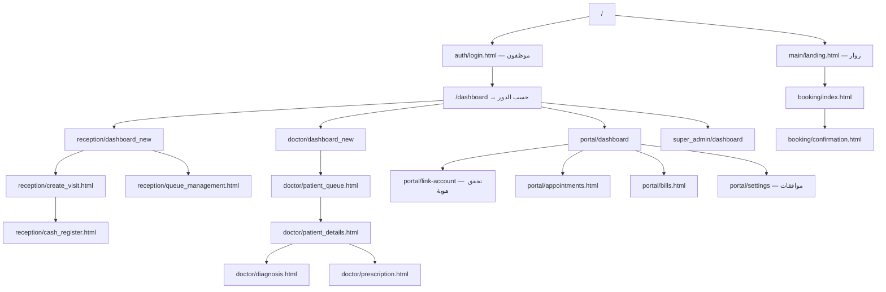

**نقطة الدخول (v2.8):** `routes/main.py` — `GET /` (سطر 11–18): زوار → `main/landing.html`؛ مريض → `portal.dashboard`؛ موظف → `main.dashboard`. **14 route** في `routes/patient_portal.py`؛ **8 route** في `routes/specialty_forms.py`.

#### 1.5.1 قائمة الـ 20 قالباً على `dashboard_base` (مرجع مرحلة 3)

`billing/dashboard_new`, `doctor/dashboard_new`, `emergency/dashboard_new`, `inbox/dashboard`, `reception/dashboard_new`, `pharmacy/{dashboard_new,pos,purchases,suppliers,sales_history,sale_receipt,add_purchase,add_supplier}`, `specialty_forms/{list,new,edit,view,fill,submission,submissions}`.

#### 1.5.2 قائمة الـ 16 قالب owner (كلها `extends "base.html"` — خطأ معماري)

`announcements`, `audit_logs`, `branding`, `bundles`, `create_tenant`, `dashboard`, `notifications`, `packages`, `plans`, `provision`, `resource_usage`, `subscriptions`, `support_tickets`, `tenant_detail`, `tenant_usage`, `webhooks`.

### 1.6 هيكل SaaS الفعلي (من الكود — ليس افتراضاً)

#### ثلاث طبقات عرض — لا تُخلط

| الطبقة | من يدخل | أين | ماذا يفعل |
|--------|---------|-----|-----------|
| **منصة** | `owner` (دور) | `/owner/*` | tenants، bundles، MRR، webhooks، platform branding |
| **إدارة العميل** | `super_admin` | `/super-admin/*` | users، roles، departments، **tenant branding** |
| **إدارة تشغيل** | `manager` | `/manager/*` | KPI، pricing، settlements، settings (SMS/lab) |
| **عمل يومي** | staff roles | `/reception/*`, … | سريري ومالي |

> **تصحيح عن v1.2:** module اسمه `owner` في `MODULE_REGISTRY` يغطي `/owner` **و** `/super-admin` — هذا اسم وحدة SaaS، ليس “دور مالك المنصة” فقط. لا نعيد تسمية الوحدة في خطة الواجهة.

#### ما ينقص في الواجهة (فقط — الباكند موجود)

| الطبقة | موجود backend | ينقص UI |
|--------|---------------|---------|
| منصة `/owner` | 16 route + APIs | **16 قالب** كلها `base.html` |
| tenant `/super-admin` | branding route + model | UI جزئية؛ `logo_url`≠`logo_path` |
| manager | settings JSON | ~12 route بلا رابط sidebar |
| تشغيل | 331 قالب | توحيد shell + CSS |

### 1.7 تخصيص المظهر — مصدر الحقيقة في SaaS (لا نخترع جديداً)

النظام فيه **ثلاثة مخازن** — الخطة تربطها ولا تضيف رابعاً:

| المخزن | متى يُستخدم | الحقول | ملاحظة |
|--------|-------------|--------|--------|
| **`Tenant`** | SaaS — لكل عميل | `logo_url`, `primary_color`, `name`, `settings` JSON | **المصدر الأساسي للمظهر per-tenant** — موجود على `tenants` |
| **`BrandingSettings`** | تفاصيل موسعة | logo_path، colors، report HTML | في `_skip_table` — يُقرأ بـ `tenant_id` صريح عند الحاجة، لا نغيّر filter دون هجرة |
| **`SystemConfig`** `owner_platform_branding` | بدون tenant (منصة) | platform_name، colors | لصفحة الدخول العامة وmarketing |

**تدفق العرض الصحيح (مقترح — لا يكسر SaaS):**

```python
# inject_branding() — منطق مقترح
tenant = g.current_tenant
if tenant:
    # أولوية: حقول Tenant ثم BrandingSettings لنفس tenant_id
    branding = merge(tenant.logo_url, tenant.primary_color, tenant.name,
                     BrandingSettings.query.filter_by(tenant_id=tenant.id).first())
else:
    # وضع منصة أو standalone
    branding = SystemConfig owner_platform_branding OR defaults
```

**واجهة No-Code للعميل — أين تُبنى (بدون مسار جديد إن أمكن):**

| الخيار | المسار الحالي | القرار |
|--------|---------------|--------|
| أ | `super_admin/branding.html` + `routes/super_admin/branding.py` | **توسيع وإصلاح** — هو المكان الصحيح لـ tenant admin |
| ب | `manager/settings.html` | تبويب “مظهر” يوجّه لنفس الـ route أو يعكس صلاحية manager |
| ج | `manager/appearance.html` route جديد | **فقط إذا** أردنا فصل الصلاحيات — ليس ضرورياً للـ MVP |

**أخطاء UI موجودة يجب إصلاحها قبل “استوديو” جديد:**

| الخطأ | الملف |
|-------|-------|
| `logo_url` في القالب vs `logo_path` في النموذج | `super_admin/branding.html` |
| رفع شعار بدون handler | `routes/super_admin/branding.py` |
| `selectTheme()` stub | `branding.js` |
| ألوان لا تُحقن في CSS | `base.html`, `inject_branding()` |

#### خلط التنقل — مشكلة UI فقط

`partials/_sidebar.html`: دور `owner` (منصة) يُعرض كـ `super_admin` — **نصلح التنقل فقط**:

- `role == 'owner'` → `_owner_sidebar.html` → روابط `/owner/*`
- `role == 'super_admin'` → قسم tenant admin → روابط `/super-admin/*`
- **لا نغيّر** decorators ولا module guards

### 1.8 خريطة النماذج → الواجهة (من فحص الكود)

كل عمود في الجدول **موجود** — المطلوب ربطه بالقوالب لا إعادة اختراعه.

| النموذج | الملف | حقول/وظيفة UI | حالة الربط |
|---------|-------|---------------|------------|
| **Tenant** | `app/core/tenant/models.py` | `logo_url`, `primary_color` (افتراضي `#0d6efd`), `name`/`name_ar`, `settings` JSON | ⚠️ غير محقون في القوالب |
| **BrandingSettings** | `models/branding.py` | ألوان، شعارات، ترويسة تقارير، `tenant_id` | ⚠️ `get_active_settings()` بدون tenant |
| **SystemTheme** | `models/branding.py` | palette كامل + `is_default` | ⚠️ UI اختيار ثيم stub |
| **SystemConfig** | `models/system_config.py` | `config_key` + typed `get_value()` | ⚠️ `owner_platform_branding` غير محقون |
| **ProductBundle** | `Tenant` models | modules، limits، تسعير | ✅ runtime من DB |
| **TenantFeatureFlag** | `Tenant` models | تفعيل ميزة per-tenant | ⚠️ نادر في القوالب |
| **TenantModuleSetting** | `Tenant` models | `settings_json` per module | ⚠️ manager يستخدم `Tenant.settings` فقط |
| **Enums** | `app/shared/enums.py` | كل الحالات + `get_all_enums_json()` | ❌ غير مستخدم في القوالب |

#### تضارب ألوان افتراضية (يجب حله — G-55)

| المصدر | القيمة الافتراضية |
|--------|-------------------|
| `Tenant.primary_color` | `#0d6efd` |
| `BrandingSettings.primary_color` | `#2563eb` |
| `SystemTheme` (Medical Blue) | `#2563eb` |
| `clinical.css` / الخطة | `#0f4c81` |
| `portal/base.html` | `#0d6efd` hardcoded |

**الحل:** سلسلة أولوية واحدة + fallback **واحد** في `core.css :root` فقط:

```
SystemTheme(is_default) → Tenant.primary_color → BrandingSettings → SystemConfig platform → :root fallback
```

#### `Tenant.settings` — مخزن UI بدون هجرات

```json
{
  "ui": { "theme_id": 1, "density": "normal", "radius": "md", "portal_welcome": "…" },
  "general": { "language": "ar", "currency": "ILS" }
}
```

#### Enums — لا `ui_filters.py` منفصل

`enums.py` = المصدر الوحيد. التنفيذ:
1. `label_ar` / `badge_variant` على Enums السريرية (نمط `PermissionLevel.label_ar`)
2. `enum_label()` في `app/shared/enum_labels.py`
3. Jinja: `{{ visit.status | enum_label('VisitState') }}`
4. اختياري: `window.__ENUMS__` من `get_all_enums_json()` للـ JS

**ملغى من الخطة:** `ui_filters.py` بقواميس مكررة (كان §5.1.3).

---

## 2. المشاكل المكتشفة (مع أدلة من الكود)

### 2.1 تشتت الهوية البصرية

| المنطقة | الملف | المظهر الحالي (v2.8) |
|---------|-------|----------------------|
| موظف (أساسي) | `base.html` + `_navbar.html` | **انتقالي** — `clinical-theme` + `design-tokens.css`؛ footer luxury |
| موظف (dashboard) | `dashboard_base.html` | slate inline CSS (سطور 10–43)； sidebar مزدوج مع `_sidebar.html` |
| مريض | `portal/base.html` | BS4 bundle AdminLTE + `#0d6efd` hardcoded (سطر 12)； Segoe UI |
| دخول | `auth/login.html` | split-screen طبي — الأفضل حالياً |
| مالك منصة | `owner/*.html` → `base.html` | **خطأ** — يظهر sidebar موظفين |

### 2.2 CSS مكرر ومتعارض

- `_navbar.html` يعرّف `--luxury-gold` داخل `<style>`
- `_sidebar.html` يستخدم `var(--luxury-gold)` لكن لا يعرّفه
- `core.css` يعرّف `--gulf-gold: #D4AF37`
- `layout.css` يعرّف `.luxury-sidebar` بخلفية slate
- النتيجة: نفس الكلاس يبدو مختلفاً حسب ترتيب التحميل

### 2.3 خلل الموبايل في الـ Sidebar

| Shell | الحالة | التفاصيل |
|-------|--------|----------|
| `base.html` | **✅ يعمل** | `base.js` 55–71: `#mobileSidebarToggle`, `#sidebarOverlay`, `#appSidebar.show`, `body.sidebar-open` |
| `dashboard_base.html` | **❌ معطّل** | زر hamburger بلا `id` (سطر 78)； `#sidebar` ≠ `#appSidebar`؛ `dashboard_base.js` لا toggle |

| ملاحظة | التفاصيل |
|--------|----------|
| `#sidebarToggle` في `base.js` 37–48 | **كود ميت** — الـ ID غير موجود في أي قالب |
| CSS desktop collapse | `.collapsed` على `#appSidebar` — يعمل على desktop فقط |

### 2.4 قيم إنجليزية تظهر للمستخدم

```jinja
{# reception/dashboard_new.html سطر 54 #}
<span class="badge ...">{{ v.status }}</span>
{# يعرض COMPLETED أو IN_PROGRESS #}

{# portal/dashboard.html سطر 51 #}
<span class="badge bg-primary">{{ a.status }}</span>

{# partials/_sidebar.html سطر 108 #}
<span class="user-role-badge">{{ current_user.role }}</span>
{# يعرض doctor أو reception #}
```

### 2.5 بوابة المريض — أخطاء تقنية

| البند | الحالة v2.8 |
|-------|-------------|
| footer مكسور | **✅ G-01** — `portal/base.html` 58–70 سليم |
| Font Awesome في الفوتر | **❌** — `<i class="fas">` بدون FA في `<head>` |
| Bootstrap | **❌** — `adminlte/plugins/bootstrap` (BS4) سطر 55؛ القوالب الفرعية تفترض BS5 أحياناً |
| branding tenant | **❌** — `--primary:#0d6efd` hardcoded سطر 12 |
| routes UX1-006 | **✅** — link-account, documents, settings, 14 route إجمالاً |

### 2.6 branding لا يؤثر على الواجهة

- `inject_branding()` (`app_factory.py` 405–449): يحقن `branding`, `developer_*` — **cached 60s**
- defaults hardcoded: `"شركة آزاد..."`, `"+ --------"` (سطور 428–435)
- `base.html` 38–43: inline `` لـ `--primary-color` — **منفصل** عن inject
- **`branding_context.py` غير موجود** — G-08
- `super_admin/branding.html` يحفظ `primary_color` لكن لا يمر عبر `ui.*` موحّد

### 2.6b BS4/BS5 مختلط في الاستقبال (G-06)

`reception/queue_management.html` على `base.html` (BS5):
- **5 modals BS4:** `data-dismiss="modal"`, `class="close"` — `callPatientModal`, `skipPatientModal`, `cancelTicketModal`, `approveEmergencyDebtModal`, `approveForceEntryModal` (سطور 183–323)
- **1 modal BS5:** `transferVisitModal` — `btn-close data-bs-dismiss` (325–352)

### 2.7 نماذج طويلة بلا stepper

`reception/create_visit.html`:
- ~530 سطر في صفحة واحدة
- يذكر "خطوات سريعة" في alert نصي فقط (سطر 74-77)
- لا واجهة stepper فعلية

### 2.8 صفحات طبيب مزدحمة

`doctor/patient_details.html`:
- 4+ أزرار في header بدون collapse على الموبايل
- بيانات المريض مكررة يدوياً بدل ماكرو `_patient_context_panel`
- badges قديمة `badge-primary` (Bootstrap 4) مختلطة مع BS5

### 2.9 تخصيص المظهر للـ Tenants — فجوة No-Code

| الفجوة | التفصيل |
|--------|---------|
| لا واجهة لـ manager | مدير المركز لا يستطيع تغيير الشعار/الألوان من لوحته |
| branding تحت super_admin فقط | `routes/super_admin/branding.py` — دور تقني وليس إداري للمركز |
| لا معاينة حية | `super_admin/branding.html` لها preview ثابت لكن **لا تنعكس فوراً** على النظام |
| لا اختيار ثيم جاهز لـ tenant | `SystemTheme` موجود في DB لكن اختيار الثيم في الواجهة غير موصول بالحفظ |
| عزل tenant ضعيف في inject | `get_active_settings()` يجلب أول سجل نشط — خطر في SaaS متعدد العملاء |
| بوابة المريض لا ترث branding | `portal/base.html` ألوان hardcoded `#0d6efd` |
| landing و login لا ترث tenant | صفحات standalone لا تقرأ `branding` بشكل كامل |

### 2.10 لوحة مالك المنصة — فجوات القدرات والواجهة

**ما يوجد اليوم** (`app/modules/owner/routes.py` — 12 قالب):

| الوظيفة | Route | القالب | الحالة |
|---------|-------|--------|--------|
| لوحة KPI | `/owner/dashboard` | `owner/dashboard.html` | ✅ MRR, ARR, churn, charts |
| إنشاء عميل | `/owner/tenants/create` | `owner/create_tenant.html` | ✅ |
| تفاصيل عميل | `/owner/tenants/<id>` | `owner/tenant_detail.html` | ✅ modules, limits |
| تجديد/إيقاف/تفعيل | API routes | — | ✅ |
| خطط الاشتراك | `/owner/plans` | `owner/plans.html` | ✅ |
| إعلانات المنصة | `/owner/announcements` | `owner/announcements.html` | ✅ |
| تذاكر الدعم | `/owner/support-tickets` | `owner/support_tickets.html` | ✅ |
| سجل التدقيق | `/owner/audit-logs` | `owner/audit_logs.html` | ✅ |
| استخدام الموارد | `/owner/resource-usage` | `owner/resource_usage.html` | ✅ |
| إشعارات المنصة | `/owner/notifications` | `owner/notifications.html` | ✅ |
| علامة المنصة | `/owner/branding` | `owner/branding.html` | ⚠️ بسيط (4 حقول لون) |
| Webhooks | `/owner/webhooks` | `owner/webhooks.html` | ✅ |
| حزم المنتجات | `/owner/bundles` | `owner/bundles.html` | ✅ |

**ما ينقص في لوحة Owner (مطلوب بالخطة):**

| الفئة | النقص | الأولوية |
|-------|-------|----------|
| **تنقل** | sidebar خاص بـ owner بدل مشاركة super_admin | P0 |
| **مالية** | فواتير منصة، تحصيل، تقارير إيرادات تفصيلية، تصدير | P1 |
| **تخصيص** | إدارة قوالب الثيمات الافتراضية للعملاء الجدد (`SystemTheme`) | P1 |
| **تخصيص** | فرض/حد ألوان مسموحة لكل خطة اشتراك | P2 |
| **عملاء** | معاينة مظهر كل tenant من لوحة المالك | P1 |
| **عملاء** | نسخ إعدادات branding من tenant لآخر | P2 |
| **أمان** | لوحة API Keys مرئية (الـ route موجود `/api-keys` بلا قالب كامل) | P1 |
| **تشغيل** | health dashboard موحّد (tenants + DB + jobs) | P2 |
| **واجهة** | توحيد مع Clinical Clean — حالياً header gradient داكن منفصل | P1 |

---

## 3. الاتجاه البصري المعتمد — Clinical Clean

### 3.1 المبادئ
1. **الوضوح قبل الزخرفة** — لا ذهبي فاخر، لا تدرجات داكنة ثقيلة
2. **مساحات تنفس** — padding واضح، كثافة متوسطة
3. **لون دلالي للحالة** — أخضر=مكتمل، أزرق=نشط، برتقالي=معلق
4. **خط واحد للنص** — Cairo؛ Tajawal للعناوين فقط
5. **لمسة ثقافية خفيفة** — شريط فلسطيني رفيع، ليس عنصراً مهيمناً
6. **احترام reduced-motion** — إيقاف GSAP عند طلب المستخدم

### 3.2 لوحة الألوان — tokens وليس hex في القوالب

**ملف واحد للـ fallback الثابت:** `static/css/core.css` → `:root`

```css
:root {
  /* fallback فقط — يُستبدل بحقن <style id="tenant-branding-vars"> */
  --color-primary: #0f4c81;
  --color-primary-light: #e8f2fa;
  --color-accent: #00a6a6;
  --color-success: #21a67a;
  --color-warning: #d97706;
  --color-danger: #dc2626;
  --color-bg: #f4f7fb;
  --color-surface: #ffffff;
  --color-border: #e2e8f0;
  --color-text: #0f172a;
  --color-muted: #64748b;
  --color-sidebar-bg: #f8fafc;
}
```

**كل ملف CSS آخر** (`components.css`, `clinical.css`, `layout.css`) يستخدم `var(--color-*)` فقط — **صفر** `#0f4c81` خارج `core.css`.

**الحقن الديناميكي** من `resolve_branding_context()` — ليس قيم inline في كل قالب:

```html
<style id="tenant-branding-vars">
:root {
  --color-primary: {{ ui.primary_color }};
  --color-accent: {{ ui.accent_color }};
  --brand-logo-url: url('{{ ui.logo_url }}');
}
</style>
```

`ui.*` يأتي من دمج `SystemTheme` + `Tenant` + `BrandingSettings` — لا `or '#0f4c81'` في Jinja.

### 3.3 الخطوط (شاشة + طباعة)

| الاستخدام | الخط | الأوزان |
|-----------|------|---------|
| شاشة — نص | Cairo | 400, 600 |
| شاشة — عناوين | Tajawal | 600, 700 |
| طباعة/PDF | IBM Plex Sans Arabic | 400, 600 |
| أرقام/باركود | system-ui / monospace | — |

**تقليل التحميل:** إزالة Amiri, Changa, Scheherazade من `core.css` — 3 خطوط + اختيار من الملف الشخصي (§19).

### 3.4 المكونات الموحّدة (يجب إنشاؤها)

| المكون | الملف المقترح | الاستخدام |
|--------|---------------|-----------|
| Page header | `partials/_page_header.html` | كل صفحة داخلية |
| Status badge | `partials/_status_badge.html` | يستدعي `enum_label` — **لا** dict داخل الماكرو |
| Patient context bar | `partials/_patient_context_bar.html` | طبيب، طوارئ، تمريض |
| Form stepper | `partials/_form_stepper.html` | create_visit, booking |
| Empty state | `partials/_empty_state.html` | جداول فارغة |
| Quick actions | `partials/_quick_actions.html` | dashboards |
| Table toolbar | `partials/_table_toolbar.html` | بحث + تصفية |
| Smart search | `partials/_smart_search.html` | مرضى، أدوية، ICD — §26 |
| Smart select | `data-smart-select` + Tom Select | قوائم منسدلة — §26 |
| Form field | `partials/_form_field.html` | label + تحقق — §27 |
| Clinical action tile | `partials/_clinical_action_tile.html` | لمس — §28 |
| Mobile bottom nav | `partials/_mobile_bottom_nav.html` | موبايل staff — §25 |
| Dashboard widget | `dashboards/widgets/_*.html` | Command Center — §29 |
| Dashboard hero | `dashboards/_hero.html` | ترحيب + سياق — §29 |

### 3.5 الوضع الليلي — tokens (مرحلة 11، التعريف مبكراً)

```css
[data-theme="dark"] {
  --color-bg: #0f172a;
  --color-surface: #1e293b;
  --color-border: #334155;
  --color-text: #f1f5f9;
  --color-muted: #94a3b8;
  --color-sidebar-bg: #1e293b;
  --color-primary-light: color-mix(in srgb, var(--color-primary) 18%, transparent);
}
```

- التبديل عبر `data-theme` على `<html>` — ليس class منفصل لكل مكوّن.
- الشعار على خلفية داكنة: نسخة `logo-on-dark` اختيارية من branding (P2).

### 3.6 مقياس المسافات والظلال

| Token | القيمة | الاستخدام |
|-------|--------|-----------|
| `--space-xs` | 4px | داخل badge |
| `--space-sm` | 8px | بين أيقونة ونص |
| `--space-md` | 16px | padding بطاقة |
| `--space-lg` | 24px | بين أقسام الصفحة |
| `--space-xl` | 32px | page header سفلي |
| `--radius-sm` | 6px | badge, input |
| `--radius-md` | 10px | بطاقة |
| `--radius-lg` | 14px | modal |
| `--shadow-sm` | 0 1px 2px rgb(0 0 0 / 6%) | بطاقة ساكنة |
| `--shadow-md` | 0 4px 12px rgb(0 0 0 / 8%) | dropdown, popover |

**قاعدة:** لا `margin` عشوائي (13px، 17px) — مضاعفات `--space-*` فقط.

### 3.7 حالات الواجهة الموحّدة (Loading / Empty / Error)

| الحالة | المكوّن | الملف | ممنوع |
|--------|---------|-------|-------|
| تحميل | skeleton shimmer | `partials/_skeleton.html` | spinner وحيد في وسط الصفحة بدون هيكل |
| فارغ | empty state + إجراء | `partials/_empty_state.html` | جدول بلا صفوف بلا رسالة |
| خطأ | banner عربي + retry | `partials/_error_banner.html` | `alert()` أو `str(e)` |
| نجاح | toast عبر SweetAlert2 | `api-feedback.js` | `window.alert` |
| تحذير | inline amber banner | `partials/_warning_banner.html` | confirm بدون سياق |

**تطبيق إلزامي:** الجداول (DataTables أو HTML)، لوحات Command Center، ونتائج البحث الذكي.

### 3.8 أنماط ممنوعة بعد Clinical Clean (Anti-patterns)

| ممنوع | البديل |
|-------|--------|
| خلفية ذهبية متدرجة في navbar | `--color-surface` + border سفلي خفيف |
| 5 ألوان خلفية في الروشتة | أبيض + لون tenant واحد للعناوين |
| `font-weight-bold` (BS4) | `fw-semibold` (BS5) |
| `badge-primary` | `badge bg-primary` |
| hover-only لإظهار أزرار الصف | `visible` دائماً على touch؛ hover إضافة على desktop |
| شعار ازاد في ترويسة فاتورة tenant | ترويسة tenant + ختم ازاد زاوية §34.10 |

---

## 4. استراتيجية عدم كسر النظام

### 4.1 قواعد حاكمة (لا تُخالف أثناء التنفيذ)

1. **لا تغيير في `action=` أو `method=` أو `name=` لحقول النماذج** — التغيير بصري فقط
2. **لا حذف `csrf_token`** من أي form
3. **لا تغيير endpoints** — نفس `url_for('blueprint.view')`؛ استخدم `tenant_url_for` حيث الموجود
4. **لا حذف blocks Jinja** (``, ``)
5. **كل مرحلة قابلة للتراجع** — commit منفصل لكل دفعة
6. **اختبار يدوي لكل دور** بعد كل دفعة: `owner`, `super_admin`, `manager`, reception, doctor, portal
7. **اختبار وضعين:** `ENABLE_SAAS_MODE=true` (مع `/t/slug/`) و`false` (standalone)
8. **لا أزرار تحويل مباشرة** بين أقسام سريرية — الاستقبال يبقى المحور

### 4.1ب ما يُسمح به من تغيير backend (حد أدنى — لربط ما هو موجود)

| مسموح | ممنوع |
|-------|-------|
| `resolve_branding_context()` + `inject_branding()` | قيم developer hardcoded في `app_factory.py` |
| `enum_label()` من `enums.py` | `ui_filters.py` بقواميس مكررة |
| إصلاح `super_admin/branding` POST | جدول branding جديد |
| `Tenant.settings['ui']` JSON | عمود DB لكل خيار UI |
| `SystemConfig` keys: `ui_clinical_theme`, `ui_default_theme_id` | `config.get('CLINICAL_UI')` في القوالب |

### 4.2 نمط التطبيق الآمن — Overlay بدل الاستبدال

```
المرحلة 1: إضافة clinical.css فوق الموجود (لا حذف luxury فوراً)
المرحلة 2: body.clinical-theme يعيد تعريف luxury classes
المرحلة 3: نقل CSS من partials إلى static (حذف inline تدريجياً)
المرحلة 4: دمج dashboard_base → extends base.html
المرحلة 5: حذف CSS legacy غير المستخدم
```

### 4.3 Feature flag بسيط (اختياري)

```html
{# في base.html — للتراجع السريع #}
<body class="clinical-theme">
```

أو عبر `SystemConfig` key: `ui_clinical_theme = true/false`

### 4.4 ما لا نلمسه

- **`tenant_filter.py`** — لا تعديل `_skip_table` في خطة الواجهة
- **`MODULE_REGISTRY` / guards** — لا إعادة تسمية وحدات
- **`models/*.py`** — إلا حقول اختيارية في `BrandingSettings` بهجرة صريحة
- **`routes/*.py`** — إلا إصلاح branding الموجود + فلاتر UI + landing (إن طُلب)
- **`static/adminlte/`** — تنظيف لاحق فقط
- **قوالب `print/*.html`** — أولوية منخفضة
- **`create_visit.js` منطق العمل** — غلاف stepper بصري فقط
- **سير عمل الاستقبال** — لا shortcuts بين lab/doctor/pharmacy

---

## 5. خطة التنفيذ على مراحل

> ⚠️ **مرجع تاريخي.** ترتيب التنفيذ الفعلي والبوابات في **§17 فقط**. هذا القسم يبقى للتفاصيل التقنية داخل كل موضوع (§13 branding، §14 owner، …) — **لا تُحسب أسابيعه ولا ترتيبه**.

> **ترتيب SaaS الصحيح (v2.8 — التفصيل في §17.0.1):**  
> **موجة 1:** 0→1 استقرار → **موجة 2:** 2→3→4 أساس shell+nav → **موجة 3:** 5→6→6b إدارة → **موجة 4:** 7→8→9 تجربة → **موجة 5:** 10→14 تميز.

### المرحلة 0 — اعتماد الاتجاه (اختياري — ليس شرطاً للتنفيذ)

Mockups HTML **اختيارية** للمراجعة البصرية. يمكن البدء مباشرة بـ P0 على القوالب الحية إذا وافق صاحب المشروع.

| # | Mockup | يمثّل |
|---|--------|-------|
| 1–6 | login, staff, reception, doctor, portal, landing | Clinical Clean |
| 7 | tenant branding UI | **توسيع `super_admin/branding`** — ليس route جديد إلزامي |
| 8 | owner console | **`owner/base.html`** — shell فقط |

**معيار الاعتماد:** موافقة على الاتجاه البصري + ترتيب المراحل — ليس بالضرورة 8 ملفات mockup.

---

### المرحلة 1ب — ربط تخصيص المظهر (tenant) — ليس استوديو جديد

انظر **القسم 13**. ملخص المخرجات:
- `inject_branding()` يقرأ `Tenant` + `BrandingSettings` حسب `g.current_tenant`
- حقن CSS variables في `base.html` و`portal/base.html`
- **إصلاح وتوسيع** `super_admin/branding.html` + route الموجود
- تبويب اختياري في `manager/settings.html` → رابط لنفس الصفحة (إن وُجدت صلاحية)
- **لا** `manager/appearance.py` جديد إلا بعد استنفاد المسار الحالي

---

### المرحلة 2ب — لوحة مالك المنصة (shell + قوالب موجودة)

انظر **القسم 14**. ملخص المخرجات:
- `templates/owner/base.html` + `partials/_owner_sidebar.html`
- فصل تنقل `owner` عن `super_admin` في `_sidebar.html`
- تحديث قوالب `owner/*` على Clinical Clean
- صفحات UI لمسارات **موجودة** (`api-keys`, billing إن وُجد route) — لا APIs جديدة

---

### المرحلة 1 — البنية التحتية للتصميم (أسبوع 2)

#### 1.1 ملفات CSS

| الملف | التعديل |
|-------|---------|
| `static/css/clinical.css` | **موجود** — ربطه في `base.html` و`portal/base.html` |
| `static/css/core.css` | تحديث tokens، تقليل @import fonts إلى Cairo+Tajawal |
| `static/css/layout.css` | نقل CSS من `_navbar` و`_sidebar`؛ إصلاح mobile sidebar classes |
| `static/css/components.css` | إضافة `.clinical-stat-card`, stepper, patient-context-bar |

#### 1.2 طبقة BrandingContext (backend رفيع)

ملف جديد `app/shared/branding_context.py`:

```python
@dataclass
class BrandingContext:
    primary_color: str
    accent_color: str
    logo_url: str
    org_name: str
    # … من دمج SystemTheme + Tenant + BrandingSettings + SystemConfig

def resolve_branding_context() -> BrandingContext:
    tenant = getattr(g, 'current_tenant', None)
    theme = SystemTheme.query.filter_by(is_default=True, is_active=True).first()
    # أولوية: theme tokens → tenant → branding row → platform config → core.css defaults
```

`inject_branding()` يعيد `{'ui': resolve_branding_context(), 'branding': ...}` — يقرأ `g.current_tenant`.

#### 1.3 تعريب الحالات — من enums.py فقط

```python
# app/shared/enum_labels.py
from app.shared.enums import VisitState

VISIT_STATE_META = {
    VisitState.OPEN: {"label_ar": "مفتوح", "badge": "primary"},
    # …
}

def enum_label(value, enum_name: str) -> str: ...
```

تسجيل: `app.jinja_env.filters['enum_label'] = enum_label`

**إعادة استخدام** `_order_status_badge.html` و`_billing_status_badge.html` — إزالة dicts الداخلية تدريجياً.

#### 1.4 إصلاح JS الموبايل

`static/js/base.js` — استبدال toggle `.collapsed` بـ:
```javascript
sidebar.classList.toggle('show');
overlay.classList.toggle('active');
document.body.classList.toggle('sidebar-open');
```

---

### المرحلة 2 — توحيد القوالب الأساسية (أسبوع 3)

#### 2.1 `dashboard_base.html` → extends `base.html`

**قبل:**
```html
<!DOCTYPE html>
<html>...sidebar منفصل + inline CSS...</html>
```

**بعد:**
```html

لوحة التحكم
{# لا حاجة لمحتوى — الصفحات الفرعية تملأ block content #}
```

**الملفات المتأثرة (11):**
- `templates/reception/dashboard_new.html`
- `templates/doctor/dashboard_new.html`
- `templates/lab/dashboard_new.html`
- `templates/radiology/dashboard_new.html`
- `templates/emergency/dashboard_new.html`
- `templates/nurse/dashboard_new.html`
- `templates/accountant/dashboard_new.html`
- `templates/billing/dashboard_new.html`
- `templates/pharmacy/dashboard_new.html`
- `templates/pharmacy/pos.html`, `purchases.html`, `suppliers.html`, `sales_history.html`, `add_supplier.html`, `add_purchase.html`, `sale_receipt.html`

> **اختبار:** فتح كل dashboard_new لكل دور والتأكد من sidebar وnavbar موحّدين.

#### 2.2 `base.html` تحديثات

- إضافة `class="clinical-theme"` على `<body>`
- تحميل `clinical.css` بعد `layout.css`
- إضافة `class="clinical-theme"` 
- حقن branding CSS variables
- إزالة GSAP من التحميل العام (أو جعله conditional + prefers-reduced-motion check)

#### 2.3 `portal/base.html` إعادة بناء

- نفس CSS stack: bootstrap RTL + core + components + layout + clinical
- إصلاح footer HTML
- تحميل Font Awesome
- Bootstrap 5 bundle بدل AdminLTE BS4
- sidebar سطح المكتب + bottom nav للموبايل
- `class="clinical-theme portal-theme"` على body

#### 2.4 تنظيف partials

| الملف | الإجراء |
|-------|---------|
| `_navbar.html` | حذف `<style>` block — الاعتماد على clinical.css |
| `_sidebar.html` | حذف `<style>`؛ استبدال `{{ current_user.role }}` بـ `{{ current_user.role\|role_label }}` |
| `_footer.html` | حذف inline CSS |

---

### المرحلة 3 — رحلات عالية الأولوية (أسبوع 4-5)

#### 3.1 Landing Page

| الملف | الإجراء |
|-------|---------|
| `templates/main/landing.html` | **إنشاء** — hero + CTA حجز + دخول موظفين + روابط |
| `routes/main.py` | تعديل `/` لعرض landing؛ إضافة `/staff-login` → auth.login |

#### 3.2 تسجيل الدخول

| الملف | الإجراء |
|-------|---------|
| `templates/auth/login.html` | تبسيط hero؛ تقليل زخرفة؛ مواءمة مع clinical |
| `static/css/medical-login.css` | تحديث tokens لتطابق clinical.css |

#### 3.3 الاستقبال

| الملف | التعديل المحدد |
|-------|----------------|
| `reception/dashboard_new.html` | استبدال `card-stat bg-*` بـ `clinical-stat-card`؛ `{{ v.status\|status_label('visit') }}` |
| `reception/create_visit.html` | stepper 4 خطوات؛ خطوة 4 دفع — **§35**؛ `pos-charge.js` |
| `pharmacy/pos.html` | Clinical؛ SweetAlert؛ دفع — **§35.4** |
| `reception/queue_management.html` | استبدال AdminLTE `info-box` بـ clinical cards |
| `reception/queue_management.html` | page header موحّد |

**Stepper لـ create_visit (4 خطوات):**
1. المريض (بحث + اختيار)
2. القسم والطبيب
3. نوع الزيارة والفحوصات
4. الدفع والتأكيد — **§35**: نقد/بطاقة/تأمين؛ `posChargeBtn`؛ رسائل عربية

#### 3.4 الطبيب — احتراف وذكاء (§36.4)

| الملف | التعديل |
|-------|---------|
| `doctor/patient_details.html` | `page-grid` + `_patient_context_panel` sticky + تبويبات |
| `doctor/patient_details.html` | `_workflow_next_actions` — إجراء بارز واحد |
| `doctor/patient_queue.html` | queue board + `_empty_state` + `enum_label` |
| `doctor/notes.js`, `dental_chart.js`, `visit_summary.js` | `notify.*` بدل `alert` |
| `doctor/prescription.html` | تحذيرات تفاعل دوائي بصياغة سريرية |

#### 3.5 بوابة المريض

| الملف | التعديل |
|-------|---------|
| `portal/dashboard.html` | clinical stat cards؛ `{{ a.status\|status_label('appointment') }}` |
| `portal/appointments.html` | نفس النمط |
| `portal/bills.html` | status معرّب |
| باقي portal/* | استفادة تلقائية من `portal/base.html` الجديد |

---

### المرحلة 4 — الدفعة الثانية (أسبوع 6-7)

| الوحدة | الملفات |
|--------|---------|
| المختبر | `lab/dashboard_new.html`, `lab/process.html`, `lab/lab_requests_results.html` |
| الأشعة | `radiology/dashboard_new.html`, `radiology/process.html` |
| الطوارئ | `emergency/dashboard_new.html`, `emergency/triage.html`, `emergency/view.html` |
| المدير | `manager/dashboard.html`, `manager/kpi_dashboard.html` |
| Super Admin | `super_admin/dashboard.html` |
| الحجز | `booking/index.html`, `booking/create.html` |

---

### المرحلة 5 — التعميم والتنظيف (أسبوع 8+)

1. **تطبيق `_page_header`** على كل القوالب التي تبني header يدوياً (~150 صفحة) — يمكن أتمتة جزئياً
2. **استبدال كل `{{ *.status }}`** بفلتر `status_label` — بحث شامل:
   ```
   rg '\{\{[^}]*\.status[^}]*\}\}' templates/
   ```
3. **حذف CSS legacy** من components.css (shim BS4 في الأسفل) بعد اكتمال الهجرة
4. **تقييم حذف** `static/adminlte/` (بعد التأكد عدم استخدام jQuery/DataTables)
5. **تحديث** `static/manifest.json` theme_color → `#0f4c81`
6. **قوالب print** — توحيد بسيط للهوية

---

## 6. تفاصيل المكونات — مواصفات التنفيذ

### 6.1 `_page_header.html`

```jinja

<div class="clinical-page-header">
  <div>
    
    <nav class="clinical-breadcrumb" aria-label="مسار التنقل">
      
        <a href="{{ crumb.url }}">{{ crumb.label }}</a>{{ crumb.label }}
         / 
      
    </nav>
    
    <h1>{{ title }}</h1>
    <p class="text-muted mb-0">{{ subtitle }}</p>
  </div>
  
  <div class="clinical-actions">
    
      <a href="{{ action.url }}" class="clinical-btn clinical-btn-{{ action.style|default('primary') }}">
        <i class="{{ action.icon }}"></i> {{ action.label }}
      </a>
    
    
    <div class="dropdown">...</div>
    
  </div>
  
</div>

```

### 6.2 `_status_badge.html`

```jinja



<span class="clinical-badge clinical-badge-{{ variant }}">{{ label }}</span>

```

### 6.3 `_patient_context_bar.html`

شريط sticky يعرض:
- صورة رمزية (حرف الاسم)
- الاسم + رقم الزيارة
- العمر، الجنس، الهوية
- شارات حساسية حمراء
- حالة الزيارة
- زر "الإجراءات" dropdown على الموبايل

### 6.4 `_form_stepper.html`

- HTML للشريط العلوي
- JS خفيف في `static/js/form-stepper.js`:
  - يخفي/يظهر `.form-step-panel` 
  - **لا يمنع submit** — كل الحقول تبقى في DOM
  - validation per step اختياري

---

## 7. خريطة الملفات الكاملة — ماذا يتغير وأين

### 7.1 ملفات جديدة

| الملف | الغرض |
|-------|-------|
| `app/shared/ui_filters.py` | تعريب الحالات والأدوار |
| `templates/partials/_page_header.html` | header موحّد |
| `templates/partials/_status_badge.html` | شارات حالة |
| `templates/partials/_patient_context_bar.html` | شريط سياق مريض |
| `templates/partials/_form_stepper.html` | خطوات نموذج |
| `templates/partials/_empty_state.html` | حالة فراغ |
| `templates/partials/_skeleton.html` | تحميل skeleton — §3.7 |
| `templates/partials/_error_banner.html` | خطأ عربي + retry — §3.7 |
| `templates/partials/_warning_banner.html` | تحذير inline — §3.7 |
| `app/shared/branding_context.py` | `resolve_branding_context()` — §13 |
| `app/shared/print_context.py` | `resolve_print_context()` — §34.10 |
| `templates/print/print_base.html` | قاعدة كل المطبوعات — §34 |
| `templates/print/_print_platform_stamp.html` | ختم AZAD زاوية — §34.10 |
| `static/css/z-index.css` | مقياس طبقات — §32.3 |
| `static/css/layout-containment.css` | احتواء — §32.2 |
| `static/css/navbar.css` | navbar بدون inline — §31 |
| `templates/layouts/app_shell.html` | shell موحّد — §32.2 |
| `templates/main/landing.html` | الصفحة العامة |
| `static/js/form-stepper.js` | منطق stepper |
| `static/js/api-feedback.js` | رسائل عربية — §36 |
| **`templates/owner/base.html`** | shell لوحة المالك — §37 |
| **`templates/partials/_owner_sidebar.html`** | تنقل Owner مستقل — §37 |
| **`templates/owner/themes.html`** | إدارة SystemTheme (إن وُجد route) |
| **`templates/owner/billing.html`** | مالية المنصة (إن وُجد route) |
| `mockups/medical-ui-refresh/*.html` | نماذج اختيارية §17.6 |

> **ملاحظة v2.6:** لا `manager/appearance.py` جديد — التوسيع عبر `super_admin/branding` (§13). `manager/settings` يمكن أن يحتوي **رابطاً** فقط.

### 7.2 ملفات تُعدَّل (مرتبة بالأولوية)

| الأولوية | الملف |
|----------|-------|
| P0 | `templates/base.html` |
| P0 | `templates/dashboard_base.html` |
| P0 | `templates/portal/base.html` |
| P0 | `static/js/base.js` |
| P0 | `static/css/clinical.css` |
| P1 | `templates/partials/_navbar.html` |
| P1 | `templates/partials/_sidebar.html` |
| P1 | `templates/partials/_footer.html` |
| P1 | `app_factory.py` |
| P1 | `routes/main.py` |
| P1 | `templates/reception/dashboard_new.html` |
| P1 | `templates/reception/create_visit.html` |
| P1 | `templates/doctor/patient_details.html` |
| P1 | `templates/portal/dashboard.html` |
| P1 | `templates/auth/login.html` |
| **P1** | **`templates/manager/appearance.html`**, **`owner/base.html`**, **`_owner_sidebar.html`** |
| P2 | باقي `*_dashboard_new.html` (8 ملفات) |
| P2 | `reception/queue_management.html` |
| P2 | `doctor/patient_queue.html` |
| P3 | ~270 قالب `extends base.html` — استفادة تلقائية من shell |
| P4 | `static/css/core.css`, `layout.css`, `components.css` تنظيف |
| P4 | `static/manifest.json` |

### 7.3 ملفات لا تُمس (إلا تنظيف لاحق)

- `templates/print/*`
- `templates/reception/waiting_display.html`, `calls_display.html` (kiosk — مرحلة منفصلة)
- `static/adminlte/**` (حذف لاحق بعد التدقيق)
- كل `routes/**` عدا `main.py` و تسجيل filters

---

## 8. قائمة الاختبار بعد كل دفعة

> **بوابات الاختبار الرسمية:** كل مرحلة في **§17.2** لها Gate مخصّص. القائمة أدناه **اختبار شامل نهائي** (مرحلة 14) — استخدمها أيضاً كمرجع جزئي بعد كل gate.

### 8.1 اختبار بصري
- [ ] Desktop 1920px — sidebar + content متوازن
- [ ] Tablet 768px — sidebar قابل للطي
- [ ] Mobile 375px — hamburger يفتح sidebar + overlay
- [ ] RTL — كل العناصر محاذاة صحيحة
- [ ] Dark preference — لا كسر (data-theme إن وُجد)

### 8.2 اختبار وظيفي (لا كسر)
- [ ] تسجيل دخول + CSRF يعمل
- [ ] إنشاء زيارة — submit يحفظ في DB
- [ ] طابور الاستقبال — استدعاء مريض
- [ ] شاشة الطبيب — بدء/إنهاء علاج
- [ ] بوابة مريض — عرض مواعيد وفواتير
- [ ] branding.primary_color يغيّر لون الأزرار **فوراً بعد الحفظ**
- [ ] **tenant A branding معزول عن tenant B**
- [ ] **manager يخصّص المظهر من appearance studio**
- [ ] **owner يرى لوحة مستقلة بدون روابط super_admin**
- [ ] كل الأدوار: reception, doctor, lab, manager, super_admin, owner, portal

### 8.3 اختبار إمكانية الوصول
- [ ] Tab navigation عبر النماذج
- [ ] `aria-label` على أزرار icon-only
- [ ] Contrast ratio ≥ 4.5:1 للنص الأساسي
- [ ] `prefers-reduced-motion` يوقف animations

---

## 9. المخاطر وخطط التراجع

| الخطر | الاحتمال | التخفيف |
|-------|----------|---------|
| كسر form submit بعد stepper | متوسط | كل fields تبقى في DOM؛ اختبار create_visit |
| dashboard_base merge يكسر JS | منخفض | dashboard_base.js لم يعد مطلوباً |
| portal Bootstrap version conflict | متوسط | اختبار كل صفحات portal بعد التبديل |
| branding color contrast سيء | منخفض | fallback لـ #0f4c81 إذا اللون فاتح جداً |
| regression في 280 صفحة | متوسط | clinical.css كـ overlay؛ flag للتراجع |

**التراجع السريع:**
```html
<!-- إزالة class من body -->
<body>  <!-- بدون clinical-theme -->
```

---

## 10. الجدول الزمني المقترح

> **استبدل بـ §17.** الجدول أدناه **قديم** — لا تُتبع أسابيعه (v2.6).

| الأسبوع التقريبي | المرحلة §17 | المخرج |
|------------------|-------------|--------|
| 0 | **0** اعتماد | موافقة على §17 + §16 |
| 1 | **1** P0 | portal footer + sidebar موبايل يعمل |
| 1–2 | **2** Branding + enums | `ui.*` معزول per tenant |
| 2–3 | **3** Shell موحّد | `app_shell` + clinical.css + z-index |
| 3 | **4** تنقل ديناميكي | NavResolver + navbar — §33 v1.8 |
| 5 | **5** استوديو tenant | branding + حقول طباعة (هجرة G-106) |
| 6 | **6** Owner AZAD | `platform_shell` + sidebar كامل — §37 |
| 6b | **6b** Manager/Admin nav | 12 route + audit — §37.6 |
| 7 | **7** بحث + تحقق | Tom Select + validators |
| 5–6 | **8** رحلات سريرية | استقبال + طبيب + portal |
| 6–7 | **9** طباعة | print_base + روشتة — §33 v1.9 |
| 7 | **10** Command Center | لوحة لكل دور |
| 7 | **11** تفضيلات | dark mode + User.preferences |
| 7–8 | **12** موبايل/PWA/لمس | SW موحّد + touch |
| 8 | **13** حيوية | motion + macros |
| 8+ | **14** تعميم | ReportTemplate + BS4 + باقي القوالب |

---

## 11. حالة التنفيذ الحالية (2026-06-23 — post مرحلة 1–5)

| البند | الحالة |
|-------|--------|
| **مرحلة 1** Gate 1 | ✅ G-156, G-06, G-159 |
| **مرحلة 2** Gate 2 | ✅ `ui.*`, `enum_label`, `__ENUMS__`, عينات reception/doctor/billing، `logo_url` على BrandingSettings، خطوط G-66 |
| **مرحلة 3** Gate 3 | ✅ 20→0 `dashboard_base`، `clinical.css` في base + portal، حذف `dashboard_base.html` |
| Gate 3 متبقي | ⚠️ G-16 (`_footer` inline CSS)، اختبار يدوي modal/z-index |
| **مرحلة 4** Gate 4 | ✅ `nav_resolver.py`, `_sidebar_dynamic.html`, `inject_nav`, `can()`؛ G-03 |
| **مرحلة 5** Gate 5 | ✅ G-106 هجرة، تبويب مستندات، `selectTheme` حفظ، معاينة iframe، عزل tenant |
| Gate 5 متبقي | ⚠️ ربط حقول print بقوالب `print/*.html` (مرحلة 9) |

**الخطوة التالية:** **مرحلة 6** — Owner AZAD shell (16 قالب).

---

## 13. تخصيص مظهر Tenant (No-Code) — توسيع الموجود

### 13.1 الهدف

تمكين **مسؤول العميل (`super_admin`)** من تخصيص مظهر مؤسسته **بدون كتابة كود**، باستخدام المسارات والنماذج **الموجودة**:
- `Tenant.logo_url`, `Tenant.primary_color`, `Tenant.name`
- `BrandingSettings` للتفاصيل (تقارير، favicon، ألوان إضافية)
- `SystemTheme` للثيمات الجاهزة (اختياري)

`manager` يرى نفس الإعدادات عبر **رابط/تبويب** إن منحت الصلاحية — لا نسخ مزدوج للواجهة.

### 13.2 مبادئ (محدودة — لا تفلسف)

1. **WYSIWYG بسيط** — معاينة في نفس الصفحة أو iframe خفيف
2. **عزل tenant** — كل حفظ يمر بـ `tenant_id` من `g.current_tenant`
3. **لا جدول جديد** — نوسّع `BrandingSettings` أو `Tenant.settings` JSON فقط عند الحاجة
4. **حدود الخطة حسب الاشتراك** — P2 اختياري (لا يعطل MVP)

### 13.3 تدفق البيانات (الصحيح)

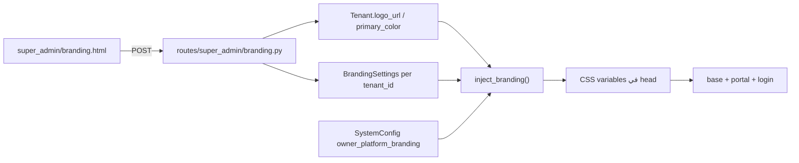

> **لا** `routes/manager/appearance.py` في المسار الافتراضي — يُضاف فقط إذا فُصلت الصلاحيات لاحقاً.

### 13.4 واجهة الاستوديو — أقسام الشاشة

نفس تخطيط §13.4 السابق، لكن الملف الأساسي: **`templates/super_admin/branding.html`** (توسيع، ليس إنشاء من الصفر).

### 13.5 حقول No-Code

| المجموعة | المصدر | يؤثر على |
|----------|--------|----------|
| هوية | `Tenant.name` + `BrandingSettings.organization_name` | navbar, title |
| شعار | `Tenant.logo_url` + `BrandingSettings.logo_path` | navbar — **توحيد الحقلين** |
| ألوان | `Tenant.primary_color` + BrandingSettings | CSS variables |
| ثيم | `SystemTheme` | tokens دفعة واحدة |
| تقارير | `report_header_html`, `_footer_html` | print — §34 |
| فواتير | `invoice_header_html`, `invoice_footer_html` *(جديد)* | `print/invoice.html` |
| إيصالات | `receipt_header_html` *(جديد)* | `print/receipt.html` |
| روشتات | `prescription_header_html` *(جديد)* | `print/prescription.html` |
| بوابة | `Tenant.settings.portal_welcome` (JSON) | portal — **بدون هجرة إن أمكن** |

### 13.6 ربط CSS — التنفيذ التقني

في `templates/base.html` و`portal/base.html` — **بدون fallback hex في Jinja**:

```html
<style id="tenant-branding-vars">
:root {
  --color-primary: {{ ui.primary_color }};
  --color-accent: {{ ui.accent_color }};
  --brand-logo-url: url('{{ ui.logo_url }}');
}
</style>
<meta name="theme-color" content="{{ ui.primary_color }}">
```

في `app/shared/branding_context.py`:

```python
def resolve_branding_context():
    tenant = getattr(g, 'current_tenant', None)
    theme = SystemTheme.query.filter_by(is_default=True, is_active=True).first()
    if tenant:
        bs = BrandingSettings.query.filter_by(tenant_id=tenant.id, is_active=True).first()
        ui_settings = (tenant.settings or {}).get('ui', {})
        return merge(theme, tenant, bs, ui_settings)
    return merge(theme, get_platform_branding())
```

### 13.7 الملفات المطلوبة (بالأولوية)

| الملف | الإجراء |
|-------|---------|
| `templates/super_admin/branding.html` | **توسيع وإصلاح** — الاستوديو الرئيسي |
| `routes/super_admin/branding.py` | **إصلاح** POST + رفع + حفظ Tenant fields |
| `app/shared/branding_context.py` | **إنشاء** — `resolve_branding_context()` + `resolve_ui_context()` |
| `app_factory.py` | **تعديل** — `inject_branding()` يستخدم `resolve_branding_context()` |
| `static/js/.../branding.js` | **إصلاح** `selectTheme()` |
| `templates/manager/settings.html` | **تعديل** — تبويب رابط اختياري |
| `templates/manager/appearance.html` | **مؤجّل** — فقط إذا لزم فصل الصلاحيات |
| `models/branding.py` | هجرة **فقط** لحقول لا تُخزَّن في `Tenant.settings` |

### 13.8 صلاحيات الوصول

| الدور | tenant branding | platform branding |
|-------|-----------------|-------------------|
| `super_admin` | ✅ `/super-admin/branding` | ❌ |
| `manager` | ⚠️ رابط إن مُنحت | ❌ |
| `owner` (منصة) | معاينة من `tenant_detail` | ✅ `/owner/branding` |
| staff | ❌ | ❌ |

### 13.9 اختبارات عدم الكسر

- [ ] حفظ branding لـ tenant A لا يغيّر مظهر tenant B
- [ ] رفع شعار كبير يُرفض أو يُصغَّر (max 2MB)
- [ ] لون فاتح جداً → تحذير contrast + fallback تلقائي
- [ ] بدون branding → defaults AZAD Clinical Clean
- [ ] print templates تعرض ترويسة العميل
- [ ] portal يرث ألوان العميل بعد إصلاح `portal/base.html`

---

## 14. لوحة مالك المنصة (`/owner/*`) — shell وقوالب فقط

> **التفاصيل الكاملة، جرد الروابط، وبوابة الاختبار:** **§37** — هذا القسم ملخص؛ التنفيذ يتبع §37 في **مرحلة 6**.

### 14.1 الهدف

تحسين **واجهة** دور `owner` على المسارات **الموجودة** — لا إعادة بناء SaaS backend:
- tenants، plans، bundles، webhooks — routes جاهزة
- platform branding في `SystemConfig`
- MRR/health من APIs الموجودة

### 14.2 الفصل عن Super Admin (إلزامي)

| | Owner (منصة) | Super Admin (tenant) |
|--|--------------|----------------------|
| النطاق | كل المنصة | مؤسسة واحدة |
| المسار | `/owner/*` | `/super-admin/*` |
| Shell | `owner/base.html` | `base.html` |
| Sidebar | `_owner_sidebar.html` | قسم tenant في `_sidebar.html` |
| Branding | `owner_platform_branding` | `Tenant` + `BrandingSettings` |

**إجراء UI فقط:** في `_sidebar.html` — `owner` لا يشارك قسم `super_admin`:
```jinja

  
```

> module اسمه `owner` في registry يغطي كلا المسارين — **لا نغيّر الاسم**؛ نفصل التنقل في القوالب فقط.

### 14.3 هيكل التنقل المقترح لـ Owner

```
لوحة المنصة
├── نظرة عامة (dashboard)          ← KPI + charts + alerts
├── العملاء (Tenants)
│   ├── قائمة العملاء
│   ├── عميل جديد
│   └── تفاصيل عميل (+ معاينة مظهره)
├── الاشتراكات والخطط
│   ├── خطط الاشتراك
│   ├── حزم المنتجات (bundles)
│   └── تقارير الإيرادات (جديد)
├── التخصيص والهوية
│   ├── علامة المنصة (branding)
│   ├── قوالب الثيمات (themes)      ← إدارة SystemTheme
│   └── إعدادات افتراضية للعملاء الجدد
├── التشغيل
│   ├── استخدام الموارد
│   ├── سجل التدقيق
│   ├── إشعارات المنصة
│   └── إعلانات
├── التكامل
│   ├── Webhooks
│   └── مفاتيح API (api-keys)
└── الدعم
    └── تذاكر الدعم
```

### 14.4 خريطة الصفحات — موجود vs مطلوب

| الصفحة | موجود | المطلوب بالخطة |
|--------|-------|----------------|
| `owner/dashboard.html` | ✅ | تحديث Clinical Clean + KPI أوضح |
| `owner/create_tenant.html` | ✅ | إضافة اختيار ثيم افتراضي عند الإنشاء |
| `owner/tenant_detail.html` | ✅ | تبويب "المظهر" + معاينة + فرض حدود الخطة |
| `owner/plans.html` | ✅ | ربط بحدود تخصيص (ألوان/ثيمات) |
| `owner/bundles.html` | ✅ | — |
| `owner/branding.html` | ⚠️ بسيط | استوديو كامل مثل المنصة + معاينة |
| `owner/themes.html` | ❌ | CRUD لـ `SystemTheme` |
| `owner/billing.html` | ❌ | إيرادات، فواتير منصة، تصدير |
| `owner/api_keys.html` | ❌ | واجهة لـ `/owner/api-keys` |
| `owner/support_tickets.html` | ✅ | — |
| `owner/audit_logs.html` | ✅ | — |
| `owner/resource_usage.html` | ✅ | — |
| `owner/notifications.html` | ✅ | — |
| `owner/announcements.html` | ✅ | — |
| `owner/webhooks.html` | ✅ | — |

### 14.5 لوحة المالية للمنصة (جديد — `owner/billing.html`)

واجهة مقترحة (بدون كسر backend موجود):

| القسم | المحتوى | مصدر البيانات |
|-------|---------|---------------|
| ملخص | MRR, ARR, LTV, churn | موجود في dashboard — توسيع |
| جدول | اشتراكات نشطة/منتهية | `Tenant` + `SubscriptionPlan` |
| تفاصيل | إيراد كل عميل شهرياً | `TenantSubscriptionHistory` |
| إجراءات | تجديد، تعليق، تصدير CSV | routes موجودة + export جديد |
| رسوم بيانية | اتجاه 12 شهر | Chart.js مثل dashboard |

> **عدم الكسر:** لا تغيير في models الاشتراك — واجهة وقراءة فقط في المرحلة الأولى.

### 14.6 إدارة قوالب الثيمات (`owner/themes.html`)

يسمح للمالك بـ:
- إنشاء/تعديل/تعطيل ثيمات في `system_themes`
- تحديد ثيم افتراضي للعملاء الجدد
- تحديد أي ثيمات متاحة لكل `SubscriptionPlan` (حقل JSON `allowed_theme_ids` — هجرة لاحقة)

العميل (manager) يرى في استوديو المظهر **فقط** الثيمات المسموحة بخطته.

### 14.7 Mockup لوحة Owner

```
mockups/medical-ui-refresh/08-owner-console.html
```
يعرض: sidebar داكن خفيف للمنصة (مميز بصرياً عن tenant admin)، KPI مالي، جدول عملاء، quick actions.

### 14.8 الملفات المطلوبة (Owner Console)

| الملف | الإجراء |
|-------|---------|
| `templates/owner/base.html` | **إنشاء** — extends clinical shell |
| `templates/partials/_owner_sidebar.html` | **إنشاء** — تنقل كامل |
| `templates/partials/_sidebar.html` | **تعديل** — فصل owner |
| `templates/owner/*.html` (12 ملف) | **تحديث** — Clinical Clean |
| `templates/owner/themes.html` | **إنشاء** |
| `templates/owner/billing.html` | **إنشاء** |
| `templates/owner/api_keys.html` | **إنشاء** |
| `app/modules/owner/routes.py` | **توسيع** — themes, billing views |
| `static/js/pages/owner/*.js` | **إنشاء/تحديث** |

### 14.9 اختبارات Owner

- [ ] owner لا يرى روابط super_admin في sidebar
- [ ] super_admin لا يرى روابط owner
- [ ] owner يفتح tenant_detail ويعدّل مظهر العميل
- [ ] تغيير ثيم افتراضي ينعكس على عميل جديد فقط
- [ ] MRR في billing يطابق dashboard

---

## 15. نتائج الجولة الشاملة على القوالب والوظائف

> **تاريخ الجولة:** 2026-06-22 | **النطاق:** 308 قالب HTML، 48 مجلداً، partials، static، routes إدارية  
> **القاعدة:** لا تنفيذ قبل اعتماد §17 Gate 0 و§16

### 15.1 ملخص رقمي

| المقياس | القيمة |
|---------|--------|
| إجمالي قوالب HTML | **308** |
| مجلدات templates رئيسية | **48** + partials (12) + layouts (2) |
| `extends base.html` | **~290** (~94%) |
| `extends dashboard_base.html` | **11** (صيدلية كاملة + reception/doctor dashboard_new + billing) |
| `extends portal/base.html` | **11** |
| standalone (login, print, kiosk, errors) | **~17** |
| قوالب فيها `<style>` inline | **52+** |
| `font-weight-bold` (BS4) | **~212** في 45 ملفاً |
| `badge-*` legacy | **~100+** في الوحدات السريرية |
| ماكروهات partials غير مستوردة | **6 من 8** |
| `clinical.css` مربوط بقالب | **0** |

### 15.2 توزيع القوالب حسب الوحدة

| الوحدة | العدد | Layout | أبرز النواقص / التحسينات |
|--------|------:|--------|---------------------------|
| **super_admin** | 32 | base | dashboards ثقيلة؛ branding معطّل جزئياً؛ تنوع headers |
| **manager** | 21 | base | **12+ route بدون رابط sidebar**؛ لا تبويب مظهر؛ English "Drill-down" |
| **reception** | 19 | base + dashboard_new + kiosk | **BS4 modals**؛ create_visit ~532 سطر؛ queue |
| **doctor** | 20 | base + dashboard_new | patient_details ~688 سطر؛ badge BS4؛ dashboard مزدوج |
| **emergency** | 18 | base | dashboard_new على base وليس dashboard_base؛ badges مكررة |
| **lab** | 12 | base + print | process ثقيل؛ print يخفي sidebar بـ CSS hack |
| **radiology** | 8 | base | process 8× inline styles |
| **nurse** | 8 | base | **dashboard.html ~950 سطر غير مربوط** بroute |
| **accountant** | 14 | base | **dashboardان حيان** (legacy + new) |
| **pharmacy** | 8 | **dashboard_base فقط** | معزول بصرياً عن بقية النظام |
| **billing** | 1 | dashboard_base | وحدة منفصلة |
| **portal** | 12 | portal/base | **footer HTML مكسور**؛ BS4 JS؛ ألوان hardcoded |
| **owner** | 12 | base | **0 روابط owner في sidebar**؛ يشارك super_admin |
| **booking** | 7 | base | عامة لكن بshell موظف |
| **print** | 5 | standalone | لا `print_base.html` مشترك |
| **auth** | 2 | login standalone | أفضل صفحة تصميماً؛ لا branding tenant |
| **main** | 5 | base | **لا landing** |
| **medication** | 10 | base | placeholders إنجليزية |
| **finance** | 6 | base | تداخل مع accountant في التنقل |
| **bed, emar, cds, pathway, or, dicom** | 2–6 each | base | حالات `{{ *.status }}` خام |
| **quality, population, security, mfa, backup** | 1–5 each | base | تحسين تجميلي بعد الأساس |
| **telemedicine, referral, barcode, vaccination** | 2–3 each | base | تداخل telemedicine مع booking |
| **patient_education, nursing_assessment, what_if** | 3–5 each | base | أولوية منخفضة |
| **sso, report_builder, payment, pwa, biometric** | 1 each | base/standalone | i18n / عزل |

### 15.3 أنماط عابرة لكل القوالب (Cross-cutting)

#### أ) ثلاثة Layout Shells متنافسة
- `base.html` — luxury navbar + sidebar (~290 صفحة)
- `dashboard_base.html` — slate inline + **sidebar مزدوج** (luxury داخل slate) — 11 صفحة
- `portal/base.html` — Bootstrap أزرق منفصل — 11 صفحة

#### ب) Partials — جاهزة وغير مستخدمة

| الملف | النوع | الاستخدام الفعلي |
|-------|-------|------------------|
| `_navbar`, `_sidebar`, `_footer`, `_flash` | include | ✅ |
| `_exchange_rate_modal` | include | accountant فقط |
| `_order_status_badge` | macro | ❌ |
| `_billing_status_badge` | macro | ❌ |
| `_patient_context_panel` | macro | ❌ |
| `_workflow_next_actions` | macro | ❌ |
| `_module_empty_state` | macro | ❌ |
| `_audit_timeline` | macro | ❌ |
| `_attachment_panel` | macro | ❌ |

#### ج) صفحات ضخمة تحتاج إعادة هيكلة UX (ليس تلوين فقط)

| القالب | الحجم التقريبي | التحسين المطلوب |
|--------|----------------|-----------------|
| `reception/create_visit.html` | ~532 سطر | stepper 4 خطوات |
| `doctor/patient_details.html` | ~688 سطر | patient context bar + tabs |
| `nurse/dashboard.html` | ~950 سطر | حذف أو دمج مع dashboard_new |
| `reception/queue_management.html` | كبير | queue board موحّد + BS5 modals |
| `super_admin/users.html` | كبير | table toolbar + DT strategy |

#### د) قوالب يتيمة / مزدوجة

| المشكلة | الملفات |
|---------|---------|
| dashboard legacy غير مستخدم | `nurse/dashboard.html` |
| dashboardان للمحاسب | `accountant/dashboard.html` + `dashboard_new.html` |
| dashboardان للطبيب | `doctor/dashboard.html` + `dashboard_new.html` |
| `*_new` على bases مختلفة | pharmacy→dashboard_base؛ lab/emergency→base |

### 15.4 فجوات الوظائف الإدارية (من فحص routes)

#### ثلاث طبقات إدارة متداخلة

| الطبقة | Prefix | ملفات | ملاحظة |
|--------|--------|-------|--------|
| منصة SaaS | `/owner/*` | `app/modules/owner/routes.py` | 12 HTML + JSON APIs |
| tenant super-admin | `/super-admin/*` | `routes/super_admin/` | ~32 قالب |
| مدير المركز | `/manager/*` | `routes/manager/` | 21 قالب |

#### أخطاء backend تؤثر على UI (يجب إصلاحها مع التخصيص)

| # | المشكلة | الملفات |
|---|---------|---------|
| B1 | `BrandingSettings` له `tenant_id` لكن **مستثنى من tenant filter** → سجل عالمي واحد | `app/shared/tenant_filter.py`, `models/branding.py` |
| B2 | `get_active_settings()` بدون فلتر tenant | `models/branding.py` |
| B3 | `logo_url` في القوالب vs `logo_path` في النموذج | `super_admin/branding.html`, `owner/branding.html`, `print/invoice.html` |
| B4 | رفع شعار: `logo_file` في UI **بدون handler** | `routes/super_admin/branding.py` |
| B5 | `selectTheme()` في JS = **alert فقط** | `static/js/pages/super_admin/branding.js` |
| B6 | `saveBranding()` يتوقع JSON؛ الـ route يعيد **redirect** | branding.js + branding route |
| B7 | `owner_platform_branding` في SystemConfig **غير محقون** في القوالب | `owner/routes.py`, `app_factory.py` |
| B8 | `Tenant.logo_url` / `primary_color` على النموذج **غير مستخدمين** في UI | `app/core/tenant/models.py` |
| B9 | بعض owner APIs **بدون `@owner_required`** | bundles, provision, record-usage |
| B10 | `SubscriptionPlan` read-only؛ `ProductBundle` منفصل — **نموذجا فوترة مزدوجان** | owner routes + tenant models |

#### sidebar `_sidebar.html` — أخطاء تنقل حرجة

**دور owner (سطر 130):** يشارك super_admin ويرى روابط خاطئة:

| التسمية في القائمة | Route الفعلي | الصحيح |
|-------------------|--------------|--------|
| لوحة المنصة | `super_admin.dashboard` | `owner.owner_dashboard` |
| خطط الاشتراك | `super_admin.pricing` | `owner.owner_plans` |
| إعلانات المنصة | `super_admin.system_config` | `owner.owner_announcements` |
| الدعم الفني | `super_admin.security_logs` | `owner.owner_support_tickets` |
| Webhooks / API | `super_admin.system_config` | `owner.owner_webhooks` |
| تخصيص المنصة | `super_admin.branding` | `owner.owner_branding` |

**دور manager — routes موجودة بدون رابط:**

`settlements`, `budget`, `monthly-comparison`, `financial-reports`, `force-payment-approvals`, `patient-satisfaction`, `departments`, `unit-control`, `user-management`, `staff-absence`, `staff-capacity`, `reports-center`, `self-service`, `drill-down`

### 15.5 فجوات البنية التحتية (static)

| # | المشكلة | الملف | التأثير |
|---|---------|-------|---------|
| S1 | Mobile sidebar: JS `.collapsed` vs CSS `.show` | `base.js`, `layout.css` | **القائمة لا تعمل على الموبايل** |
| S2 | Overlay `#sidebarOverlay` بدون JS | `base.js` | لا إغلاق بالنقر |
| S3 | `dashboard_base` hamburger بدون handler | `dashboard_base.html`, `dashboard_base.js` | موبايل معطّل |
| S4 | `dashboard_base` يضمّ `_sidebar` داخل `.sidebar` | `dashboard_base.html` | **sidebar مزدوج** |
| S5 | `clinical.css` غير مربوط | أي قالب | طبقة التصميم الجديدة معطّلة |
| S6 | `datatables-init.js` بدون `data-dt="1"` وبدون jQuery | `app.js`, templates | dead code |
| S7 | `initAdvancedTable()` على كل `table[id]` | `base.js` | يتعارض مع DT |
| S8 | GSAP بدون guard + يتجاهل reduced-motion | `base.js` | أخطاء محتملة |
| S9 | `enforceSafeLinks` يكسر anchors `#` | `base.js` | تنقل داخلي |
| S10 | ساعتان مكررتان | `base.js`, `_navbar.js` | تكرار |

### 15.6 قوالب kiosk / عامة تحتاج معاملة خاصة

| القالب | النوع | ملاحظة |
|--------|-------|--------|
| `reception/waiting_display.html` | kiosk | CSS inline؛ شاشة انتظار |
| `reception/calls_display.html` | kiosk | شاشة استدعاء |
| `reception/survey.html` | public form | standalone |
| `booking/*` | public | يحتاج shell أخف من staff |
| `main/*` | legal | يحتاج landing عامة |

---

## 18. مصفوفة التخصيص الثلاثي (Platform → Tenant → User)

كل مستوى له حدود واضحة — لا خلط صلاحيات.

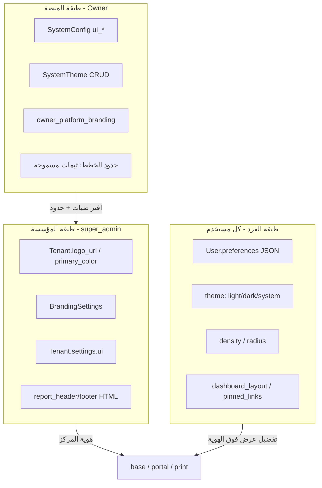

| الإعداد | Owner | super_admin | المستخدم العادي | المريض (portal) |
|---------|-------|-------------|-----------------|-----------------|
| شعار المؤسسة | معاينة | ✅ تعديل | عرض فقط | عرض |
| ألوان المؤسسة | حدود الخطة | ✅ | وراثة | وراثة |
| ثيم جاهز (SystemTheme) | CRUD | ✅ اختيار | ❌ | ❌ |
| وضع ليلي/نهاري | افتراضي للمنصة | افتراضي للـ tenant | ✅ شخصي | ✅ شخصي |
| كثافة واجهة | — | افتراضي tenant | ✅ شخصي | ✅ |
| خط العرض | — | — | ✅ اختيار محدود | ✅ |
| ترتيب اختصارات | — | — | ✅ حسب الدور | ❌ |
| ترويسة/تذييل المستندات المطبوعة | ❌ لا يعدّل طباعة العميل | ✅ HTML ديناميكي — **tenant فقط** | — | — |
| شعار AZAD في الطباعة | — | — | — | — | **كل المطبوعات — زاوية + ©** |
| هوية المنصة في UI | ✅ `owner_platform_branding` | ❌ | — | — |

**طباعة tenant (عمود منفصل):**

| عنصر | مصدر | قاعدة §34.10 |
|------|------|--------------|
| ترويسة فاتورة/إيصال/روشتة | `BrandingSettings` tenant | **100% tenant** — لا AZAD |
| ترويسة تقرير طبي | `report_header_html` tenant | **100% tenant** |
| تذييل tenant | `*_footer_html` tenant | نص المركز — ديناميكي |
| ختم AZAD + © | ثابت في `print_base` | **كل المطبوعات** — زاوية أسفل |
| footer التطبيق | `_footer.html` | **شركة ازاد دائماً** — §34.10.5 |

**قاعدة الوراثة:** `resolve_ui_context()` = دمج `BrandingContext` (tenant) + `UserPreferences` (فرد) → CSS vars + `data-theme` + `data-density`.

---

## 19. الملف الشخصي وتفضيلات المستخدم

### 19.1 الوضع الحالي (من الكود)

[`templates/auth/profile.html`](templates/auth/profile.html): اسم، بريد، هاتف، قسم، دور، كلمة مرور، توقيع رقمي — **بدون** تبويب مظهر.

[`models/user.py`](models/user.py): **لا** عمود `preferences`.

### 19.2 المستهدف — تبويب «المظهر والعرض»

هجرة واحدة:

```python
# models/user.py
preferences = db.Column(db.JSON, nullable=True, default=dict)
```

بنية JSON:

```json
{
  "ui": {
    "color_mode": "system",
    "density": "normal",
    "radius": "md",
    "font_scale": "normal",
    "font_family": "cairo",
    "motion": "default",
    "sidebar_collapsed": false,
    "locale": "ar"
  },
  "dashboard": {
    "pinned_routes": ["/reception/dashboard", "/reception/create_visit"],
    "hidden_widgets": [],
    "default_landing": null
  }
}
```

| الحقل | القيم | مصدر العرض |
|-------|-------|------------|
| `color_mode` | `light` \| `dark` \| `system` | `data-theme` + يحترم `prefers-color-scheme` |
| `density` | `compact` \| `normal` \| `comfortable` | `data-density` (موجود في CSS) |
| `radius` | `sm` \| `md` \| `lg` | `data-radius` (موجود في CSS) |
| `font_scale` | `sm` \| `normal` \| `lg` | `data-font-scale` على `html` |
| `font_family` | `cairo` \| `tajawal` \| `ibm-plex-arabic` | `--font-family` |
| `motion` | `default` \| `reduced` | يعطّل GSAP |
| `pinned_routes` | مصفوفة routes | شريط اختصارات في navbar |

**حفظ:** POST من `profile.html` → `auth/profile` route — نفس نمط التوقيع الرقمي.

**مزامنة:** عند تسجيل الدخول → حقن `window.__USER_PREFS__` + تطبيق فوري؛ `localStorage` cache للزيارة التالية قبل تحميل DB.

### 19.3 من يخصّص ماذا — إجابة صريحة

| السؤال | الجواب |
|--------|--------|
| هل **أي** مستخدم يخصّص بروفايله؟ | ✅ بيانات الحساب اليوم؛ **بعد التنفيذ** + مظهر شخصي |
| هل المريض في البوابة؟ | ✅ وضع ليلي + حجم خط؛ ❌ ألوان المؤسسة (وراثة) |
| هل super_admin يغيّر مظهر الجميع؟ | ✅ هوية المؤسسة فقط |
| هل الموظف يغيّر شعار المركز؟ | ❌ |

---

## 20. الوضع الليلي/النهاري، الثيمات، والخطوط

### 20.1 الوضع الليلي — إكمال ما بُني نصفه

**موجود:**
- `[data-theme="dark"]` في `core.css`
- قراءة `localStorage.theme` في `base.js`

**ينقص (G-61):**

| # | المهمة | الملف |
|---|--------|-------|
| 1 | زر تبديل في navbar (شمس/قمر) + قائمة: فاتح/داكن/النظام | `_navbar.html`, `base.js` |
| 2 | `setColorMode(mode)` يحفظ في `User.preferences` + localStorage | `static/js/ui-preferences.js` |
| 3 | تطبيق على `portal/base.html`, `owner/base.html`, `dashboard_base` | كل shells |
| 4 | tokens داكنة لـ sidebar الفاخر (اليوم يتجاهل dark) | `layout.css` |
| 5 | `meta theme-color` ديناميكي | `base.html` |

```javascript
// static/js/ui-preferences.js
export function applyColorMode(mode) {
  const resolved = mode === 'system'
    ? (matchMedia('(prefers-color-scheme: dark)').matches ? 'dark' : 'light')
    : mode;
  document.documentElement.setAttribute('data-theme', resolved);
}
```

### 20.2 ثيمات المؤسسة (SystemTheme)

**إصلاح `selectTheme()` (G-62):**

1. POST `theme_id` → يحدّث `Tenant.settings.ui.theme_id` + حقول `BrandingSettings` من ألوان الثيم
2. معاينة فورية في iframe
3. Owner يدير CRUD في `owner/themes.html` (G-31)

ثيمات البذرة الحالية (من `models/branding.py`): Medical Blue، Green Health، Professional Gray — **توسيع لاحقاً** عبر Owner دون هجرة.

### 20.3 استراتيجية الخطوط العربية

**المعتمد للواجهة (v1.5):**

| الاستخدام | الخط | السبب |
|-----------|------|-------|
| نص عام | **Cairo** | أوضح للشاشات الطبية؛ الأكثر استخداماً في SaaS عربي |
| عناوين | **Tajawal** | تمييز بصري خفيف |
| طباعة/PDF | **IBM Plex Sans Arabic** | وضوح عند 10–12pt |
| احتياطي | `system-ui` | offline |

**يُزال من `@import`:** Amiri، Changa، Scheherazade — تبقى كلاسات `.arabic-script` اختيارية بتحميل lazy إن طُلب.

**اختيار المستخدم:** 3 خيارات فقط في الملف الشخصي — ليس قائمة مفتوحة (أداء + اتساق).

```css
[data-font="cairo"] { --font-family: 'Cairo', system-ui, sans-serif; }
[data-font="tajawal"] { --font-family: 'Tajawal', 'Cairo', sans-serif; }
[data-font="ibm-plex-arabic"] { --font-family: 'IBM Plex Sans Arabic', 'Cairo', sans-serif; }
```

**portal:** استبدال `Segoe UI` بـ `var(--font-family)` — G-18.

---

## 21. الطباعة، الفواتير، الإيصالات، والتقارير الديناميكية

> ⚠️ **§34 هو المرجع الكامل للطباعة** (استوديو tenant، `print_base`، روشتة Rx، ختم AZAD §34.10). هذا القسم ملخّص تاريخي + حالة الكود الحالية.

### 21.1 الوضع الحالي

| القالب | branding | خط | قاعدة مشتركة |
|--------|----------|-----|--------------|
| `print/prescription.html` | ⚠️ footer branding؛ **عنوان hardcoded** (G-155) | Arial | standalone |
| `print/invoice.html` | ⚠️ `logo_url` vs `logo_path` (G-05) | Arial | standalone |
| `print/radiology_report.html` | جزئي | Arial | standalone |
| `print/emergency_report.html` | جزئي | Arial | standalone |
| `lab/lab_requests_results_print.html` | ⚠️ | منفصل | — |
| `lab/barcode_print.html` | ❌ | monospace | — |
| **تذكرة طابور** | ❌ غير موجود | — | — |

[`ReportTemplate`](models/reporting.py): نموذج كامل (`template_content`, `template_variables`) — **0 استخدام** في routes.

### 21.2 الهيكل المستهدف

> **التفاصيل الكاملة:** §34 — ترويسة ديناميكية لكل tenant + نموذج أسطوري لكل `PrintDocType` + روشتة Rx.

```
templates/print/
├── print_base.html          ← جديد: هيكل A4 + header/footer من branding
├── _print_header.html       ← report_header_html أو افتراضي
├── _print_footer.html
├── invoice.html             ← extends print_base
├── receipt.html
├── prescription.html
├── radiology_report.html
├── emergency_report.html
├── queue_ticket.html        ← جديد: تذكرة انتظار 80mm
├── lab_result.html          ← توحيد lab_requests_results_print
└── barcode_label.html     ← من barcode_print
```

**print_base.html:**

```jinja

<!DOCTYPE html>
<html lang="ar" dir="rtl">
<head>
  <link rel="stylesheet" href="{{ url_for('static', filename='css/print.css') }}">
  <style>
    :root {
      --print-primary: {{ ui.primary_color }};
      --print-font: 'IBM Plex Sans Arabic', 'Cairo', sans-serif;
    }
  </style>
</head>
<body class="print-doc" data-doc-type="">
  
  
  
</body>
</html>
```

**static/css/print.css:** أنماط موحّدة — فاتورة، إيصال، روشتة، تذكرة (عرض 80mm للتذاكر).

### 21.3 تقارير ديناميكية (ReportTemplate)

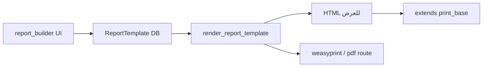

| المرحلة | المهمة |
|---------|--------|
| 1 | route `manager/reports-center` يقرأ `ReportTemplate` |
| 2 | محرر بسيط (متغيرات `{{patient_name}}` من `template_variables` JSON) |
| 3 | معاينة + طباعة عبر `print_base` |
| 4 | ربط `MedicalReport` body بقالب اختياري |

### 21.4 تذكرة الطابور (queue ticket)

- قالب `print/queue_ticket.html` — 80mm thermal
- route: `reception.print_queue_ticket(ticket_id)`
- محتوى: رقم الدور، اسم المريض (مختصر)، القسم، QR للزيارة، شعار tenant
- زر طباعة من `queue_management.html` و`waiting_display.html` (kiosk)

---

## 22. الحيوية والتفاعل (Motion System)

### 22.1 المبدأ

حيوية **طبية هادئة** — ليست ألعاباً. الحركة تخدم التوجيه لا الزخرفة.

| مسموح | ممنوع |
|-------|-------|
| fade/slide للبطاقات عند الدخول | parallax، shake، pulse مستمر |
| stagger للقوائم القصيرة | GSAP على كل صفحة جدول |
| hover 150ms على أزرار | animations تمنع القراءة |
| skeleton أثناء التحميل | autoplay carousel |

### 22.2 التنفيذ

**ملف:** `static/css/motion.css` + `static/js/motion.js`

```javascript
// motion.js
const prefersReduced = matchMedia('(prefers-reduced-motion: reduce)').matches;
const userMotion = window.__USER_PREFS__?.ui?.motion;
const motionEnabled = !prefersReduced && userMotion !== 'reduced';

if (motionEnabled && typeof gsap !== 'undefined') {
  gsap.utils.toArray('.animate-in').forEach((el, i) => {
    gsap.from(el, { y: 12, opacity: 0, duration: 0.35, delay: i * 0.05, ease: 'power2.out' });
  });
}
```

**كلاسات موحّدة:** `.animate-in`, `.skeleton`, `.fade-enter` — بدل استهداف `.card-modern` فقط في `base.js`.

**kiosk / waiting_display:** تحديث ناعم لرقم الدور (flip أو fade) — `waiting_display.js`.

---

## 23. لوحات حسب الدور + اختصارات شخصية

### 23.1 حسب الدور (موجود → تحسين)

| الدور | لوحة افتراضية | اختصارات مقترحة في navbar |
|-------|---------------|----------------------------|
| reception | `/reception/dashboard` | زيارة جديدة، طابور، صندوق |
| doctor | `/doctor/dashboard` | طابور المرضى، مواعيد اليوم |
| lab | `/lab/worklist` | عينات معلقة |
| manager | `/manager/dashboard` | KPI، تقارير، تسويات |

**التنفيذ:** `partials/_role_quick_bar.html` — يقرأ من `MODULE_REGISTRY` + `enabled_modules` + `User.preferences.dashboard.pinned_routes`.

### 23.2 ماكروهات جاهزة — تفعيل إلزامي (G-14)

| ماكرو | أين يُستخدم أولاً |
|-------|-------------------|
| `_patient_context_panel` | `doctor/patient_details.html` |
| `_workflow_next_actions` | reception, doctor, lab |
| `_order_status_badge` | lab, radiology جداول |
| `_billing_status_badge` | accountant, finance |
| `_module_empty_state` | كل جداول فارغة |
| `_status_badge` | جديد — يغلف `enum_label` |

### 23.3 تخصيص شخصي للوحة (P2)

- سحب/إخفاء widgets في dashboard (اختياري — `TenantFeatureFlag`: `dashboard_customize`)
- حفظ في `User.preferences.dashboard.hidden_widgets`
- **MVP:** اختصارات pinned فقط — بدون drag-drop في المرحلة الأولى

---

## 24. مصفوفة التكامل — الحالي vs المستهدف (v1.5)

| القدرة | Backend | UI | مدمج اليوم | هدف v1.5 |
|--------|---------|-----|------------|----------|
| بروفايل مستخدم | ✅ User | ✅ بيانات | ⚠️ | + تبويب مظهر |
| تفضيلات فرد | ❌ | ❌ | ❌ | ✅ `User.preferences` |
| وضع ليلي | ⚠️ CSS | ❌ زر | ❌ | ✅ |
| ثيم مؤسسة | ✅ SystemTheme | ⚠️ stub | ❌ | ✅ |
| ألوان tenant | ✅ Tenant | ❌ حقن | ❌ | ✅ BrandingContext |
| خطوط موحّدة | ⚠️ 5 خطوط | ❌ اختيار | ❌ | ✅ 3 خطوط |
| حيوية | ⚠️ GSAP | جزئي | ❌ | ✅ motion system |
| اختصارات دور | ⚠️ sidebar يدوي | جزئي | ⚠️ | ✅ registry + pins |
| فواتير/إيصالات | ✅ routes | ✅ | ⚠️ منفصلة | ✅ print_base |
| تقارير ديناميكية | ✅ ReportTemplate | ❌ | ❌ | ✅ |
| تذكرة طابور | ✅ Queue model | ❌ print | ❌ | ✅ |
| بوابة مريض | ✅ | ⚠️ منفصلة | ⚠️ | ✅ branding + dark |

| تذكرة طابور | ✅ Queue model | ❌ print | ❌ | ✅ |
| بوابة مريض | ✅ | ⚠️ منفصلة | ⚠️ | ✅ branding + dark |
| **موبايل responsive** | ⚠️ CSS | ⚠️ sidebar | ❌ | ✅ §25 |
| **PWA / تثبيت** | ⚠️ 2 SW | portal فقط | ❌ | ✅ §25 |
| **بحث ذكي** | ✅ APIs | صفحة واحدة | ❌ | ✅ §26 |
| **تحقق إدخال** | ⚠️ WTForms | جزئي | ❌ | ✅ §27 |
| **لمس tablet/kiosk** | ⚠️ displays | ❌ | ❌ | ✅ §28 |
| **Command Center** | ⚠️ dashboards منفصلة | جزئي | ❌ | ✅ §29 |

---

## 25. الموبايل وتطبيق النظام (PWA — أفضل مسار للـ Full-Stack SaaS)

### 25.1 الوضع الحالي (من الكود)

| البند | موجود | المشكلة |
|-------|--------|---------|
| `viewport` + PWA meta | `base.html`, `dashboard_base.html` | ✅ |
| `manifest.json` | `/static/manifest.json` + أيقونات | ⚠️ **غير مربوط** في `base.html` (portal فقط) |
| Service Worker | `sw.js` (staff) + `service-worker.js` (portal) | **اثنان متضاربان** |
| تسجيل SW | `base.js` → `sw.js`؛ `portal/base.js` → `service-worker.js` | عدم توحيد |
| mobile sidebar CSS | `layout.css` → `.luxury-sidebar.show` | JS يستخدم `.collapsed` — G-02 |
| kiosk | `waiting_display.html`, `calls_display.html` | منفصلة — لا tokens موحّدة |
| `theme_color` في manifest | `#0d6efd` ثابت | لا يرث tenant |

**لا يوجد** تطبيق native (React Native / Flutter) — والخطة **لا تقترح إعادة بناء**؛ المسار الأمثل: **PWA قوي + TWA اختياري للمتجر**.

### 25.2 استراتيجية ثلاث مستويات

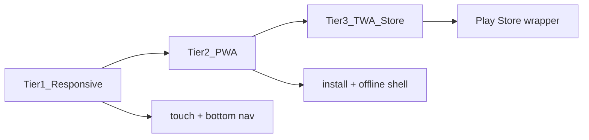

| المستوى | المحتوى | الأولوية |
|---------|---------|----------|
| **Tier 1 — Responsive** | mobile-first CSS، إصلاح sidebar، bottom nav للموظف، جداول قابلة للتمرير | **P0–P1** |
| **Tier 2 — PWA** | manifest موحّد، SW واحد، install prompt، offline login shell، push لاحقاً | **P1** |
| **Tier 3 — TWA/Capacitor** | غلاف للمتجر يلف نفس PWA — **بدون كود منفصل** | P3 اختياري |

### 25.3 Tier 1 — تجربة موبايل يومية (الموظف الطبي)

**نقاط كسر UX اليوم على الموبايل:**
- sidebar لا يفتح (G-02)
- جداول عريضة بدون scroll hint
- أزرار صغيرة (< 44px touch target)
- select2 من CDN ثقيل على 3G
- نماذج طويلة (create_visit 532 سطر) بدون stepper على شاشة ضيقة

**الحل في الخطة:**

| # | المهمة | الملف |
|---|--------|-------|
| 1 | إصلاح toggle: `.show` + `#sidebarOverlay.active` | `base.js`, `layout.css` |
| 2 | `static/css/mobile.css` — touch targets 44px، safe-area-inset | جديد |
| 3 | **Bottom navigation** للموبايل `< 768px` — 4 أيقونات حسب الدور | `partials/_mobile_bottom_nav.html` |
| 4 | جداول: `.table-responsive` + `.table-stack` (بطاقات على موبايل) | `components.css` |
| 5 | stepper create_visit يتكيف — خطوة واحدة per screen | §5 + G-20 |
| 6 | `inputmode`, `autocomplete` صحيح لكل حقل | §27 |

**رحلات موبايل أولوية (MVP):**

| الدور | ما يجب أن يعمل على الهاتف |
|-------|---------------------------|
| reception | طابور، بحث مريض، زيارة سريعة، طباعة تذكرة |
| doctor | طابور المرضى، ملف مريض (قراءة)، وصفة |
| portal (مريض) | مواعيد، نتائج، فواتير — **PWA أساسي هنا** |
| lab/radiology | worklist + مسح باركود |

### 25.4 Tier 2 — PWA موحّد

**ملف واحد:** `static/pwa/sw.js` (دمج `sw.js` + `service-worker.js`)

```javascript
// استراتيجية cache
const SHELL = ['/', '/auth/login', '/offline', '/static/css/core.css', ...];
// network-first للـ /api/* و /reception/* POST
// cache-first للـ static
// navigate → offline fallback templates/pwa/offline.html
```

| # | المهمة | التفاصيل |
|---|--------|----------|
| 1 | `<link rel="manifest">` في **كل** shell: base, portal, owner, login | `href` مع `tenant` scope في SaaS: `/t/<slug>/` |
| 2 | `manifest.json` ديناميكي أو per-tenant `start_url` | route `/.well-known/manifest.json` أو inject |
| 3 | `theme_color` من `ui.primary_color` | BrandingContext |
| 4 | **Install prompt** — banner بعد زيارتين | `static/js/pwa-install.js` |
| 5 | `beforeinstallprompt` + iOS «أضف إلى الشاشة الرئيسية» تعليمات | |
| 6 | Offline: صفحة `templates/pwa/offline.html` + قراءة طابور cached (P2) | |
| 7 | إزالة `sw.js` و`service-worker.js` القديمين بعد الدمج | G-78 |

**SaaS:** `scope` و`start_url` في manifest يجب أن يحترما `/t/<slug>/` عند SaaS mode.

### 25.5 Tier 3 — متجر التطبيقات (اختياري — P3)

- **Trusted Web Activity (TWA)** أو **Capacitor** يلف نفس URL للـ PWA
- لا منطق أعمال مكرر — مجرد shell + splash + أيقونة
- يُفعَّل فقط بعد Tier 2 مستقر
- push notifications عبر FCM لاحقاً (يتطلب backend route)

### 25.6 معايير قبول الموبايل

- [ ] Lighthouse Mobile Performance ≥ 80 على dashboard استقبال
- [ ] Lighthouse PWA: installable + manifest + SW
- [ ] كل أزرار تفاعلية ≥ 44×44px
- [ ] sidebar + bottom nav يعملان على iOS Safari وChrome Android
- [ ] create_visit مكتمل على شاشة 390px بدون scroll أفقي
- [ ] portal يُثبَّت كتطبيق ويعمل offline للصفحات الثابتة

---

## 26. القوائم المنسدلة والبحث الذكي

### 26.1 الوضع الحالي

| المكوّن | أين | الحالة |
|---------|-----|--------|
| بحث مريض ذكي | `create_visit.js` → `/reception/api/smart-patient-search` | ✅ يعمل — **غير معمّم** |
| بحث طبيب | `doctor/api_patient_search` | ✅ منفصل |
| select2 | `create_visit.html` فقط (CDN) | ⚠️ jQuery + CDN؛ لا RTL موحّد |
| `<select>` عادي | ~200+ نموذج | بدون بحث داخل القائمة |
| جداول بحث | `initAdvancedTable` في `base.js` | محلي — ليس API |

### 26.2 المعيار الموحّد — مكوّنان فقط

```
static/js/components/
├── smart-search.js      ← بحث نصي مع اقتراحات (مرضى، أدوية، ICD…)
└── smart-select.js      ← قائمة منسدلة قابلة للبحث (بديل select2)
```

**اختيار التقنية:** **Tom Select** (خفيف، RTL، بدون jQuery) — vendor في `static/vendor/tom-select/` — **ليس** CDN ولا select2 جديد per-page.

> select2 موجود في AdminLTE — نستخدمه **فقط** حيث jQuery legacy؛ الصفحات الجديدة Tom Select فقط.

### 26.3 Smart Search — مواصفات

**ماكرو Jinja:** `partials/_smart_search.html`

```jinja

<div class="smart-search" data-api="{{ api_url }}" data-min="{{ min_chars }}">
  <input type="text" id="{{ field_id }}" class="form-control" autocomplete="off"
         inputmode="search" placeholder="{{ placeholder }}" aria-autocomplete="list">
  <div class="smart-search-results list-group" role="listbox" hidden></div>
  <input type="hidden" name="{{ field_id }}_id" id="{{ field_id }}_id">
</div>

```

**سلوك:**
- debounce 300ms (نفس create_visit)
- لوحة مفاتيح: ↑↓ Enter Escape
- عرض: اسم + معرّف ثانوي (هوية، هاتف)
- حالة فارغة + تحميل skeleton
- يعمل على موبايل (قائمة full-width)

**APIs موحّدة (توسيع الموجود):**

| Endpoint | الاستخدام | موجود |
|----------|-----------|--------|
| `GET /api/search/patients?q=` | استقبال، طبيب، طوارئ | ⚠️ مساران منفصلان — **توحيد** |
| `GET /api/search/staff?department_id=&q=` | create_visit | جزئي |
| `GET /api/search/medications?q=` | صيدلية، وصفة | جديد |
| `GET /api/search/services?q=` | فوترة | جديد |
| `GET /api/search/icd?q=` | تشخيص | إن وُجد catalog |

**Backend:** `app/shared/search_service.py` — طبقة واحدة مع `tenant_filter` + حدود نتائج (20).

### 26.4 Smart Select — قوائم منسدلة قابلة للبحث

**تفعيل تلقائي:**

```javascript
// smart-select.js
document.querySelectorAll('[data-smart-select]').forEach(el => {
  new TomSelect(el, {
    plugins: ['dropdown_input', 'clear_button'],
    maxOptions: 50,
    allowEmptyOption: true,
    render: { no_results: () => '<div class="no-results">لا توجد نتائج</div>' }
  });
});
```

**في القوالب:**

```html
<select name="department_id" data-smart-select required data-placeholder="اختر القسم...">
```

**حالات خاصة:**
- **Cascading:** قسم → طبيب (موجود في create_visit) — event `change` يحدّث Tom Select الثاني عبر API
- **Multi-select:** تحاليل متعددة — `data-smart-select data-multiple`
- **Remote:** `data-api="/api/search/medications"` للقوائم الكبيرة (> 100 عنصر)

### 26.5 أين يُطبَّق أولاً (G-79–G-82)

| الأولوية | الصفحة | الحقول |
|----------|--------|--------|
| P0 | `reception/create_visit.html` | مريض، قسم، طبيب، تحاليل |
| P0 | `reception/create_appointment.html` | مريض |
| P1 | `doctor/prescription.html` | دواء |
| P1 | `reception/add_patient_to_queue.html` | مريض |
| P1 | `super_admin/users.html` | قسم، دور |
| P2 | كل `<select>` بأكثر من 8 خيارات | تلقائي عبر `data-smart-select` |

### 26.6 CSS للقوائم

`static/css/smart-components.css` — RTL، z-index فوق modals، موبايل full-screen dropdown تحت 576px.

---

## 27. التحقق من البيانات عند الإدخال (Client + Server)

> **رسائل التحقق:** نفس الجمل العربية في client وserver — جزء من §36 (لا «هذا الحقل مطلوب» عام فقط).

### 27.1 الوضع الحالي

| الطبقة | موجود | الفجوة |
|--------|--------|--------|
| Server WTForms | `forms/*.py` validators | ليس كل النماذج |
| `security.js` | email + phone على `blur` | لا هوية وطنية، لا تاريخ، لا مبلغ |
| `base.js` `validateForm` | `required` فقط | لا رسائل عربية موحّدة |
| HTML5 | `required`, `pattern` في MFA | متفرق |
| Bootstrap | `needs-validation` + `novalidate` في profile | غير مفعّل بشكل صحيح |

**المشكلة:** قواعد مكررة ومتضاربة — المستخدم يرى خطأ بعد submit بدل أثناء الكتابة.

### 27.2 المصدر الوحيد للقواعد — `app/shared/validators.py`

```python
# قواعد مشتركة — يستهلكها WTForms و JSON schema للـ JS
FIELD_RULES = {
    'national_id': {'pattern': r'^\d{9}$', 'message_ar': 'رقم الهوية 9 أرقام'},
    'phone': {'pattern': r'^(\+?970|0)?5\d{8}$', 'message_ar': 'رقم جوال غير صالح'},
    'email': {'type': 'email', 'message_ar': 'بريد إلكتروني غير صالح'},
    'amount': {'type': 'decimal', 'min': 0, 'message_ar': 'المبلغ يجب أن يكون موجباً'},
    'date_past': {'type': 'date', 'max': 'today', 'message_ar': 'التاريخ لا يمكن أن يكون مستقبلياً'},
    'patient_name': {'min_length': 2, 'max_length': 120, 'message_ar': 'الاسم قصير جداً'},
}
```

تصدير للفرونت:

```python
@app.context_processor
def inject_validation_rules():
    return {'validation_rules': get_rules_json()}
```

```html
<script>window.__VALIDATION_RULES__ = {{ validation_rules|tojson }};</script>
```

### 27.3 طبقة Client — `static/js/form-validation.js`

| الحدث | السلوك |
|-------|--------|
| `input` (debounced) | تحقق فوري للحقول `data-validate` |
| `blur` | تحقق كامل للحقل |
| `submit` | منع الإرسال + scroll لأول خطأ + `aria-invalid` |
| `paste` | تنظيف (هوية: أرقام فقط) |

**في القالب:**

```html
<input name="national_id" data-validate="national_id" class="form-control"
       inputmode="numeric" maxlength="9" autocomplete="off" required>
<div class="invalid-feedback" data-error-for="national_id"></div>
```

**ماكرو:** `partials/_form_field.html` — label + input + feedback + `data-validate` من قواعد مشتركة.

### 27.4 تكامل Bootstrap 5

- إزالة `novalidate` حيث نريد HTML5 + custom
- `was-validated` على الـ form بعد أول submit فاشل
- `.is-invalid` + `.invalid-feedback` برسالة من `validators.py` — **نفس نص السيرفر**

### 27.5 تحقق حسب نوع الحقل (طبي)

| الحقل | Client | Server |
|-------|--------|--------|
| رقم هوية فلسطيني | 9 أرقام | نفس regex + unique per tenant |
| جوال | نمط + طول | |
| تاريخ ميلاد | `<input type="date">` + max=today | |
| مبلغ مالي | أرقام عشرية | `Decimal` + ≥ 0 |
| كمية دواء | رقم + وحدة | |
| ضغط/حرارة | نطاق طبي | `min`/`max` في rules |
| CSRF | دائماً | دائماً — لا تغيير |

### 27.6 أين يُطبَّق أولاً

| P0 | النماذج |
|----|---------|
| `reception/create_visit.html` | مريض جديد inline، هوية، هاتف |
| `auth/login.html` | username |
| `auth/profile.html` | email, phone |
| `reception/patients` (إضافة مريض) | كل الحقول الإلزامية |

### 27.7 اختبارات قبول التحقق

- [ ] نفس الخطأ يظهر client وserver بنفس النص العربي
- [ ] لا submit مع حقول `.is-invalid`
- [ ] لوحة المفاتيح رقمية تفتح لـ `national_id` على موبايل
- [ ] قارئ شاشة يعلن الخطأ (`aria-describedby`)

---

## 28. دعم شاشات اللمس بشكل محترف (Touch-First)

### 28.1 الوضع الحالي

| البند | الحالة |
|-------|--------|
| `@media (max-width)` في layout.css | ✅ جزئي |
| `touch-action` / `48px` targets | ❌ غير منهجي |
| واجهات `:hover` فقط | ⚠️ كثيرة — **لا تعمل على اللمس** |
| كشك الانتظار | `waiting_display.html` — منفصل، بدون tokens |
| تسجيل وصول لمسي | ❌ غير موجود |
| `pointer: coarse` media query | ❌ |

**الهدف:** تجربة **tablet/kiosk/touch PC** كوضع تشغيل رسمي — ليس بعدthought.

### 28.2 أوضاع العرض (Display Modes)

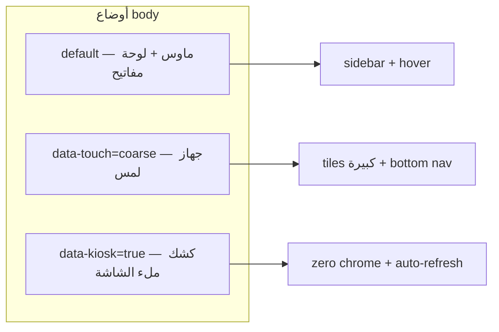

| الوضع | متى يُفعَّل | التغييرات |
|-------|-------------|-----------|
| **default** | desktop عادي | الوضع الحالي المحسّن |
| **touch** (`data-touch="coarse"`) | `@media (pointer: coarse)` أو tablet | أهداف 48–56px، لا hover-only، مسافات أوسع |
| **kiosk** (`data-kiosk="true"`) | `?kiosk=1` أو route مخصص | إخفاء navbar/sidebar، خط كبير، SSE refresh |

**كشف تلقائي:**

```javascript
// static/js/touch-mode.js
const coarse = matchMedia('(pointer: coarse)').matches;
const kiosk = new URLSearchParams(location.search).has('kiosk');
document.body.dataset.touch = coarse || kiosk ? 'coarse' : 'fine';
if (kiosk) document.body.dataset.kiosk = 'true';
```

### 28.3 معايير اللمس (إلزامية في `static/css/touch.css`)

| القاعدة | القيمة | السبب |
|---------|--------|-------|
| الحد الأدنى للمس | **48×48px** (56px للكشك) | Apple HIG / Material |
| المسافة بين الأهداف | ≥ 8px | منع اللمس الخاطئ |
| `:active` feedback | scale(0.98) + لون خلال 120ms | تأكيد بصري فوري |
| `-webkit-tap-highlight-color` | شفاف + custom ring | مظهر نظيف |
| `touch-action` | `manipulation` على الأزرار | إلغاء تأخير 300ms |
| لا `dblclick` | — | استخدم أزرار صريحة |
| Scroll | `-webkit-overflow-scrolling: touch` | جداول وقوائم |

```css
/* touch.css — مقتطف */
@media (pointer: coarse) {
  .btn, .nav-link-luxury, .clinical-action-tile {
    min-height: 48px;
    min-width: 48px;
    padding: 0.75rem 1.25rem;
  }
  .table-hover tbody tr:hover { background: inherit; }
  .table-hover tbody tr:active { background: var(--color-primary-light); }
}
[data-kiosk="true"] {
  --font-size-base: 1.125rem;
  --touch-target: 56px;
}
```

### 28.4 مكوّن Action Tiles (لمس احترافي)

**بديل صف الأزرار الصغيرة** في reception dashboard:

```html
<div class="clinical-action-grid">
  <a href="..." class="clinical-action-tile tile-primary" data-touch-target>
    <i class="fas fa-plus-circle"></i>
    <span>زيارة جديدة</span>
    <small>تسجيل مريض</small>
  </a>
  ...
</div>
```

- شبكة 2×2 على tablet، 4×1 على kiosk
- أيقونة 32px، نص عربي واضح، سطر فرعي
- haptic: `navigator.vibrate(10)` اختياري عند نجاح إجراء (P2)

### 28.5 سيناريوهات لمس حسب المكان

| السيناريو | القالب | التحسين |
|-----------|--------|---------|
| **استقبال — tablet** | Command Center §29 | tiles + smart search كبير |
| **طابور انتظار — TV** | `waiting_display.html` | tokens موحّدة، أرقام 120px، SSE |
| **نداء المرضى** | `calls_display.html` | صوت + flash لوني عند نداء جديد |
| **تسجيل وصول ذاتي** | `kiosk/check_in.html` **جديد** | هوية/QR + طباعة تذكرة |
| **صيدلية POS** | pharmacy POS | أزرار منتجات كبيرة |
| **مختبر — باركود** | `barcode/scan.html` | حقل مسح full-width، vibrate عند قراءة |

### 28.6 تفاعلات لمس متقدمة (مدروسة — لا استعراض)

| التفاعل | الاستخدام | الأولوية |
|---------|-----------|----------|
| **Swipe** على بطاقة طابور | تخطي / إعادة للطابور | P1 reception |
| **Pull-to-refresh** | تحديث لوحة القيادة | P1 |
| **Long-press** | قائمة سياق (طبيب: ملف سريع) | P2 |
| **Pinch** | تكبير صورة أشعة في portal | P3 |

**ممنوع:** drag معقد، gestures مخفية بدون تلميح.

### 28.7 اختبارات قبول اللمس

- [ ] iPad 10" + Android tablet: create_visit كامل بدون أخطاء لمس
- [ ] كل tile رئيسي ≥ 48px على Lighthouse tap targets
- [ ] لا إجراء يعتمد على `:hover` فقط
- [ ] kiosk يعمل 8 ساعات بدون تسريب memory (SSE)
- [ ] قفل تلقائي بعد 5 دقائق خمول في kiosk (`/auth/login?next=...`)

---

## 29. لوحة القيادة Command Center — لكل مستخدم حسب وظيفته

### 29.1 المشكلة اليوم

| ما هو موجود | لماذا ليس «رائعاً» |
|-------------|-------------------|
| `*_dashboard_new.html` لكل دور | 4 بطاقات KPI متشابهة + جدول واحد |
| `manager/dashboard.html` | ضخم (~charts كثيرة) — ليس مركّزاً |
| `access_control_service.role_menus` | hardcoded — لا يتزامن مع MODULE_REGISTRY |
| `main.dashboard` | redirect حسب role فقط — لا تخصيص فردي |
| `User.preferences` | غير موجود | لا «لوحتي» |

**الهدف:** لوحة تفتح وتقول: **مرحباً أحمد — لديك 7 مرضى بالانتظار — ابدأ من هنا.**

### 29.2 فلسفة التصميم — «رائع» لكن طبي

| مبدأ | التطبيق |
|------|---------|
| **وضوح فوري** | أول شاشة = «ماذا أفعل الآن؟» panel |
| **عمق عند الحاجة** | KPI ثانوية قابلة للطي |
| **جمال هادئ** | Clinical Clean + sparkline خفيف + بطاقات بظل ناعم |
| **دور محدد** | استقبال ≠ طبيب ≠ مختبر — widgets مختلفة تماماً |
| **شخصنة خفيفة** | ترتيب widgets من `User.preferences` — لا drag-drop في MVP |

### 29.3 معمارية — Widget Registry

```
app/shared/dashboard_registry.py     ← تعريف widgets لكل دور
templates/dashboards/
├── command_center.html              ← shell واحد لكل الأدوار
├── _hero.html                       ← ترحيب + سياق الوردية
├── _now_panel.html                  ← «الآن» — أولوية قصوى
└── widgets/
    ├── _queue_live.html
    ├── _visits_today.html
    ├── _patient_waiting_doctor.html
    ├── _lab_pending.html
    ├── _revenue_today.html
    └── ...
```

```python
# dashboard_registry.py — مقتطف
@dataclass(frozen=True)
class WidgetMeta:
    id: str
    title_ar: str
    roles: tuple          # ('reception',) أو ('doctor', 'nurse')
    modules: tuple        # يتطلب enabled_modules
    size: str             # sm | md | lg | full
    priority: int         # 1 = أعلى (يظهر في _now_panel)
    template: str
    data_endpoint: str | None  # API للتحديث الحي

ROLE_LAYOUTS: dict[str, list[str]] = {
    "reception": [
        "queue_live",           # priority 1 — الآن
        "quick_actions",        # tiles لمس
        "visits_today",
        "appointments_pending",
        "cash_summary",
    ],
    "doctor": [
        "my_queue",             # الآن
        "patients_waiting",
        "appointments_today",
        "prescriptions_draft",
        "lab_results_new",
    ],
    "lab": ["worklist_urgent", "samples_pending", "qc_alerts", "throughput_today"],
    "radiology": ["worklist_urgent", "reports_pending", "modality_load"],
    "nurse": ["assigned_patients", "vitals_due", "medications_due"],
    "accountant": ["pending_payments", "debt_alerts", "revenue_today", "invoices_draft"],
    "manager": ["kpi_strip", "department_load", "revenue_chart", "alerts"],
    "emergency": ["triage_board", "critical_count", "bed_status"],
    "pharmacy": ["dispense_queue", "low_stock", "pos_summary"],
}
```

**دمج مع MODULE_REGISTRY:** widget يُخفى إذا `module` غير مفعّل — لا widget لـ lab إذا lab module off.

### 29.4 تخطيط الشاشة (wireframe)

```
┌─────────────────────────────────────────────────────────────┐
│  مرحباً، د. سارة  ·  الوردية: صباح  ·  الثلاثاء 24 يونيو   │  ← _hero
├─────────────────────────────────────────────────────────────┤
│  ⚡ الآن يحتاج انتباهك                                      │
│  ┌──────────────┐ ┌──────────────┐ ┌──────────────┐        │
│  │ 7 بالانتظار  │ │ 2 مواعيد    │ │ صندوق: 3     │        │  ← _now_panel
│  │ [افتح الطابور]│ │ [المواعيد]  │ │ [الصندوق]    │        │
│  └──────────────┘ └──────────────┘ └──────────────┘        │
├─────────────────────────────────────────────────────────────┤
│  إجراءات سريعة (tiles لمس)                                  │
│  [➕ زيارة] [📋 طابور] [📅 موعد] [💰 صندوق]               │
├──────────────────────────┬──────────────────────────────────┤
│  زيارات اليوم (live)     │  مواعيد قادمة (2h)               │
│  جدول/stack موبايل       │  قائمة مدمجة                     │
├──────────────────────────┴──────────────────────────────────┤
│  KPI ثانوية (قابلة للطي) ··· sparklines ···                 │
└─────────────────────────────────────────────────────────────┘
```

### 29.5 بيانات حية (Live) — بدون over-engineering

| Widget | مصدر البيانات | تحديث |
|--------|---------------|-------|
| `queue_live` | API موجود للطابور | SSE أو poll 15s |
| `visits_today` | route dashboard الحالي | poll 30s |
| `my_queue` (doctor) | `doctor/dashboard` data | poll 20s |
| manager charts | APIs موجودة في manager | عند التحميل |

**ملف:** `static/js/dashboard-live.js` — يحدّث `[data-widget-id]` فقط — لا reload كامل.

### 29.6 تخصيص فردي (فوق الدور)

من `User.preferences.dashboard` (§19):

```json
{
  "hidden_widgets": ["revenue_today"],
  "pinned_actions": ["/reception/create_visit", "/reception/queue_management"],
  "collapsed_sections": ["kpi_secondary"]
}
```

- زر «تخصيص لوحتي» → checklist widgets (لا drag في MVP)
- حفظ في DB — تظهر على tablet وdesktop

### 29.7 خريطة الانتقال من القوالب الحالية

| القالب الحالي | الإجراء |
|---------------|---------|
| `reception/dashboard_new.html` | → `command_center.html` + widgets reception |
| `doctor/dashboard_new.html` | → نفس shell |
| `lab/dashboard_new.html` | → نفس shell |
| `manager/dashboard.html` | → widgets manager **منفصلة** — لا حذف analytics؛ تُدمج كـ widgets |
| `nurse/dashboard.html` (950 سطر) | **حذف** — استبدال بـ command_center |
| `dashboard_base.html` | **إلغاء** في **§17 مرحلة 3** — command_center extends `base.html` (مرحلة 10) |

**Routes:** كل `*/dashboard` يستدعي:

```python
return render_template('dashboards/command_center.html',
    widgets=resolve_dashboard_widgets(current_user),
    hero=build_hero_context(current_user))
```

### 29.8 لمس + لوحة = تجربة «رائعة»

على tablet (`data-touch="coarse"`):
- `_now_panel` بطاقات كبيرة قابلة للضغط مباشرة
- `clinical-action-grid` بدل صف `btn-sm`
- جداول → `.table-stack` (بطاقة لكل صف)
- pull-to-refresh على command_center

### 29.9 معايير قبول Command Center

- [ ] كل دور يرى widgets **مختلفة** — ليس نفس 4 KPI
- [ ] panel «الآن» يظهر خلال 1s — بيانات حقيقية
- [ ] استقبال: 3 نقرات من الدخول → زيارة جديدة
- [ ] طبيب: نقر واحد من «الآن» → أول مريض بالانتظار
- [ ] manager: KPI + تنبيه واحد على الأقل
- [ ] تخصيص: إخفاء widget يبقى مخفياً بعد إعادة الدخول
- [ ] Lighthouse Accessibility ≥ 90 على command_center

---

## 30. قوالب ديناميكية — عرض حسب الصلاحية فقط

### 30.1 الوضع الحالي (فجوة)

| ما يعمل | ما لا يعمل |
|---------|------------|
| `enabled_modules` + `module_active()` في `app_factory` | السايدبار **hardcoded** بـ `if role == 'doctor'` — 358 سطر |
| `PermissionScopeService.get_accessible_module_names()` | **غير مستخدم** في القوالب |
| `AccessControlService.has_permission()` | أزرار داخل الصفحات أحياناً بدون فحص |
| guards على routes (backend) | المستخدم قد **يرى رابطاً** لمسار يُرفض لاحقاً 403 |

**الهدف:** المستخدم لا يرى في الواجهة **أي عنصر** لا يستطيع استخدامه.

### 30.2 طبقة NavResolver (مصدر واحد)

```python
# app/shared/nav_resolver.py
@dataclass
class NavItem:
    id: str
    label_ar: str
    icon: str
    endpoint: str
    module: str | None      # يتطلب enabled_modules
    permission: str | None  # يتطلب has_permission
    roles: tuple | None     # None = الكل المصرّح لهم
    children: list = field(default_factory=list)

def resolve_nav_for_user(user) -> list[NavSection]:
    """
    1. MODULE_REGISTRY → قائمة مرشّحة
    2. تقاطع enabled_modules (tenant)
    3. تقاطع PermissionScopeService / ModulePermission.can_view
    4. تقاطع user.role
    5. إرجاع أقسام جاهزة للقالب
    """
```

**يُحقن في كل قالب:**

```python
@app.context_processor
def inject_nav():
    if current_user.is_authenticated:
        return {'nav_sections': resolve_nav_for_user(current_user)}
    return {'nav_sections': []}
```

### 30.3 السايدبار الديناميكي

**استبدال** `partials/_sidebar.html` بـ:

```jinja
{# partials/_sidebar_dynamic.html #}
<aside class="app-sidebar" id="appSidebar">
  
  <div class="nav-section">
    <h6 class="nav-section-title">{{ section.title_ar }}</h6>
    <ul class="nav-list">
      
      <li>
        <a href="{{ tenant_url_for(item.endpoint) }}"
           class="nav-link active"
           data-perm="{{ item.permission }}">
          <i class="{{ item.icon }}"></i><span>{{ item.label_ar }}</span>
        </a>
      </li>
      
    </ul>
  </div>
  
</aside>
```

**لا** `` — البيانات من `nav_registry.py` (مشتقة من MODULE_REGISTRY + مسارات معروفة).

### 30.4 ديناميكية داخل الصفحات (ليس السايدبار فقط)

| الآلية | الاستخدام |
|--------|-----------|
| `` | أزرار، بطاقات، أعمدة جدول |
| `` | روابط cross-module (موجود — تعميم) |
| `data-requires-perm="billing.view"` | إخفاء JS للعناصر الديناميكية |
| Command Center widgets | كل widget له `permission` + `module` — §29 |

```python
# app_factory.py
def can(permission_name):
  return AccessControlService.has_permission(current_user, permission_name)
app.jinja_env.globals['can'] = can  # في context_processor
```

### 30.5 اختبارات قبول الصلاحية

- [ ] مستخدم lab-only **لا يرى** روابط reception في sidebar
- [ ] tenant بدون module pharmacy — **صفر** عناصر صيدلية
- [ ] تغيير صلاحية role — القائمة تتحدث بعد re-login
- [ ] لا رابط يؤدي لـ 403 (إلا URL يدوي) — اختبار E2E لكل دور

---

## 31. Navbar — شريط علوي مميز (Clinical App Bar)

### 31.1 الوضع الحالي

- `partials/_navbar.html`: **107 سطر inline CSS** — luxury ذهبي، منفصل عن Clinical Clean
- `z-index: 1050` — يتصارع مع sidebar وmodals
- شعار من `branding.logo_path` (حقل خاطئ — G-05)
- لا breadcrumb، لا مؤشر tenant في SaaS

### 31.2 التصميم المستهدف — مميز وجميل بدون فخامة مزعجة

```
┌──────────────────────────────────────────────────────────────────────────┐
│ [≡] [شعار tenant] المركز الطبي · غزة     │  🔔  │  🌙  │  أحمد ▾  │
│      مسار: استقبال › زيارة جديدة          (breadcrumb)                  │
└──────────────────────────────────────────────────────────────────────────┘
```

| منطقة | المحتوى |
|-------|---------|
| **يسار** | hamburger (موبايل) + شعار `ui.logo_url` + اسم tenant |
| **وسط** | breadcrumb ديناميكي من `request.endpoint` — يختفي على موبايل |
| **يمين** | إشعارات (إن مُفعّل) + وضع ليلي + قائمة مستخدم |

**الملفات:**
- `static/css/navbar.css` — **نقل كل CSS من inline**
- `partials/_navbar.html` — markup فقط
- `partials/_breadcrumb.html` — ماكرو

**الهوية البصرية:**
- خلفية: `var(--color-surface)` + حد سفلي `1px solid var(--color-border)`
- ارتفاع ثابت: `--app-navbar-height: 56px`
- شعار tenant يُحقن من BrandingContext
- في SaaS: شارة صغيرة `tenant.name` بجانب الشعار
- **ليس** gradient ذهبي — Clinical Clean مع لمسة `primary` خفيفة على active

### 31.3 تكامل مع الصلاحيات

- عناصر navbar (إشعارات، إعدادات سريعة) تمر عبر `nav_resolver` — نفس قواعد السايدبار
- دور `owner` → navbar مختلف (شعار المنصة، بدون breadcrumb تشغيلي)

### 31.4 معايير قبول Navbar

- [ ] صفر `<style>` inline في `_navbar.html`
- [ ] breadcrumb صحيح على 5 صفحات عينة
- [ ] sticky دون تغطية أول سطر محتوى (`padding-top` على main)
- [ ] يعمل على موبايل: اسم tenant يختصر، breadcrumb يُخفى

---

## 32. احتواء المحتوى — Layout بدون تشتيت أو تكديس

### 32.1 المشاكل الحالية

| المشكلة | الدليل |
|---------|--------|
| **sidebar مزدوج** | `dashboard_base.html` يضم `_sidebar` داخل shell آخر — G-07 |
| **z-index حرب** | navbar 1050، sidebar 1040/1050، overlay 1035 — تعارض |
| **محتوى يتداخل** | GSAP `y:50` + sticky header يغطي بطاقات |
| **جداول تكسر الصفحة** | overflow أفقي بدون container واضح |
| **modals تحت navbar** | BS5 modal z-index غير موحّد |
| **footer يطفو** | `_footer.html` z-index وposition |

### 32.2 نظام Layout الموحّد — App Shell

```html
{# templates/layouts/app_shell.html — الهدف النهائي لـ base.html #}
<body class="app-body">
  <div class="sidebar-overlay" id="sidebarOverlay"></div>
  
  <div class="app-shell">
    
    <main class="app-main" id="mainContent">
      <div class="app-content-container">
        
        
      </div>
    </main>
  </div>
  <div id="toastContainer" class="app-toast-region"></div>
  
</body>
```

```css
/* layout-containment.css */
.app-shell {
  display: grid;
  grid-template-columns: var(--sidebar-width, 260px) 1fr;
  min-height: calc(100vh - var(--app-navbar-height));
}
.app-main {
  overflow-x: hidden;
  overflow-y: auto;
  padding: 1.25rem 1.5rem;
  padding-top: calc(1.25rem + env(safe-area-inset-top, 0));
}
.app-content-container {
  max-width: var(--content-max-width, 1400px);
  margin-inline: auto;
  width: 100%;
}
@media (max-width: 991.98px) {
  .app-shell { grid-template-columns: 1fr; }
}
```

### 32.3 مقياس الطبقات (Z-Index Scale) — **لا استثناء**

| الطبقة | z-index | العنصر |
|--------|---------|--------|
| base | 0 | محتوى |
| sticky | 100 | page-header داخل main |
| sidebar | 200 | `.app-sidebar` |
| overlay | 250 | `.sidebar-overlay` |
| navbar | 300 | `.app-navbar` |
| dropdown | 400 | قوائم منسدلة |
| modal | 500 | نوافذ حوار |
| toast | 600 | إشعارات |
| tooltip | 700 | تلميحات |

**ملف واحد:** `static/css/z-index.css` — كل مكون يستخدم `var(--z-navbar)` إلخ.

### 32.4 قواعد منع التشتيت

| القاعدة | التطبيق |
|---------|---------|
| **عمود واحد للمحتوى** | `app-content-container` — لا `container-fluid` عشوائي |
| **Page header ثابت المكان** | `_page_header.html` — عنوان + إجراءات يمين |
| **بطاقة واحدة = موضوع واحد** | لا 3 جداول في card بدون tabs |
| **جداول عريضة** | `.table-region { overflow-x: auto; }` — scroll داخل الإطار لا الصفحة |
| **لا position:absolute عشوائي** | إلا في مكونات موثّقة (dropdown, tooltip) |
| **مسافة بين الأقسام** | `--section-gap: 1.5rem` موحّد |
| **إلغاء dashboard_base** | مصدر التكديس الرئيسي — G-07, G-11 |

### 32.5 Grid للصفحات الداخلية

```html
<div class="page-grid page-grid--2col">
  <section class="page-grid__primary"></section>
  <aside class="page-grid__aside"></aside>
</div>
```

- على موبايل: عمود واحد — primary فوق aside
- على desktop: 2fr 1fr — المحتوى الرئيسي أوسع
- `doctor/patient_details` → primary = tabs، aside = patient context

### 32.6 معايير قبول الاحتواء

- [ ] لا scroll أفقي على 1280px لصفحات الاستقبال والطبيب
- [ ] modal يظهر **فوق** navbar دائماً
- [ ] فتح sidebar موبايل لا يدفع المحتوى — overlay فقط
- [ ] toast لا يغطي زر submit الرئيسي
- [ ] Lighthouse CLS < 0.1 على dashboard

---

## 34. مستندات الطباعة — ترويسة ديناميكية + نموذج أسطوري موحّد لكل نوع

> **ترتيب القراءة:** 34.1→34.7 (أنواع ومستندات) → **34.10** (هوية tenant/AZAD) → 34.8 (ملفات) → 34.9 (قبول).  
> **الوضع الحالي في الكود:** `print/prescription.html` — عنوان hardcoded؛ `invoice.html` يستخدم `logo_url` بينما النموذج `logo_path` (G-05).

### 34.1 المبدأ المعماري

```
┌─────────────────────────────────────────────────────────────┐
│  Platform (AZAD)     │  نموذج أسطوري ثابت لكل doc_type     │
│  — print_base        │  ترتيب، شبكة، خطوط — **لا شعار**   │
│  — ختم زاوية + ©     │  **كل المطبوعات** — §34.10          │
├──────────────────────┼──────────────────────────────────────┤
│  Tenant (المدير)     │  ترويسة/تذييل **100% tenant**       │
│  — super_admin/      │  شعار المركز، اسم، عنوان، ترخيص    │
│    branding          │  من BrandingSettings + معاينة حية   │
├──────────────────────┼──────────────────────────────────────┤
│  Runtime (البيانات)  │  محتوى ديناميكي من DB               │
│  — فاتورة، روشتة…   │  مريض، أدوية، نتائج، مبالغ          │
├──────────────────────┼──────────────────────────────────────┤
│  Bundle (الحزمة)     │  يظهر نوع المستند فقط إن module     │
│  — enabled_modules   │  مفعّل في tenant — لا روابط ميتة    │
└─────────────────────────────────────────────────────────────┘
```

**قاعدة ذهبية:** الترويسة والمحتوى = **tenant** (المدير يخصّصها). **زاوية أسفل كل ورقة مطبوعة** = شعار AZAD + حقوق النشر — **للجميع** وليس قابلاً للتعطيل. داخل النظام = **footer شركة ازاد دائماً**.

### 34.2 أنواع المستندات (`PrintDocType`)

| `doc_type` | القالب الموحّد | الحجم | الوحدة المطلوبة | route حالي |
|------------|----------------|-------|-----------------|------------|
| `invoice` | `print/invoice.html` | A4 | `billing` | billing/reception |
| `receipt` | `print/receipt.html` | 80mm / A5 | `billing` | reception |
| `prescription` | `print/prescription.html` | A4 | `doctor` أو `medication` | doctor, emergency |
| `lab_result` | `print/lab_result.html` | A4 | `lab` | lab |
| `radiology_report` | `print/radiology_report.html` | A4 | `radiology` | radiology |
| `emergency_report` | `print/emergency_report.html` | A4 | `emergency` | emergency |
| `medical_report` | `print/medical_report.html` | A4 | `reports` | report_builder |
| `queue_ticket` | `print/queue_ticket.html` | 80mm | `reception` | reception |
| `barcode_label` | `print/barcode_label.html` | ملصق | `lab` | lab |

**مصدر حقيقة:** `app/shared/enums.py` → `PrintDocType` — يُستخدم في القوالب، الاستوديو، وguards.

### 34.3 لوحة المدير — استوديو الطباعة الديناميكي

**المسار:** `super_admin/branding` — تبويب **«مستندات الطباعة»** (توسيع الموجود، ليس مساراً جديداً).

| الحقل (BrandingSettings) | الحالة | يؤثر على |
|--------------------------|--------|----------|
| `report_header_html` | ✅ موجود | تقارير طبية عامة |
| `report_footer_html` | ✅ موجود | كل التقارير |
| `invoice_header_html` | ❌ **جديد** | فواتير |
| `invoice_footer_html` | ❌ **جديد** | فواتير |
| `receipt_header_html` | ❌ **جديد** | إيصالات |
| `prescription_header_html` | ❌ **جديد** | روشتات |
| `prescription_footer_html` | ❌ **جديد** | روشتات |
| `organization_*`, `logo_path`, `watermark_path` | ✅ موجود | كل الأنواع |
| `tax_number`, `license_number` | ❌ **جديد** (أو `Tenant.settings.print`) | فواتير + روشتات |

**واجهة الاستوديو:**

```
┌─ مستندات الطباعة ─────────────────────────────────────────┐
│ [فاتورة] [إيصال] [روشتة] [تقرير طبي] [مختبر] [أشعة]      │  ← تبويبات حسب enabled_modules
├────────────────────────────────────────────────────────────┤
│  معاينة حية (iframe)          │  حقول الترويسة           │
│  ┌─────────────────────┐      │  ☑ شعار تلقائي           │
│  │ [نموذج أسطوري]     │      │  اسم عربي/إنجليزي        │
│  │ + ترويسة tenant     │      │  عنوان، هاتف، بريد       │
│  └─────────────────────┘      │  HTML ترويسة (اختياري)   │
│                                │  HTML تذييل (اختياري)    │
│                                │  [حفظ] [معاينة PDF]      │
└────────────────────────────────────────────────────────────┘
```

- تبويب **روشتة** يظهر فقط إن `module_active('doctor')` أو `module_active('medication')`
- تبويب **فاتورة** فقط إن `module_active('billing')`
- **لا تبويبات لوحدات غير مفعّلة في الحزمة** — يمنع إرباك المدير

**Fallback آمن:** إن `invoice_header_html` فارغ → `_print_header_default.html` يبني ترويسة من `organization_name` + `logo_url` + `primary_color`.

### 34.4 النموذج الأسطوري الموحّد — هيكل ثابت لكل نوع

كل قالب `extends print/print_base.html` ويملأ **blocks** فقط — **لا** `<style>` inline، **لا** ألوان ثابتة (#28a745 / #dc3545).

```jinja
{# print/print_base.html #}
<body class="print-doc print-doc--{{ doc_type }}" data-doc-type="{{ doc_type }}">
  <header class="print-header">
      {# tenant dynamic #}
  </header>
  <div class="print-doc-meta"></div>
  <section class="print-subject-strip"></section>
  <main class="print-body"></main>
  <footer class="print-totals"></footer>
  <section class="print-signatures"></section>
  <footer class="print-footer">
      {# tenant — ديناميكي #}
      {# AZAD — زاوية — كل المطبوعات #}
  </footer>
</body>
```

**شبكة الترتيب والنظافة (كل الأنواع):**

| المنطقة | القاعدة |
|---------|---------|
| `print-header` | ارتفاع أقصى 120px؛ شعار يسار، نص وسط، QR اختياري يمين |
| `print-doc-meta` | صف واحد: رقم المستند \| تاريخ \| حالة — `font-variant-numeric: tabular-nums` |
| `print-subject-strip` | شريط مريض/عميل — 4 حقول كحد أقصى في صف |
| `print-body` | جدول أو نص — `border-collapse`؛ صفوف متناوبة خفيفة |
| `print-totals` | محاذاة يمين للأرقام؛ فواصل آلاف |
| `print-signatures` | توقيع + ختم — مساحة ثابتة 80px |
| `print-footer` | نص قانوني صغير 9pt؛ لا يتجاوز 3 أسطر |

**`static/css/print.css`:** IBM Plex Sans Arabic؛ `@page` حسب `doc_type`؛ `.print-doc--prescription` له لمسة Rx خفيفة (حد علوي `primary`، رمز ℞).

### 34.5 الروشتة الطبية — ديناميكية بمظهر طبي مذهل

**الوضع الحالي:** `print/prescription.html` — 380 سطر inline CSS، ألوان متعددة (أحمر/أصفر/أخضر/أزرق)، عنوان ثابت «المركز الصحي»، عنوان hardcoded.

**الهدف:** روشتة **احترافية عالمية** — نظيفة، طبية، قابلة للطباعة A4، ترويسة tenant ديناميكية.

```
┌──────────────────────────────────────────────────────────┐
│ [شعار]  اسم المركز · العنوان · هاتف        ℞  روشتة طبية │
│ ─────────────────────────────────────────────────────────│
│ رقم: RX-2026-00142    تاريخ: 2026-06-22    زيارة: #8841  │
├──────────────────────────────────────────────────────────┤
│ المريض: أحمد محمد │ 34 سنة │ ذكر │ هوية: 4xxxxxxx      │
├──────────────────────────────────────────────────────────┤
│ التشخيص: ...                                              │
├──────────────────────────────────────────────────────────┤
│ # │ الدواء (تجاري/علمي) │ الجرعة │ التكرار │ المدة │ تعليمات │
├───┴─────────────────────┴────────┴─────────┴───────┴─────────┤
│ تعليمات إضافية: ...                                       │
├──────────────────────────────────────────────────────────┤
│ توقيع الطبيب: ___________    ختم المركز    ترخيص: #12345  │
├──────────────────────────────────────────────────────────┤
│ صالحة 30 يوماً · {tenant footer} · QR (اختياري)          │
│ (تذييل tenant ديناميكي)                                   │
│                                    [شعار AZAD] © ازاد…   │  ← زاوية ثابتة
└──────────────────────────────────────────────────────────┘
```

| عنصر ديناميكي | المصدر |
|---------------|--------|
| ترويسة | `prescription_header_html` أو `_print_header_default` |
| بيانات مريض/طبيب | `Prescription` + relations |
| جدول أدوية | `prescription.items` — صف لكل دواء |
| تشخيص/ملاحظات | `prescription.diagnosis`, `.notes` |
| QR | `prescription.id` + tenant slug — route تحقق اختياري |
| watermark | `branding.watermark_path` — شفافية 5% |

**شاشة الطبيب (`doctor/prescription.html`):** نفس الهوية — معاينة قبل الطباعة عبر `iframe` أو modal؛ زر «طباعة» → `print_prescription` route.

**لا تكرار:** route واحد `print_prescription` — doctor و emergency و reception يشيرون له.

### 34.6 الفواتير والإيصالات والتقارير

| النوع | محتوى ديناميكي | ترويسة tenant |
|-------|----------------|---------------|
| **فاتورة** | بنود، ضريبة، إجمالي، طريقة دفع | `invoice_header_html` |
| **إيصال** | مبلغ، مرجع، تاريخ، كاشير | `receipt_header_html` |
| **تقرير طبي** | body من `MedicalReport` أو `ReportTemplate` | `report_header_html` |
| **مختبر** | نتائج + reference ranges | `report_header_html` (مشترك) |
| **أشعة** | findings + images list | `report_header_html` |

**ReportTemplate** (`models/reporting.py`): يُستخدم لـ **body** التقرير المخصّص — الترويسة دائماً من BrandingSettings؛ القالب الأسطوري يوفّر الإطار.

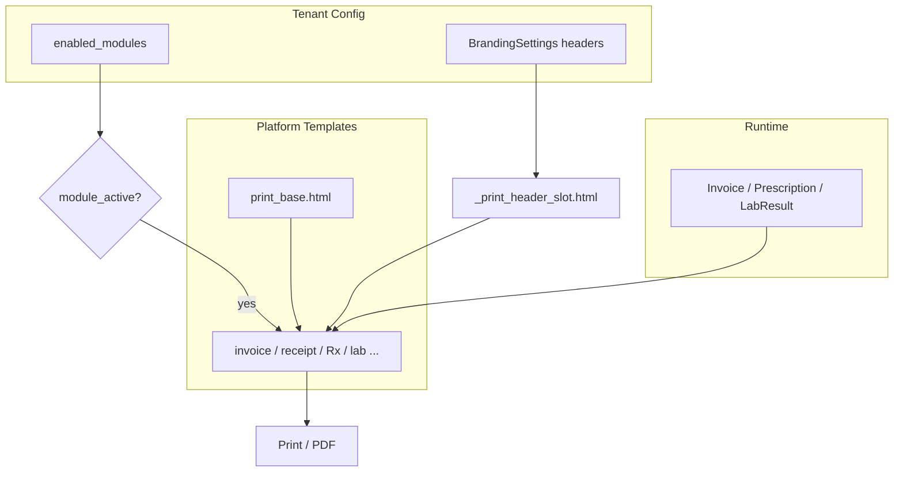

### 34.7 الحزم المتعددة — لا كل الوحدات في كل حزمة

| القاعدة | التطبيق |
|---------|---------|
| **Guard على route** | `@require_module('billing')` على `print_invoice` |
| **Guard على زر الطباعة** | `` في القالب |
| **استوديو branding** | تبويبات المستندات = تقاطع `PrintDocType` × `enabled_modules` |
| **sidebar / nav** | لا رابط «طباعة مختبر» بدون lab — §30 |
| **معاينة افتراضية** | tenant بدون pharmacy → لا `sale_receipt` print |

**لا اختراع bundle logic جديد** — نفس `g.enabled_modules` و`MODULE_REGISTRY` الموجود في الباكند.

### 34.10 طباعة ثنائية الطبقة — tenant أعلى + ختم AZAD زاوية في كل مطبوعة

> **باختصار — لا لبس:** **شعار التينانت** (المركز الطبي) هو **الرئيسي**: كبير، في **ترويسة** كل مطبوعة (شعار + اسم المركز). **شعار شركة ازاد + اسم الشركة + ©** هو **ثانوي**: صغير، في **زاوية أسفل الورقة فقط** — على **كل** المطبوعات. لا عكس، لا خلط.

```
┌─────────────────────────────────────────────────────────────────┐
│  داخل النظام (شاشة)         │  كل مطبوعة (PDF/ورق)            │
├─────────────────────────────┼───────────────────────────────────┤
│  footer التطبيق:            │  ▲ الترويسة: شعار + اسم المركز  │
│  شركة ازاد **دائماً**       │    (tenant — ديناميكي)            │
│  © + روابط المنصة           │  │ المحتوى: فاتورة/روشتة/تقرير   │
│                             │  │ تذييل tenant (اختياري)        │
│  owner shell: شعار AZAD     │  ▼ زاوية أسفل الورقة:            │
│                             │    [شعار AZAD] شركة ازاد…       │
│                             │    © جميع الحقوق محفوظة          │
└─────────────────────────────┴───────────────────────────────────┘
```

**ما يفرق بين الطبقتين:**

| الطبقة | أين | ماذا | من يعدّله |
|--------|-----|------|-----------|
| **Tenant** | **ترويسة** (شعار رئيسي كبير + اسم المركز) + body + تذييل اختياري | هوية المركز الطبي | `super_admin` branding |
| **Platform** | **زاوية أسفل الورقة فقط** (شعار صغير + اسم الشركة + ©) | AZAD ثانوي — لا يتنافس مع ترويسة التينانت | **ثابت** — لا يُعطَّل |
| **Platform UI** | `_footer.html` كل shells | نفس هوية AZAD | ثابت في القالب |

**ممنوع:**
- شعار AZAD في **ترويسة** الفاتورة (ترويسة = tenant فقط)
- `owner_platform_branding` يحل محل شعار المركز في الأعلى
- tenant يحذف أو يستبدل ختم AZAD الزاوي
- `developer_company` مكرر في وسط الروشتة (يُستبدل بالختم الموحّد)

#### 34.10.1 ختم AZAD — كل `PrintDocType`

| `PrintDocType` | ترويسة tenant | ختم AZAD زاوية |
|----------------|---------------|----------------|
| `invoice` | ✅ | ✅ |
| `receipt` | ✅ | ✅ |
| `prescription` | ✅ | ✅ |
| `queue_ticket` | ✅ | ✅ |
| `barcode_label` | ✅ | ✅ |
| `lab_result` | ✅ | ✅ |
| `radiology_report` | ✅ | ✅ |
| `emergency_report` | ✅ | ✅ |
| `medical_report` | ✅ | ✅ |

`show_platform_stamp = True` **دائماً** — لا شرط `doc_type`.

#### 34.10.2 `_print_platform_stamp.html`

```jinja
{# زاوية أسفل الورقة — @page margin — لا يتداخل مع تذييل tenant #}
<div class="print-platform-stamp" aria-hidden="true">
  
  <div class="print-platform-stamp__text">
    <span class="print-platform-stamp__name">شركة ازاد للأنظمة الذكية</span>
    <span class="print-platform-stamp__copyright">© {{ copyright_year }} جميع الحقوق محفوظة</span>
  </div>
</div>
```

```css
/* print.css */
.print-platform-stamp {
  position: fixed;  /* يتكرر أسفل كل صفحة عند الطباعة متعددة الصفحات */
  bottom: 8mm;
  inset-inline-start: 8mm;  /* RTL: زاوية */
  font-size: 7pt;
  color: #64748b;
  opacity: 0.85;
  z-index: 1;
}
.print-footer .print-platform-stamp { /* لا يغطي توقيع الطبيب */ max-width: 45%; }
```

| قاعدة | التفاصيل |
|-------|----------|
| **الموضع** | زاوية **أسفل** — ليس في الترويسة ولا وسط المحتوى |
| **الحجم** | شعار 40px؛ نص سطران كحد أقصى |
| **80mm tickets** | نسخة مصغّرة: شعار 24px + سطر © واحد |
| **ثابت** | لا يظهر في استوديو tenant كحقل قابل للحذف |

#### 34.10.3 `resolve_print_context()`

```python
PLATFORM_COPYRIGHT = 'شركة ازاد للأنظمة الذكية'

def resolve_print_context(doc_type: str, tenant_branding) -> dict:
    return {
        'header_html': resolve_tenant_header(doc_type, tenant_branding),
        'footer_html': resolve_tenant_footer(doc_type, tenant_branding),
        'show_platform_stamp': True,  # كل المطبوعات
        'copyright_year': datetime.now().year,
        'platform_copyright_name': PLATFORM_COPYRIGHT,
        'primary_color': tenant_branding.primary_color,
    }
```

#### 34.10.4 استوديو tenant — المعاينة

- المعاينة تعرض: **ترويسة tenant** + محتوى نموذجي + **ختم AZAD زاوية** (لتوضيح الشكل النهائي)
- المدير يخصّص **tenant فقط** — الختم يظهر كـ «جزء ثابت من النظام» غير قابل للتعديل

#### 34.10.5 footer داخل النظام — AZAD دائماً

```jinja
{# partials/_footer.html — كل shells ما عدا portal إن لزم استثناء خفيف #}
<footer class="app-footer">
  <div class="app-footer__tenant"></div>
  <div class="app-footer__platform">
    
    <span>شركة ازاد للأنظمة الذكية</span>
    <span class="text-muted">© {{ copyright_year }}</span>
  </div>
</footer>
```

| Shell | footer AZAD |
|-------|-------------|
| `base.html` (موظفين) | ✅ دائماً |
| `portal/base.html` | ✅ سطر AZAD صغير أسفل |
| `owner/base.html` | ✅ بارز — لوحة المنصة |
| `print/*` | ❌ — يستخدم `_print_platform_stamp` |

#### 34.10.6 نواقص

| ID | النقص | مرحلة |
|----|-------|-------|
| G-149 | `_print_platform_stamp.html` + `azad-stamp.svg` | 9 |
| G-150 | `resolve_print_context()` | 9 |
| G-151 | إزالة `developer_*` المكرر → ختم موحّد | 9 |
| G-152 | معاينة branding: ختم AZAD في كل الأنواع | 5/9 |
| G-153 | `_footer.html` — كتلة AZAD دائمة | 3 أو 6 |
| G-154 | `queue_ticket` 80mm — ختم مصغّر | 9 |
| G-155 | `prescription.html` — إزالة عنوان hardcoded | 9 |

### 34.8 الملفات المطلوبة

| الملف | الإجراء |
|-------|---------|
| `models/branding.py` | هجرة: `invoice_*`, `receipt_*`, `prescription_*`, `tax_number` |
| `templates/super_admin/branding.html` | تبويب مستندات + معاينة iframe |
| `routes/super_admin/branding.py` | حفظ الحقول الجديدة + sanitize HTML |
| `app/shared/enums.py` | `PrintDocType` enum |
| `app/shared/print_context.py` | `resolve_print_context()` — **tenant فقط** + stamp flag §34.10 |
| `templates/print/_print_platform_stamp.html` | **إنشاء** — **كل** المطبوعات |
| `templates/print/print_base.html` | **إنشاء** |
| `templates/print/_print_header_slot.html` | **إنشاء** |
| `templates/print/_print_header_default.html` | **إنشاء** |
| `templates/print/prescription.html` | **إعادة كتابة** — extends base، صفر inline |
| `templates/print/invoice.html` | **إعادة كتابة** |
| `templates/print/receipt.html` | **إعادة كتابة** |
| `static/css/print.css` | أنماط موحّدة + variants لكل doc_type |
| `static/js/pages/print/preview.js` | معاينة استوديو branding |

### 34.9 معايير قبول الطباعة والروشتات

- [ ] مدير tenant A يغيّر ترويسة الفاتورة — tenant B لا يتأثر
- [ ] كل نوع مستند: **نموذج واحد موحّد** — لا نسخ منفصلة بألوان مختلفة
- [ ] روشتة: طباعة A4 نظيفة — لا 5 ألوان خلفية؛ خط IBM Plex
- [ ] tenant بدون `lab` — لا تبويب مختبر في الاستوديو ولا route طباعة
- [ ] فاتورة: أرقام محاذاة يمين؛ إجمالي واضح؛ ترويسة tenant ظاهرة
- [ ] معاينة حية في branding قبل الحفظ
- [ ] `ReportTemplate` body + ترويسة branding = تقرير كامل
- [ ] Lighthouse Print: تباين نص ≥ 4.5:1 على الروشتة
- [ ] **§34.10:** فاتورة + إيصال + روشتة + تقرير — ختم AZAD زاوية + ©
- [ ] ترويسة كل مطبوعة = tenant فقط (لا شعار AZAD في الأعلى)
- [ ] `_footer.html` — كتلة AZAD في كل shells التطبيق
- [ ] `developer_company` غير موجود في أي print template

---

## 35. الدفع بالبطاقة ورسائل المستخدم — بساطة وربط بالباكند

### 35.1 المبدأ

| مسموح | ممنوع |
|-------|-------|
| ربط أزرار ونماذج بمسارات **موجودة** | Stripe / PayPal / gateway جديد |
| `PosTerminalService.charge()` كما هو | microservice دفع |
| `PaymentMethod` من `enums.py` + `enum_label` | عرض `CARD` / `visa` خام للموظف |
| SweetAlert2 / `_flash.html` لرسائل عربية | `alert(data.error)` |
| نفس حقول البطاقة في الاستقبال والمحاسبة | 3 نماذج مختلفة لنفس الشيء |

### 35.2 ما هو موجود في الباكند (مصدر الحقيقة — لا تخترع فوقه)

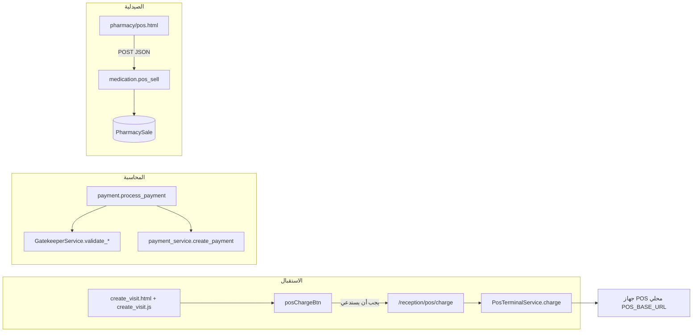

| المكوّن | المسار / الملف | الوظيفة |
|---------|----------------|---------|
| **جهاز البطاقة** | `services/pos_terminal_service.py` | `charge(amount)` → `transaction_id`, `card_last_digits` |
| **تحصيل POS استقبال** | `routes/reception/payments.py` → `/pos/charge` | JSON لـ `PosTerminalService` |
| **دفع زيارة كامل** | `routes/payment_routes.py` → `payment.process_payment` | نقد / بطاقة / تأمين / دين — `module billing` |
| **تحقق قواعد** | `services/gatekeeper_service.py` | رسائل عربية جاهزة لبطاقة وتأمين ودين |
| **طرق الدفع** | `app/shared/enums.py` → `PaymentMethod` | CASH, CARD, VISA, MADA, … |
| **بيع صيدلية** | `routes/medication_routes/pos.py` → `pos_sell` | حفظ `PharmacySale` — **بدون** `payment_method` اليوم |
| **واجهة محاسبة** | `accountant/process_payment.html` | نموذج كامل — المرجع للحقول |

### 35.3 الاستقبال — القوالب تخدم الوظيفة الموجودة

**الخطوة 4 في stepper** (`create_visit`): نقد / بطاقة / تأمين — **نفس أسماء الحقول** الحالية.

| عنصر UI | يربط بـ | ملاحظة |
|---------|---------|--------|
| `payment_method` select | حقل Visit عند الحفظ | قيم من `PaymentMethod` + `enum_label` للعرض |
| `posChargeBtn` | `POST /reception/pos/charge` | يملأ `card_last_digits`, `card_holder_name`, `amount_paid` |
| حقول البطاقة | ما يتوقعه `GatekeeperService.validate_card_payment` | آخر 4 أرقام + اسم حامل |
| `visits.html` badges | `visit.payment_status\|enum_label('payment')` | **لا** `{{ visit.payment_status }}` خام |
| إرسال للمحاسبة | `reception.process_payment` (موجود) | زر واضح: «إرسال للمحاسبة» — ليس «دفع» |

**تدفق بطاقة (بسيط):**

```
1. موظف يختار «بطاقة»
2. يدخل المبلغ
3. يضغط «تحصيل عبر جهاز البطاقة»
4. الجهاز يستجيب → تُملأ الحقول تلقائياً
5. حفظ الزيارة → إيصال (مرحلة 9)
```

**فجوات واجهة↔باكند يجب حلها في مرحلة 8 (G-116):**

| الفجوة | الوضع | المطلوب |
|--------|-------|---------|
| URL في JS | `create_visit.js` يستدعي `/reception/api/pos/charge` | توحيد مع route الفعلي `/reception/pos/charge` |
| صلاحية route | `pos_charge` يسمح `accountant` فقط | إضافة `reception` — **تعديل backend صغير** |
| رسالة الجهاز | `PosTerminalService` يرجع `(not enabled)` | العرض عبر `user_message()` — §35.5 |

**لا تُنشأ صفحة دفع جديدة للاستقبال** — المحاسبة تبقى على `payment.process_payment`؛ الاستقبال يجمع البيانات عند إنشاء الزيارة أو يحوّل للمحاسبة.

### 35.4 الصيدلية POS — واقعية بدون هبل

**اليوم:** `pos_sell` يُتمم البيع مباشرة — **ضمنياً نقد**؛ لا عمود `payment_method` في `PharmacySale`.

| المرحلة | ما تفعله القوالب |
|---------|------------------|
| **8 (فوري)** | واجهة POS نظيفة؛ رسائل عربية؛ SweetAlert بدل `alert()`؛ تسمية «إتمام البيع (نقداً)» إن لم يُفعّل الجهاز |
| **8 + G-122** | عند إضافة `payment_method` + دعم `PosTerminalService` في `pos_sell` (**backend صغير مُوافَق**) → نفس زر «تحصيل بالبطاقة» كالاستقبال |

**واجهة POS المستهدفة (بسيطة):**

```
┌─ سلة ─────────────────┐  ┌─ الدفع ──────────────┐
│ أدوية…               │  │ ○ نقداً  ○ بطاقة      │  ← بطاقة تظهر فقط إن POS_ENABLED
│ الإجمالي: 120 ₪      │  │ [تحصيل بالجهاز]       │
│                      │  │ [إتمام البيع]         │
└──────────────────────┘  └──────────────────────┘
```

- `module_active('medication')` أو pharmacy — لا POS بدون وحدة
- بعد البيع: `sale_receipt.html` (مرحلة 9 print_base)
- أخطاء المخزون: «المخزون غير كافٍ لـ {اسم الدواء}» — **موجود في backend** — العرض عبر `message` لا `error`

### 35.5 رسائل وتنبيهات صديقة — سياسة إلزامية (نطاق الدفع)

> **النطاق العام لكل الشاشات:** §36 — هذا القسم يخص **الدفع والصيدلية** فقط؛ القواعد نفسها تُطبَّق على النظام كله.

**القاعدة:** المستخدم النهائي (موظف استقبال، صيدلي، ممرض) **لا يرى أبداً:**
- `Exception` أو `str(e)`
- أكواد enum: `PAID`, `PENDING`, `CONFIRMED`
- نصوص إنجليزية تقنية: `(not enabled)`, `(conn)`, `HTTPError`
- `alert('خطأ في الاتصال')` بدون سياق

**طبقة العرض (قوالب + JS — بدون تغيير منطق الدفع):**

```python
# app/shared/user_messages.py — عرض فقط
USER_MESSAGES = {
    'pos_not_enabled': 'جهاز البطاقة غير مفعّل في هذا المركز. تواصل مع المدير أو اختر الدفع نقداً.',
    'pos_connection_failed': 'تعذّر الاتصال بجهاز البطاقة. تأكد أن الجهاز يعمل وحاول مرة أخرى.',
    'pos_charge_failed': 'لم تتم عملية البطاقة. يمكنك المحاولة مجدداً أو اختيار طريقة دفع أخرى.',
    'sale_failed': 'تعذّر إتمام البيع. راجع السلة وحاول مرة أخرى.',
}
def user_message(code: str, fallback: str = '') -> str: ...
```

```jinja
{# partials/_user_alert.html — استخدام موحّد #}

  {# يعرض response.message بعد تمريرها عبر user_message إن لزم #}

```

| السياق | قبل (ممنوع) | بعد (مطلوب) |
|--------|-------------|-------------|
| POS معطّل | `(not enabled)` | «جهاز البطاقة غير مفعّل…» |
| فشل شبكة | `خطأ في الاتصال` فقط | «تعذّر الاتصال بجهاز البطاقة…» |
| صيدلية JSON | `alert(data.error)` | `Swal.fire({ text: data.message })` |
| حالة دفع | `badge: {{ visit.payment_status }}` | `enum_label('payment_status', visit.payment_status)` |
| تحقق بطاقة | `طريقة دفع غير صالحة: card` | «يرجى إدخال آخر 4 أرقام من البطاقة» (من Gatekeeper) |

**مصدر الرسائل:**

1. **Backend جاهز عربي** → `GatekeeperService`, `pos_sell` message — اعرضها كما هي
2. **Backend تقني** → `user_message()` في القالب أو JS قبل العرض
3. **Flash** → `_flash.html` فقط — جمل قصيرة، أيقونة، لون حسب النوع

### 35.6 مكونات مشتركة (DRY)

| ماكرو / JS | الاستخدام |
|------------|-----------|
| `partials/_payment_method_select.html` | create_visit، process_payment، pharmacy pos |
| `static/js/components/pos-charge.js` | زر تحصيل الجهاز — **دالة واحدة** |
| `static/js/components/api-feedback.js` | `showSuccess(msg)` / `showError(msg)` — SweetAlert2 |
| `enum_label` | كل `payment_status`, `payment_method` في الجداول |

### 35.7 نواقص مكتشفة (سجل — مرحلة 8)

| ID | النقص | نوع |
|----|-------|-----|
| G-116 | توحيد URL + صلاحية `reception` لـ `/pos/charge` | Backend صغير + JS |
| G-117 | `user_messages.py` + عرض في القوالب | Backend عرض |
| G-118 | إزالة `alert()` — SweetAlert موحّد في POS وcreate_visit | JS |
| G-119 | `pos-charge.js` مشترك استقبال/صيدلية | JS |
| G-120 | `visits.html` / `edit_visit` — `enum_label` لحالات الدفع | Templates |
| G-121 | pharmacy `pos.html`: `data.message` + نقل JS لملف static | Templates/JS |
| G-122 | `PharmacySale.payment_method` + `pos_sell` + POS charge | Backend ثم UI |
| G-123 | ماكرو `_payment_method_select.html` | Component |
| G-124 | تبسيط `process_payment.html` — إزالة ازدواج حقول التأمين | UX |
| G-125 | Gate 8: اختبار دفع بطاقة وهمي/جهاز — رسالة عربية فقط | QA |

### 35.8 معايير قبول (ضمن Gate 8)

- [ ] زر «تحصيل بالبطاقة» يستدعي route **صحيح** ويملأ الحقول عند النجاح
- [ ] فشل الجهاز: رسالة عربية — **صفر** إنجليزية تقنية على الشاشة
- [ ] جدول الزيارات: حالة الدفع **معرّبة** — لا `PAID` خام
- [ ] صيدلية: فشل بيع يعرض «المخزون غير كافٍ لـ …» وليس `medication_id`
- [ ] لا `alert()` في مسارات الاستقبال والصيدلية — SweetAlert أو flash
- [ ] `module_active('billing')` — لا أزرار دفع زيارة بدون الوحدة

---

## 36. تجربة المستخدم الإنسانية — رسائل صديقة على كل الشاشات + واجهة طبيب احترافية

### 36.1 المبدأ العام

```
النظام يتحدث بلغة المركز الطبي — لا بلغة البرمجة
```

| الجمهور | نبرة الرسالة | مثال |
|---------|--------------|------|
| **استقبال / محاسبة** | عملية، واضحة، خطوة تالية | «تعذّر حفظ الزيارة. تحقق من رقم الهوية وحاول مرة أخرى.» |
| **طبيب / ممرض** | احترافية، مختصرة، سريرية | «تعذّر حفظ التشخيص. الاتصال انقطع — بياناتك محفوظة محلياً إن أمكن.» |
| **مختبر / أشعة** | دقيقة، مرجعية | «العينة غير مسجلة. تأكد من رقم الطلب.» |
| **مريض (بوابة)** | بسيطة، مطمئنة | «لم نتمكن من تحميل مواعيدك. أعد تحميل الصفحة أو اتصل بالمركز.» |
| **مدير / owner** | إدارية | «تعذّر حفظ الإعدادات. تحقق من الاتصال وحاول لاحقاً.» |

**ممنوع على أي شاشة:**
- `alert()`, `window.alert()`, `confirm()` خام (استبدل SweetAlert2)
- عرض `{{ obj.status }}` أو `{{ error }}` بدون `enum_label` / `user_message`
- `flash(str(e))` أو `jsonify({'error': str(e)})` يصل للمستخدم كما هو
- بادئة «خطأ: » + نص تقني فارغ أو إنجليزي
- أكواد HTTP: `403`, `500`, `HTTPError`
- أسماء حقول: `payment_method`, `IntegrityError`, `visit_id`

### 36.2 طبقة العرض الموحّدة (بدون تغيير منطق الأعمال)

```
Backend message (عربي أو code)
        ↓
user_message(code, raw)   ← app/shared/user_messages.py
        ↓
api-feedback.js         ← static/js/components/api-feedback.js
        ↓
Swal / _flash.html / inline .field-error
```

| المكوّن | الملف | الوظيفة |
|---------|-------|---------|
| **قاموس الرسائل** | `app/shared/user_messages.py` | تحويل code/نص تقني → جملة عربية + `action_hint` |
| **ماكرو Flash** | `partials/_flash.html` | توسيع — أيقونة + لون + **لا HTML خام من المستخدم** |
| **ماكرو حقل** | `partials/_field_error.html` | خطأ تحقق تحت الحقل — عربي — §27 |
| **ماكرو فراغ** | `partials/_empty_state.html` | «لا مرضى بالانتظار» + زر إجراء — ليس جدولاً فارغاً |
| **JS موحّد** | `api-feedback.js` | `notify.success(msg)` / `notify.error(msg)` / `notify.confirm()` |
| **Jinja filter** | `user_message` | `{{ err\|user_message }}` في القوالب |
| **JSON contract** | توثيق فقط | الواجهة تقرأ **`message`** أولاً ثم `error` — مع ترجمة |

**حقن عالمي في `base.html`:**

```html
<script src="{{ url_for('static', filename='js/components/api-feedback.js') }}"></script>
```

### 36.3 قواعد حسب نوع التفاعل

| النوع | العرض | مثال صحيح |
|-------|-------|-----------|
| **نجاح** | toast أخضر أو Swal خفيف 2ث | «تم حفظ التشخيص» |
| **خطأ قابل للتصحيح** | Swal + تركيز على الحقل | «رقم الهوية غير صالح» |
| **خطأ نظام** | Swal — **بدون تفاصيل تقنية** | «تعذّر الاتصال بالخادم. حاول بعد قليل.» |
| **تحذير** | أصفر — قرار مطلوب | «المريض لديه دين سابق. هل تتابع؟» |
| **معلومة** | أزرق خفيف | «تم إرسال الطلب للمختبر» |
| **حالة workflow** | badge `enum_label` فقط | «قيد الانتظار» — ليس `IN_PROGRESS` |
| **API فشل** | `notify.error(data.message)` | لا `console` فقط |

**قاعدة الطبيب:** الرسالة **لا تقاطع** سير العلاج — modal فقط عند فشل يمنع المتابعة؛ الباقي toast.

### 36.4 شاشات الطبيب — احتراف وذكاء

**الهدف:** الطبيب يرى **مريضه وسير عمله** — لا واجهة مزدحمة ولا رسائل هابطة.

#### 36.4.1 هيكل `patient_details` (المرجع)

```
┌─ patient context bar (ثابت) ─────────────────────────────┐
│ أحمد محمد · 45س · ذكر · حساسية: بنسلين │ زيارة #12 │
├─ تبويبات ────────────────────────────────────────────────┤
│ تشخيص │ وصفة │ مختبر │ أشعة │ ملاحظات │ ملخص │
├─ محتوى التبويب (نظيف — عمود واحد) ─────────────────────┤
│                                                          │
├─ _workflow_next_actions (ذكي) ───────────────────────────┤
│ [إنهاء الزيارة] [تحويل استقبال] [طلب مختبر]            │
└──────────────────────────────────────────────────────────┘
```

| عنصر ذكاء | المصدر | السلوك |
|-----------|--------|--------|
| **سياق مريض** | `_patient_context_panel` ماكرو | عمر، حساسية، تنبيهات — دائماً ظاهر |
| **التالي** | `_workflow_next_actions` | إجراء واحد بارز حسب حالة الزيارة |
| **طابور** | `patient_queue.html` | نقر → تفاصيل؛ حالة معرّبة |
| **تشخيص** | `diagnosis.html` | حفظ تلقائي + toast «تم الحفظ» — لا alert |
| **وصفة** | `prescription.html` | تفاعلات دوائية → **تحذير** عربي واضح |
| **ملاحظات** | `notes.js` | إزالة `window.alert` → `notify` |

#### 36.4.2 ملفات الطبيب — أولوية التنظيف

| الملف | المشكلة اليوم | الإجراء §36 |
|-------|---------------|-------------|
| `doctor/patient_details.html` | 688 سطر، لا context bar | `page-grid` + ماكرو سياق |
| `doctor/notes.js` | `window.alert('فشل الحفظ')` | `notify.error('تعذّر حفظ الملاحظة…')` |
| `doctor/dental_chart.js` | `alert('تم الحفظ')` | `notify.success` |
| `doctor/visit_summary.js` | `'خطأ: ' + message` | `notify.error(userMessage)` |
| `doctor/dashboard.js` | أخطاء في console فقط | banner خفيف للمستخدم عند فشل poll |
| `doctor/prescription.html` | تفاعلات | تحذير SweetAlert بصياغة سريرية |

#### 36.4.3 نبرة الرسائل السريرية (أمثلة معتمدة)

| الموقف | ❌ ممنوع | ✅ مطلوب |
|--------|---------|---------|
| فشل حفظ | `فشل الحفظ` | «تعذّر حفظ التشخيص. حاول مرة أخرى.» |
| لا مرضى | جدول فارغ | «لا مرضى بالانتظار حالياً» + رابط الطابور |
| تفاعل دوائي | `InteractionWarning` | «تحذير: قد يتفاعل {دواء أ} مع {دواء ب}. راجع الجرعة.» |
| صلاحية | `403 Forbidden` | «ليس لديك صلاحية لهذا الإجراء.» |
| انقطاع | `NetworkError` | «انقطع الاتصال. تحقق من الشبكة.» |

### 36.5 تعميم على كل الوحدات

| الوحدة | قوالب/JS ذات أولوية | Gate عينة |
|--------|---------------------|-----------|
| reception | create_visit, visits, queue | §35 + §36 |
| doctor | patient_details, notes, prescription | §36.4 |
| pharmacy | pos.html | §35.4 |
| lab | lab_requests, results entry | enum_label + notify |
| radiology | orders, reports | نفس |
| emergency | triage.js | إزالة `data.error` خام |
| portal | dashboard, appointments | لغة مبسطة للمريض |
| manager / super_admin | settings, branding | رسائل حفظ واضحة |
| accountant | process_payment | §35 |

**أمر تدقيق (قبل Gate 8 و Gate 14):**

```bash
# ممنوع في templates و static/js (عدا vendor)
rg 'window\.alert|[^.]alert\(' templates/ static/js/ --glob '!**/adminlte/**'
rg "flash\(.*str\(e\)" routes/ --glob '*.py'
rg '\{\{[^}]*\.status[^}]*\}\}' templates/ --glob 'doctor/**'
```

### 36.6 نواقص سجل (G-126+)

| ID | النقص | النوع |
|----|-------|-------|
| G-126 | `api-feedback.js` + `notify.*` عالمي في `base.html` | JS |
| G-127 | `user_message` Jinja filter + توسيع `user_messages.py` | Backend |
| G-128 | `doctor/*.js` — إزالة `alert`/`window.alert` | JS |
| G-129 | `_empty_state.html` ماكرو + استخدام في الطابور والجداول | Component |
| G-130 | `patient_details` — context bar + tabs + workflow actions | Templates |
| G-131 | `portal/*` — رسائل مبسطة للمريض | Templates |
| G-132 | تدقيق `flash(str(e))` في routes — خريطة رسائل | Backend |
| G-133 | `emergency/triage.js` ووحدات أخرى — `message` لا `error` | JS |
| G-134 | Gate 8+: مسح عينة 20 شاشة — صفر نص تقني | QA |
| G-135 | توثيق «نبرة الرسائل» في §36.4.3 كمرجع للمترجم/المطور | Docs |

### 36.7 معايير قبول (ضمن Gate 8 و Gate 14)

- [ ] `rg 'window\.alert'` على `static/js/pages` = **0** (عدا vendor)
- [ ] `doctor/patient_details` — context bar + تبويبات + إجراءات workflow
- [ ] فشل حفظ تشخيص/ملاحظة — رسالة عربية + إجراء مقترح
- [ ] بوابة مريض — لا `error` إنجليزي
- [ ] كل badge حالة في doctor/reception/lab — `enum_label`
- [ ] نفس الخطأ من server وclient — **نفس الجملة العربية** (§27)

---

## 37. لوحة مالك المنصة AZAD + اكتمال روابط كل الوحدات

### 37.1 المشكلة اليوم (أدلة من الكود)

| المشكلة | الدليل |
|---------|--------|
| **لا shell owner** | `owner/dashboard.html` → `` — sidebar **tenant** |
| **لا `_owner_sidebar.html`** | الملف **غير موجود** |
| **روابط owner خاطئة** | `_sidebar.html` يوجّه owner لـ `super_admin.*` — §15.4 |
| **تكديس dashboard** | `owner/dashboard.html` ~320 سطر؛ KPI + جدول + charts + 6 أزرار |
| **صفحات ناقصة** | `themes.html`, `billing.html`, `api_keys.html` — routes جزئية فقط |
| **manager نواقص** | 12+ route بدون رابط sidebar |
| **رابط hardcoded** | `_module_empty_state.html` → `/owner/dashboard` بدل `url_for` |

### 37.2 الهدف — لوحة AZAD Owner

```
┌─ Platform Shell (ليس tenant shell) ─────────────────────────┐
│ Navbar: شعار AZAD · «لوحة المنصة» · مستخدم owner          │
├─ Sidebar منظم (6 أقسام كحد أقصى) ─┤ Content (app-content) ┤
│  نظرة عامة                        │  page-header          │
│  العملاء                          │  ┌─ بطاقة واحدة ─┐   │
│  الاشتراكات والحزم                │  │ محتوى نظيف    │   │
│  الهوية والثيمات                  │  └───────────────┘   │
│  التشغيل                          │                       │
│  التكامل                          │                       │
└───────────────────────────────────┴───────────────────────┘
```

**قواعد عدم التكديس (Owner):**
- **صفحة واحدة = موضوع واحد** — billing منفصل عن dashboard
- KPI في dashboard: **4–6 بطاقات** كحد أقصى؛ الباقي tabs أو صفحات فرعية
- **لا** `container-fluid` + 3 صفوف charts + جدول + 8 أزرار في نفس الشاشة
- `page-grid` — جدول tenants في `app-content-container` بعرض محدود
- inline `<style>` في owner/* → **صفر** بعد المرحلة 6

### 37.3 جرد routes ↔ قوالب ↔ sidebar (مصدر الحقيقة)

**ملف:** `app/modules/owner/routes.py` — كل `@owner_bp.route` يجب أن يظهر في `_owner_sidebar.html` **أو** يكون إجراء فرعي (POST/renew) وليس رابط قائمة.

| Route | View | Template | Sidebar |
|-------|------|----------|---------|
| `/owner/dashboard` | `owner_dashboard` | `dashboard.html` | ✅ نظرة عامة |
| `/owner/tenants/create` | `owner_create_tenant` | `create_tenant.html` | ✅ عميل جديد |
| `/owner/tenants/<id>` | `owner_tenant_detail` | `tenant_detail.html` | — (من الجدول) |
| `/owner/plans` | `owner_plans` | `plans.html` | ✅ خطط |
| `/owner/bundles` | `owner_bundles` | `bundles.html` | ✅ حزم |
| `/owner/branding` | `owner_branding` | `branding.html` | ✅ هوية المنصة |
| `/owner/announcements` | `owner_announcements` | `announcements.html` | ✅ إعلانات |
| `/owner/support-tickets` | `owner_support_tickets` | `support_tickets.html` | ✅ دعم |
| `/owner/audit-logs` | `owner_audit_logs` | `audit_logs.html` | ✅ تدقيق |
| `/owner/resource-usage` | `owner_resource_usage` | `resource_usage.html` | ✅ موارد |
| `/owner/notifications` | `owner_notifications` | `notifications.html` | ✅ إشعارات |
| `/owner/webhooks` | `owner_webhooks` | `webhooks.html` | ✅ webhooks |
| `/owner/api-keys` | POST فقط | — | ✅ **صفحة** `api_keys.html` جديدة |
| — | — | `themes.html` | ✅ **جديد** — CRUD SystemTheme |
| — | — | `billing.html` | ✅ **جديد** — MRR/تصدير |

**API routes** (`/owner/api/*`) — لا sidebar؛ تُستدعى من الواجهات فقط.

### 37.4 `owner_nav_registry` + shell

```python
# app/shared/owner_nav_registry.py — منفصل عن tenant NavResolver
def resolve_owner_nav() -> list[NavSection]:
    """أقسام ثابتة لدور owner فقط — لا MODULE_REGISTRY tenant"""
```

```jinja
{# templates/owner/base.html #}

{# platform_shell = navbar + owner sidebar + content — بدون tenant branding #}
```

| ملف | الإجراء |
|-----|---------|
| `templates/layouts/platform_shell.html` | **إنشاء** — مثل `app_shell` لكن للمنصة |
| `templates/owner/base.html` | **إنشاء** — كل `owner/*.html` → `extends owner/base.html` |
| `partials/_owner_sidebar.html` | **إنشاء** — من `owner_nav_registry` |
| `partials/_owner_navbar.html` | شعار AZAD + breadcrumb منصة |
| `owner/*.html` (12) | تحديث extends + إزالة inline CSS |
| `owner/themes.html`, `billing.html`, `api_keys.html` | **إنشاء** |

### 37.5 تحسين الصفحات الحرجة

| الصفحة | اليوم | المستهدف |
|--------|-------|----------|
| `dashboard.html` | KPI + charts + جدول + أزرار مكررة | صف علوي 4 KPI؛ «إجراءات سريعة» 4 فقط؛ جدول tenants مع pagination |
| `tenant_detail.html` | بطاقات متعددة | tabs: عام \| وحدات \| حدود \| مظهر \| اشتراك |
| `bundles.html` | API-heavy | واجهة واضحة لحزم ↔ `enabled_modules` |
| `branding.html` | 4 ألوان | استوديو مثل §13 لكن `owner_platform_branding` |
| `webhooks.html` | يخلط api-keys في نفس الصفحة | فصل: webhooks هنا؛ api_keys صفحة مستقلة |

### 37.6 اكتمال التنقل — كل الوحدات (ليس Owner فقط)

**قاعدة عالمية (تُكمّل §30):** لكل دور/plane جدول **Route Coverage Matrix**:

| Plane | المصدر | الأداة | Gate |
|-------|--------|--------|------|
| **Owner** | `owner/routes.py` | `_owner_sidebar` | §37.8 |
| **super_admin** | `routes/super_admin/` | `_sidebar_dynamic` قسم tenant-admin | Gate 4 |
| **manager** | `routes/manager/` | إكمال 12 route §15.4 | Gate 6b |
| **clinical** | `MODULE_REGISTRY` | `nav_resolver` | Gate 4 |
| **portal** | `routes/portal/` | footer nav | Gate 8 |

**manager — routes بدون رابط (يجب إغلاقها في مرحلة 6b):**

`settlements`, `budget`, `monthly-comparison`, `financial-reports`, `force-payment-approvals`, `patient-satisfaction`, `departments`, `unit-control`, `user-management`, `staff-absence`, `staff-capacity`, `reports-center`, `self-service`, `drill-down`

→ تجميع في أقسام sidebar (مالية \| موارد بشرية \| تقارير) — **لا** قائمة مسطحة 40 رابط.

**سكربت تدقيق (يُشغَّل قبل Gate 6 و Gate 14):**

```bash
# routes بدون ذكر في أي sidebar/nav partial
python scripts/audit_nav_coverage.py --role owner
python scripts/audit_nav_coverage.py --role manager
python scripts/audit_nav_coverage.py --role super_admin

# روابط sidebar تشير لـ endpoints غير موجودة
python scripts/audit_nav_links.py --check-404
```

### 37.7 نواقص سجل (G-136+)

| ID | النقص | مرحلة |
|----|-------|-------|
| G-136 | `platform_shell.html` + `owner/base.html` | 6 |
| G-137 | `_owner_sidebar.html` + `owner_nav_registry.py` | 6 |
| G-138 | كل `owner/*.html` → extends owner/base | 6 |
| G-139 | `dashboard.html` — إزالة تكديس + inline CSS | 6 |
| G-140 | `themes.html`, `billing.html`, `api_keys.html` | 6 |
| G-141 | فصل webhooks / api-keys في UI | 6 |
| G-142 | manager sidebar — 12 route ناقص | **6b** |
| G-143 | `audit_nav_coverage.py` | 6 |
| G-144 | إصلاح `_module_empty_state` hardcoded URL | 6 |
| G-145 | owner: رسائل §36 — لا `confirm()` خام | 6 |
| G-146 | E2E owner: كل sidebar → 200 | 6 |
| G-147 | E2E manager + super_admin: صفر 404 من القائمة | 6b |
| G-148 | `tenant_detail` tabs + معاينة مظهر عميل | 6 |

### 37.8 معايير قبول — Gate 6 (Owner) + Gate 6b (Manager/Admin)

**Gate 6 — Owner AZAD:**
- [ ] `owner` **لا** يرى `_sidebar.html` tenant — فقط `_owner_sidebar`
- [ ] `rg 'super_admin\.' templates/partials/_owner_sidebar.html` = 0
- [ ] `rg 'extends "base.html"' templates/owner/` = 0 — الكل `owner/base.html`
- [ ] كل صف sidebar owner → HTTP 200
- [ ] dashboard: ≤6 KPI ظاهرة؛ لا scroll أفقي 1280px
- [ ] `themes`, `billing`, `api_keys` موجودة ومربوطة
- [ ] §36 — رسائل عربية؛ لا `onclick="return confirm"` بدون SweetAlert

**Gate 6b — اكتمال الوحدات الإدارية:**
- [ ] manager: الـ 12 route الناقصة لها رابط أو **قرار مُوثّق** بإخفائها (feature flag)
- [ ] super_admin: لا route في sidebar يشير لـ `owner.*`
- [ ] `audit_nav_links.py` — **صفر** broken endpoints لكل دور إداري

---

## 16. سجل النواقص الموحّد — Master Gap Register

جدول واحد بكل ما يجب معالجته — مرتب بالأولوية. **ترتيب التنفيذ:** §17.4 (لا تُنفَّذ G-ID خارج مرحلتها).

### 16.0 ملخص التحقق v2.8 (2026-06-23)

> **331 قالب** — **264** base، **20** dashboard_base، **14** portal، **33** standalone.

| الحالة | العدد | أمثلة |
|--------|-------|-------|
| ✅ منجز | 8+ | G-01, G-19, G-156, G-06, G-159, G-08, G-56, G-59, G-65 (جزئي) |
| ⚠️ جزئي | 5 | G-02, G-03, G-57, G-17, G-153, G-158, G-15 (filter فقط) |
| ❌ مفتوح | الباقي | G-07–G-18, G-156–G-159, print, owner shell |

### P0 — حرج (قبل أي تجميل)

| ID | النقص | النوع | الملفات الرئيسية | حالة v2.7 |
|----|-------|-------|------------------|-----------|
| G-01 | إصلاح footer مكسور portal | HTML | `portal/base.html` | ✅ |
| G-02 | Mobile sidebar JS/CSS | JS/CSS | `base.js`, `layout.css` | ⚠️ `base.html` فقط |
| G-03 | فصل owner عن super_admin sidebar | Nav | `_sidebar.html`, `_owner_sidebar.html` (جديد) | ⚠️ رابط owner |
| G-04 | إصلاح branding: `inject_branding` + tenant scope + حفظ | Backend+UI | `app_factory.py`, `branding.py`, `super_admin/branding` | ❌ |
| G-05 | توحيد `logo_url` (Tenant) و `logo_path` (Branding) | Backend+UI | branding templates, navbar | ❌ |
| G-06 | BS4 modals في reception | HTML | `queue_management.html`, `add_patient_to_queue.html` | ❌ |
| G-07 | إزالة sidebar المزدوج dashboard_base | Layout | `dashboard_base.html` | ❌ 20 صفحة |
| G-08 | حقن CSS variables عبر `BrandingContext` | Layout | `branding_context.py`, `base.html` | ❌ |
| G-55 | توحيد 4 قيم default للون الأساسي | Backend | `Tenant`, `BrandingSettings`, `core.css`, `portal` | ❌ |
| G-56 | `enum_label` من `enums.py` — إلغاء حالات خام | Backend+UI | `enum_labels.py`, templates, badge macros | ❌ |
| G-57 | sidebar يُولَّد من `MODULE_REGISTRY` | Nav | `_sidebar.html`, `registry.py` | ⚠️ حلقة جزئية |
| G-58 | إزالة hex من `components.css` → `var()` | CSS | `components.css` (~15 موضع) | ❌ |
| G-59 | `window.__ENUMS__` للـ JS من `get_all_enums_json()` | JS | `base.html`, `app_factory.py` | ❌ |
| G-60 | developer defaults من `SystemConfig` لا hardcode | Backend | `inject_branding()` سطر 427–434 | ❌ |

### P1 — أساس التجربة الموحّدة

| ID | النقص | النوع | الملفات |
|----|-------|-------|---------|
| G-10 | ربط `clinical.css` + `clinical-theme` | CSS | `base.html` — ❌ (`design-tokens.css` فقط) |
| G-11 | دمج **20** صفحة dashboard_base → base | Layout | pharmacy×8, billing, inbox, *_new×5, specialty_forms×8 — ❌ |
| G-12 | توسيع `super_admin/branding` No-Code | Feature | §13 — **ليس** manager route جديد |
| G-13 | owner/base + shell كامل | Feature | §14 — ❌ 16 صفحة على `base.html` |
| G-14 | تفعيل ماكروهات status/patient | Templates | doctor, emergency, lab, reception |
| G-15 | تعريب عبر `enum_label` | Filters | `enum_labels.py`, `enums.py` |
| G-16 | نقل CSS من partials | CSS | `_navbar`, `_sidebar`, `_footer` |
| G-17 | إكمال manager sidebar links | Nav | `_sidebar.html` — ⚠️ جزئي |
| G-18 | portal rebuild (BS5, FA, branding) | Layout | `portal/base.html`, `portal/*` — ❌ shell قديم |
| G-19 | landing page | Feature | `main/landing.html`, `routes/main.py` — ✅ UX1-006 |
| G-20 | stepper create_visit | UX | `reception/create_visit.html` |
| G-21 | patient context bar | UX | `doctor/patient_details.html` |
| G-22 | قرار جداول: DT vs initAdvancedTable | JS | `datatables-init.js`, `base.js` |
| G-23 | GSAP guard + reduced-motion | JS | `motion.js`, `base.js` |
| G-61 | زر وضع ليلي/نهاري + `ui-preferences.js` | UI | §20.1 — `_navbar.html` |
| G-62 | إصلاح `selectTheme()` حفظ فعلي | Backend+UI | `branding.js`, `super_admin/branding` |
| G-63 | `User.preferences` JSON + هجرة | Backend | `models/user.py`, Alembic |
| G-64 | تبويب مظهر في `profile.html` | UI | §19 |
| G-65 | `resolve_ui_context()` = branding + user prefs | Backend | `branding_context.py` |
| G-66 | تقليل خطوط → Cairo+Tajawal+IBM Plex | CSS | `core.css` |
| G-67 | `print_base.html` + `print.css` | Print | §21, **§34** |
| G-68 | توحيد 5 قوالب print على base | Print | §34.8 |
| G-69 | `print/queue_ticket.html` + route | Feature | reception |
| G-70 | ربط `ReportTemplate` بـ report_builder | Feature | `models/reporting.py` |
| G-71 | `_role_quick_bar.html` من MODULE_REGISTRY | Nav | §23 |
| G-72 | `motion.css` + `.animate-in` موحّد | CSS/JS | §22 |
| G-73 | portal: خط + dark + branding | Layout | `portal/base.html` |
| G-74 | `report_header_html` في كل الطباعة | Print | §34.3 — كل أنواع المستندات |
| G-75 | kiosk `waiting_display` motion + print ticket | UX | reception |
| G-78 | دمج SW → `static/pwa/sw.js` واحد | PWA | §25.4 |
| G-79 | `manifest` + install prompt في كل shells | PWA | `base.html`, `pwa-install.js` |
| G-80 | `mobile.css` + bottom nav حسب الدور | Mobile | §25.3 |
| G-81 | `smart-search.js` + `_smart_search.html` | Component | §26 |
| G-82 | Tom Select موحّد + إزالة select2 CDN | Component | `smart-select.js` |
| G-83 | `app/shared/validators.py` + `form-validation.js` | Backend+JS | §27 |
| G-84 | توحيد `/api/search/patients` | Backend | `search_service.py` |
| G-85 | `.table-stack` للجداول على موبايل | CSS | `components.css` |
| G-86 | `partials/_form_field.html` ماكرو | Component | §27 |
| G-89 | `touch.css` + `touch-mode.js` | Touch | §28 |
| G-90 | `clinical-action-tile` grid | Component | §28.4 |
| G-91 | kiosk `check_in.html` + route | Feature | §28.5 |
| G-92 | `dashboard_registry.py` + widgets | Backend | §29 |
| G-93 | `command_center.html` shell | Layout | §29 |
| G-94 | `dashboard-live.js` SSE/poll | JS | §29.5 |
| G-95 | استبدال `*_dashboard_new` | Templates | كل الأدوار |
| G-96 | توحيد waiting/calls display tokens | Kiosk | §28.5 |
| G-97 | `nav_resolver.py` + `nav_registry.py` من MODULE_REGISTRY | Backend | §30.2 |
| G-98 | `_sidebar_dynamic.html` — إزالة sidebar اليدوي 358 سطر | Nav | §30.3, `_sidebar.html` |
| G-99 | `inject_nav` + `can()` في Jinja | Backend | §30.4 |
| G-100 | `navbar.css` + إزالة inline من `_navbar.html` | CSS/Nav | §31 |
| G-101 | `_breadcrumb.html` ماكرو + mapping endpoints | Component | §31.2 |
| G-102 | `z-index.css` + مقياس طبقات موحّد | CSS | §32.3 |
| G-103 | `layout-containment.css` + `app_shell.html` | Layout | §32.2 |
| G-104 | `page-grid` + `.table-region` overflow | CSS | §32.5 |
| G-105 | اختبار E2E: صفر روابط 403 لكل دور | QA | §30.5 |
| G-106 | هجرة `invoice_*`, `receipt_*`, `prescription_*` headers | Backend | §34.3, `branding.py` |
| G-107 | تبويب «مستندات الطباعة» + معاينة iframe | UI | `super_admin/branding.html` |
| G-108 | `PrintDocType` enum + `print_context.py` | Backend | §34.2 |
| G-109 | إعادة كتابة `print/prescription.html` — Rx أسطوري | Print | §34.5 |
| G-110 | إعادة كتابة invoice + receipt على print_base | Print | §34.4 |
| G-111 | `print.css` variants لكل doc_type | CSS | §34.4 |
| G-112 | guard طباعة حسب `enabled_modules` | Backend | §34.7 |
| G-113 | توحيد routes `print_prescription` | Backend | doctor, emergency, reception |
| G-114 | `sale_receipt` pharmacy على print_base | Print | pharmacy |
| G-115 | QR تحقق روشتة (اختياري P2) | Feature | §34.5 |
| G-116 | توحيد URL + صلاحية reception لـ `/pos/charge` | Backend+JS | §35.3 |
| G-117 | `user_messages.py` — رسائل عربية للعرض | Backend | §35.5 |
| G-118 | SweetAlert موحّد بدل `alert()` | JS | §35.5 |
| G-119 | `pos-charge.js` مشترك | JS | §35.6 |
| G-120 | `enum_label` لحالات الدفع في القوالب | Templates | §35.5 |
| G-121 | pharmacy POS: `data.message` + JS منفصل | Templates | §35.4 |
| G-122 | صيدلية: `payment_method` في `pos_sell` | Backend+UI | §35.4 |
| G-123 | `_payment_method_select.html` ماكرو | Component | §35.6 |
| G-124 | تبسيط `process_payment.html` | UX | §35.3 |
| G-125 | اختبار دفع — صفر نصوص تقنية على الشاشة | QA | §35.8 |
| G-126 | `api-feedback.js` عالمي في base | JS | §36.2 |
| G-127 | `user_message` filter + توسيع user_messages.py | Backend | §36.2 |
| G-128 | `doctor/*.js` — إزالة alert | JS | §36.4 |
| G-129 | `_empty_state.html` ماكرو | Component | §36.2 |
| G-130 | `patient_details` context + tabs + workflow | Templates | §36.4 |
| G-131 | portal رسائل مبسطة للمريض | Templates | §36.5 |
| G-132 | تدقيق `flash(str(e))` في routes | Backend | §36.5 |
| G-133 | emergency/وحدات — JSON `message` في UI | JS | §36.5 |
| G-134 | مسح 20 شاشة — صفر نص تقني | QA | §36.7 |
| G-135 | مرجع نبرة الرسائل §36.4.3 | Docs | §36 |
| G-136 | `platform_shell.html` + `owner/base.html` | Layout | §37.4 |
| G-137 | `_owner_sidebar.html` + `owner_nav_registry.py` | Nav | §37.4 |
| G-138 | كل `owner/*.html` → extends owner/base | Templates | §37.4 |
| G-139 | `owner/dashboard` — إزالة تكديس | UX | §37.5 |
| G-140 | `owner/themes`, `billing`, `api_keys` | Templates | §37.3 |
| G-141 | فصل webhooks / api-keys UI | UX | §37.5 |
| G-142 | manager sidebar — 12 route ناقص | Nav | §37.6 |
| G-143 | `audit_nav_coverage.py` | QA | §37.6 |
| G-144 | `_module_empty_state` hardcoded URL | Templates | §37.1 |
| G-145 | owner: SweetAlert بدل confirm خام | JS | §36 |
| G-146 | E2E owner sidebar → 200 | QA | §37.8 |
| G-147 | E2E manager/super_admin صفر 404 | QA | §37.8 |
| G-148 | `tenant_detail` tabs + معاينة مظهر | Templates | §37.5 |
| G-149 | `_print_platform_stamp.html` + `azad-stamp.svg` | Print | §34.10 |
| G-150 | `resolve_print_context()` — `show_platform_stamp: True` دائماً | Backend | §34.10 |
| G-151 | إزالة `developer_*` من قوالب print | Print | §34.10 |
| G-152 | معاينة branding: ختم AZAD في كل doc_type | UI | §34.10 |
| G-153 | `_footer.html` — AZAD دائماً | Component | §34.10.5 |
| G-154 | `queue_ticket` 80mm — ختم مصغّر | Print | §34.10 |
| G-155 | `prescription.html` — عنوان hardcoded لا `BrandingSettings` | Print | §34.5 |
| G-156 | `dashboard_base.html` — hamburger بلا JS handler | JS | `dashboard_base.js` — ❌ |
| G-157 | `specialty_forms/*` على `dashboard_base` (دين UX1-005) | Layout | `templates/specialty_forms/*.html` ×8 — ❌ |
| G-158 | توثيق/دمج `design-tokens.css` ↔ `clinical.css` | CSS | `base.html`, `static/css/` — ⚠️ tokens فقط |
| G-159 | `macros/forms.html` مفقود — 4 قوالب تستورده | Templates | `reception/visits`, `lab/process`, `accountant/process_payment`, `doctor/prescription` |

### P2 — تحسين وإزالة ديون

| ID | النقص | النوع |
|----|-------|-------|
| G-30 | owner/billing.html | Owner مالي |
| G-31 | owner/themes.html | Owner تخصيص |
| G-32 | owner/api_keys.html | Owner أمان |
| G-33 | print_base + queue_ticket + lab unify | Print | **مُدمج في مرحلة 9** — G-67–G-69 |
| G-34 | BS4 codemod (`font-weight-bold` ~212) | CSS classes |
| G-35 | دمج dashboards مزدوجة (accountant, doctor, nurse) | Cleanup |
| G-36 | page_header partial موحّد | Component |
| G-37 | login + medical-login tokens | Branding |
| G-38 | kiosk display CSS مشترك | CSS |
| G-39 | owner APIs بدون `@owner_required` | Security |
| G-40 | توحيد SubscriptionPlan vs ProductBundle | Backend |

### P3 — لاحق

| ID | النقص |
|----|-------|
| G-50 | حذف AdminLTE vendor (~1700 ملف) |
| G-51 | `enums.js` غير مستخدم |
| G-52 | lab catalog templates المفقودة |
| G-53 | booking public shell أخف |
| G-54 | telemedicine nav dedup |
| G-76 | drag-drop dashboard widgets | P3 — بعد MVP pinned routes |
| G-77 | Owner: ثيمات إضافية + حدود حسب Bundle | P3 — SaaS plans |
| G-87 | TWA/Capacitor لمتجر التطبيقات | P3 — §25.5 |
| G-88 | Push notifications PWA | P3 — FCM |

---

## 17. خارطة التنفيذ v2.8 — موجات متسلسلة بلا تناقض

> **المرجع التنفيذي الوحيد.** التفاصيل الموضوعية في §3–§37؛ هنا **الترتيب، التبعيات، قوائم الملفات، والبوابات**.

### 17.0 قواعد منع التناقض (محدَّثة v2.8)

| # | قاعدة | الواقع الحالي | لماذا |
|---|--------|---------------|-------|
| R-P1 | **مرحلة واحدة نشطة** — commit منفصل | — | تراجع آمن |
| R-P2 | **لا `ui.*` ديناميكي قبل مرحلة 2** | `design-tokens.css` + tenant inline في base **مسموح** (موجود) | تجنب ازدواجية inject |
| R-P2b | **لا دمج `clinical.css` قبل مرحلة 2 أو 3** | tokens فقط اليوم | G-158 يدمج بعد BrandingContext |
| R-P3 | **لا NavResolver قبل مرحلة 3** (`app_shell`) | sidebar 54 سطر يدوي جزئي | هيكل نهائي أولاً |
| R-P4 | **لا استوديو طباعة كامل قبل مرحلة 5** | حقول print غير مهاجرة | G-106 |
| R-P5 | **لا Command Center قبل 4+8** | dashboards على `dashboard_base` | widgets + nav |
| R-P6 | **لا stepper استقبال قبل 7** | create_visit ~530 سطر | smart-search + validators |
| R-P7 | **إلغاء `dashboard_base` في مرحلة 3 فقط** | 20 ملف نشط | G-07+G-11+G-157 معاً |
| R-P8 | **طباعة (9) بعد استوديو tenant (5)** | 5 print standalone | ترويسات ديناميكية |
| R-P9 | **طباعة/أزرار تمر `module_active()`** | — | حزم SaaS |
| R-P10 | **دفع = `PosTerminalService` فقط** | — | §35 |
| R-P11 | **`enum_label` قبل عرض حالات للمستخدم** | حالات خام في قوالب | مرحلة 2 |
| R-P12 | **Owner = `owner/base` لا `base.html`** | 17 قالب خطأ اليوم | §37 |
| R-P13 | **كل route إداري = رابط أو إخفاء مُوثّق** | manager ناقص | §37.6 |
| R-P14 | **طباعة: tenant أعلى + ختم AZAD زاوية** | developer_* في prescription | §34.10 |
| R-P15 | **footer AZAD في كل shells** | `_footer` + portal footer | §34.10.5 |

### 17.0.1 الموجات الخمس — تسلسل منطقي

```mermaid
flowchart LR
  subgraph W1 [موجة 1 — استقرار]
    M0[0 اعتماد]
    M1[1 إصلاحات حرجة]
  end
  subgraph W2 [موجة 2 — أساس البيانات]
    M2[2 Branding + Enums]
    M3[3 Shell موحّد]
    M4[4 Nav ديناميكي]
  end
  subgraph W3 [موجة 3 — إدارة]
    M5[5 استوديو tenant]
    M6[6 Owner AZAD]
    M6b[6b Manager nav]
  end
  subgraph W4 [موجة 4 — تجربة]
    M7[7 بحث + تحقق]
    M8[8 رحلات + دفع + portal]
    M9[9 طباعة]
  end
  subgraph W5 [موجة 5 — تميز]
    M10[10 Command Center]
    M11[11 تفضيلات]
    M12[12 PWA + touch]
    M13[13 Motion + macros]
    M14[14 تنظيف]
  end
  W1 --> W2 --> W3 --> W4 --> W5
```

| موجة | مراحل | الهدف | لا تبدأ قبل |
|------|-------|-------|-------------|
| **1 استقرار** | 0→1 | النظام قابل للاستخدام يومياً | Gate 0 |
| **2 أساس** | 2→3→4 | shell واحد + ألوان + تنقل صحيح | Gate 1 |
| **3 إدارة** | 5→6→6b | tenant No-Code + owner منفصل + روابط manager | Gate 3+4 |
| **4 تجربة** | 7→8→9 | نماذج + رحلات سريرية + طباعة | Gate 4 |
| **5 تميز** | 10→14 | dashboards حية + PWA + polish | Gate 8+9 |

### 17.1 مخطط التسلسل (خطي — بلا فروع متوازية)

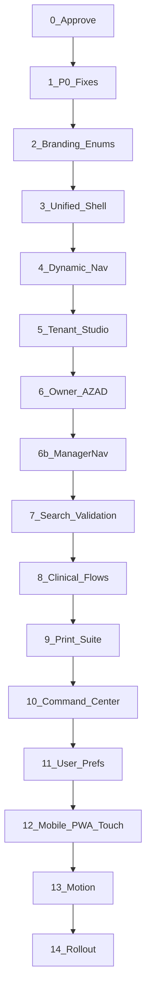

### 17.2 جدول المراحل — المخرجات، النواقص، البوابة

#### مرحلة 0 — اعتماد الخطة

| | |
|--|--|
| **المحتوى** | مراجعة §0–§38 + §16؛ موافقة على §17 |
| **النواقص** | — |
| **لا كود** | ✅ |

**Gate 0:** توقيع/موافقة صريحة على **§17 (v2.8)** قبل أي commit تنفيذي.

---

#### مرحلة 1 — استقرار فوري (P0)

| | |
|--|--|
| **الهدف** | إغلاق Gate 1 — موبايل + modals + ماكرو forms |
| **النواقص** | G-02 (جزئي), **G-06**, **G-156**, **G-159** |
| **ممنوع** | NavResolver، إلغاء dashboard_base، portal rebuild |

| الملف | الإجراء المحدد |
|-------|----------------|
| `static/js/pages/dashboard_base.js` | إضافة toggle: `#sidebar` + `#sidebarOverlay` أو توحيد IDs مع `base.js` |
| `templates/dashboard_base.html` سطر 78 | إعطاء الزر `id="mobileSidebarToggle"` أو `id="dashboardSidebarToggle"` |
| `reception/queue_management.html` 183–323 | ترحيل 5 modals → `data-bs-dismiss`, `btn-close` |
| `templates/macros/forms.html` | **إنشاء** الملف المفقود أو إزالة import من 4 قوالب |
| `static/js/base.js` 37–48 | إزالة أو ربط `#sidebarToggle` (كود ميت) |
| `portal/base.html` | ~~footer~~ ✅؛ اختياري: تحميل FA في head |

**Gate 1:**
- [x] `base.html` موبايل 375px
- [x] portal footer
- [x] `dashboard_base` hamburger
- [x] queue modals BS5
- [x] `macros/forms.html`
- [ ] CSRF + create_visit regression (يدوي)

---

#### مرحلة 2 — مصدر حقيقة UI (`ui.*` + تعريب)

| | |
|--|--|
| **الهدف** | إنشاء الملفات **غير الموجودة** + حقن موحّد |
| **النواقص** | G-04–G-08, G-55, G-56, G-15, G-59, G-60, G-65 |
| **يعتمد على** | Gate 1 |

| الملف | الحالة اليوم | الإجراء |
|-------|-------------|---------|
| `app/shared/branding_context.py` | **✅** | `resolve_branding_context()`, `build_branding_payload()` |
| `app/shared/enum_labels.py` | **✅** | `enum_label` Jinja filter |
| `app_factory.py` `inject_branding()` | cache per-tenant | `ui` + `branding` + `developer_*` |
| `templates/base.html` | `ui.*` CSS vars + `window.__ENUMS__` | G-59 ✅ |

**Gate 2:**
- [x] `ui.primary_color` / `ui.logo_url` في base + navbar
- [x] `enum_label` filter + عينات reception/doctor/billing/visits
- [x] `window.__ENUMS__` في base
- [x] `BrandingSettings.logo_url` (G-05) + خطوط G-66
- [ ] باقي القوالب (~40 status خام) — مرحلة 8
- [ ] tenant A ≠ tenant B (اختبار يدوي بعد حفظ branding)

---

#### مرحلة 3 — قشرة موحّدة (إلغاء dashboard_base) ✅

| | |
|--|--|
| **الحالة** | **منجزة** 2026-06-23 |

| | |
|--|--|
| **الهدف** | **20 → 0** صفحة على `dashboard_base` |
| **النواقص** | G-07, G-10, G-11, G-157, G-16, G-58, G-102–G-104, G-158 |
| **يعتمد على** | Gate 2 (`ui.*`) |
| **ممنوع** | NavResolver (مرحلة 4) |

##### 17.2.3 قائمة الـ 20 ملفاً للترحيل (كلها → `extends "base.html"`)

| # | الملف |
|---|-------|
| 1–5 | `reception/dashboard_new`, `doctor/dashboard_new`, `emergency/dashboard_new`, `billing/dashboard_new`, `inbox/dashboard` |
| 6–13 | `pharmacy/dashboard_new`, `pos`, `purchases`, `suppliers`, `sales_history`, `sale_receipt`, `add_purchase`, `add_supplier` |
| 14–20 | `specialty_forms/list`, `new`, `edit`, `view`, `fill`, `submission`, `submissions` |

| الملف | الإجراء |
|-------|---------|
| `templates/layouts/app_shell.html` | grid نهائي §32 |
| `dashboard_base.html` | **حذف** بعد الترحيل |
| `static/css/clinical.css` | ربط في `base.html` + دمج G-158 مع tokens |
| `partials/_footer.html` | نقل 91 سطر CSS → `layout.css` |
| `z-index.css`, `layout-containment.css` | جديد §32.3 |

**Gate 3:**
- [x] `rg 'extends "dashboard_base"'` = **0**؛ حذف `dashboard_base.html`
- [x] `clinical.css` + `design-tokens.css` في `base.html` و`portal/base.html`
- [ ] modal فوق navbar؛ لا scroll أفقي 1280px (اختبار يدوي)
- [ ] G-16: نقل `_footer` inline CSS

---

#### مرحلة 4 — تنقل ديناميكي

| | |
|--|--|
| **النواقص** | G-97–G-101, G-03, G-57 (إكمال), G-105 |
| **يعتمد على** | Gate 3 (`app_shell`) + Gate 2 (`ui.*`) |
| **الوضع الحالي** | ✅ `nav_resolver` + `_sidebar_dynamic` في `base.html`؛ G-03؛ `_sidebar.html` legacy |

| الملف | الإجراء |
|-------|---------|
| `app/shared/nav_resolver.py` | ✅ `resolve_nav_for_user()` + `_tenant_path()` |
| `partials/_sidebar_dynamic.html` | ✅ مفعّل في `base.html` |
| `_owner_sidebar.html` | ⏭️ دُمج في nav_resolver (G-03) بدل ملف منفصل |
| `static/css/navbar.css` | ⏳ إن وُجد CSS inline في navbar |

**Gate 4:** §33 v1.8 — صفر 403 من sidebar؛ صفر inline style في navbar

---

#### مرحلة 5 — استوديو tenant

| | |
|--|--|
| **الهدف** | المدير يخصّص المظهر + **حقول ترويسة** المستندات (هجرة DB) |
| **النواقص** | G-12, G-62, **G-106** (هجرة حقول print headers) |
| **المراجع** | §13, §34.3 |
| **الوضع الحالي** | ✅ هجرة `p5_001`، تبويب مستندات + iframe، `apply-theme`، عزل tenant |

| الملف | الإجراء |
|-------|---------|
| `super_admin/branding.html` | ✅ تبويب مستندات + معاينة |
| `models/branding.py` | ✅ `invoice_*`, `receipt_*`, `prescription_*`, `tax_number` |
| `branding.js` | ✅ `selectTheme()` + حفظ AJAX |
| `print/_print_header_default.html` | ✅ |
| `app/shared/print_context.py` | ✅ |

**Gate 5:**
- [ ] حفظ شعار + ألوان + عزل tenant
- [ ] حقول ترويسة الفاتورة/الروشتة **تُحفظ في DB**
- [ ] معاينة iframe تعرض `_print_header_default` (حتى قبل مرحلة 9)

---

#### مرحلة 6 — Owner AZAD (16 قالب)

| | |
|--|--|
| **النواقص** | G-13, G-136–G-146, G-148 |
| **الوضع الحالي** | **16** ملف `templates/owner/*.html` → `extends "base.html"` |

| المخرج | القائمة |
|--------|---------|
| `owner/base.html` + `platform_shell.html` | shell جديد |
| `_owner_sidebar.html` | 1:1 مع routes في `app/modules/owner/routes.py` |
| ترحيل 16 قالب | تغيير extends → `owner/base.html` |
| صفحات ناقصة | `themes`, `billing`, `api_keys` (G-30–G-32) |

**Gate 6:** §37.8 — owner sidebar كامل؛ لا `super_admin.*` لدور owner

---

#### مرحلة 6b — Manager + Super Admin nav

| | |
|--|--|
| **الهدف** | إغلاق **12+ route** manager الناقصة؛ تدقيق روابط إدارية |
| **النواقص** | G-142, G-143, G-147 |
| **المراجع** | §37.6, §15.4 |

**Gate 6b — §37.8:** manager routes مغطاة؛ `audit_nav_links` صفر broken

---

#### مرحلة 7 — بحث ذكي + تحقق إدخال

| | |
|--|--|
| **الهدف** | مكوّنات النماذج قبل stepper الاستقبال |
| **النواقص** | G-81–G-86, G-84 |
| **المراجع** | §26, §27 |

**Gate 7:**
- [ ] `/api/search/patients` يعمل من `create_visit`
- [ ] Tom Select موحّد — لا select2 CDN جديد
- [ ] validator مشترك: national_id + phone على نموذج عينة

---

#### مرحلة 8 — رحلات سريرية + portal rebuild

| | |
|--|--|
| **النواقص** | G-14, G-17–G-21, G-73, G-116–G-135 |
| **portal اليوم** | 14 قالب؛ BS4 shell؛ G-18 مفتوح |

| الرحلة | مخرج + ملفات |
|--------|----------------|
| استقبال | stepper `create_visit.html`؛ G-20 |
| طبيب | `patient_details.html` 688 سطر → context bar + 7 partial macros |
| portal | `portal/base.html` rebuild BS5 + FA + `ui.*` |
| دفع | §35 — `PosTerminalService` |
| رسائل | `api-feedback.js`؛ لا `alert()` |

**Gate 8:** §35.8 + §36.7 + portal بدون نص تقني

---

#### مرحلة 9 — طباعة (5 قوالب standalone اليوم)

| | |
|--|--|
| **الوضع الحالي** | `print/{prescription,receipt,invoice,emergency_report,radiology_report}.html` — كلها standalone |
| **النواقص** | G-67–G-74, G-107–G-114, G-149–G-155 |
| **يعتمد على** | Gate 5 (حقول branding) |

| الملف | الإجراء |
|-------|---------|
| `print/print_base.html` | هيكل blocks §34.4 |
| `print/prescription.html` | إعادة كتابة — Rx طبي |
| `print/invoice.html`, `receipt.html` | extends base |
| `print.css` | variants لكل `PrintDocType` |
| `print_context.py` | `resolve_print_header(doc_type)` |

**Gate 9 — §33 v1.9 + §34.10:**
- [ ] روشتة A4: صفر inline CSS؛ ترويسة tenant
- [ ] فاتورة + إيصال: `extends print_base`
- [ ] **كل** المطبوعات: ختم AZAD زاوية + © (فاتورة، إيصال، روشتة، تقرير، تذكرة)
- [ ] ترويسة كل مطبوعة = tenant فقط (لا شعار AZAD في الأعلى)
- [ ] tenant بدون `lab` → لا زر طباعة مختبر
- [ ] معاينة استوديو branding = نفس مخرج الطباعة (مع الختم)

---

#### مرحلة 10 — Command Center

| | |
|--|--|
| **الهدف** | لوحة قيادة **حسب الدور** — تستبدل `*_dashboard_new` |
| **النواقص** | G-92–G-95, G-35 (دمج dashboards) |
| **المراجع** | §29 |
| **يعتمد على** | مرحلة 4 (nav) + 8 (بيانات حقيقية) |

**Gate 10:**
- [ ] كل دور widgets مختلفة
- [ ] panel «الآن» &lt; 1s
- [ ] `command_center.html` extends `base.html` فقط

---

#### مرحلة 11 — تفضيلات المستخدم + وضع ليلي

| | |
|--|--|
| **النواقص** | G-61, G-63, G-64 |
| **المراجع** | §19, §20 |

**Gate 11:**
- [ ] زر navbar يبدّل dark/light
- [ ] `User.preferences` يبقى بعد re-login
- [ ] `prefers-reduced-motion` لا يُكسر

---

#### مرحلة 12 — موبايل + PWA + لمس

| | |
|--|--|
| **النواقص** | G-78, G-79, G-80, G-85, G-89–G-91, G-96, G-75 |
| **المراجع** | §25, §28 |

**Gate 12:**
- [ ] manifest + SW **واحد** في `base.html`
- [ ] Install prompt يظهر
- [ ] touch targets ≥ 48px على استقبال tablet
- [ ] kiosk `check_in` يعمل

---

#### مرحلة 13 — حيوية + macros

| | |
|--|--|
| **النواقص** | G-14, G-72, G-23 |
| **المراجع** | §22 |

**Gate 13:**
- [ ] GSAP خلف `motionEnabled` + reduced-motion
- [ ] `_patient_context_panel`, `_workflow_next_actions` **مستوردة** في ≥3 قوالب

---

#### مرحلة 14 — تعميم وتنظيف

| | |
|--|--|
| **النواقص** | G-70, G-34, G-33, G-36–G-40, G-50+, P2/P3 |
| **المراجع** | §8 كامل, §21.3 ReportTemplate |

**Gate 14 — إطلاق:**
- [ ] §8.1–8.3 **كامل**
- [ ] **G-134** — مسح 20 شاشة عينة عبر كل الأدوار
- [ ] `ReportTemplate` مربوط بـ report_builder
- [ ] BS4 legacy codemod أو مقبول كدين مُوثّق

---

### 17.3 تعارضات v1.9 — كيف حُلّت

| التعارض السابق | الحل في v2.0 |
|----------------|--------------|
| Phase **O** قبل **B** (navbar بدون branding) | O → **مرحلة 4** بعد 2 و 3 |
| **H** طباعة قبل **D** branding studio | H → **مرحلة 9** بعد **5** |
| **F** stepper قبل **L** بحث | F → **8** بعد **7** |
| **N** Command Center قبل shell مستقر | N → **10** بعد 4 و 8 |
| **G-07** في A و **G-11** في C منفصلين | دمج في **مرحلة 3** |
| §5 أسابيع vs §17 أسابيع مختلفة | §10 يشير لـ §17 فقط |
| أحرف A,O,K,N,G غير متسلسلة | أرقام **0–14** خطية |
| 3 مراحل في «أسبوع 6» متوازية | تسلسل 10→11→12 |

### 17.4 خريطة النواقص → المرحلة (مرجع سريع)

| مرحلة | G-IDs |
|-------|-------|
| 1 | G-02 (جزئي), G-06, G-156, **G-159** |
| 2 | G-04–G-08, G-15, G-55, G-56, G-59, G-60, G-65, G-66 |
| 3 | G-07, G-10, G-11, G-157, G-16, G-58, G-102–G-104, G-153, G-158 |
| 4 | G-03, G-57 (إكمال), G-97–G-101, G-105 |
| 5 | G-12, G-62, G-106 |
| 6 | G-13, G-136–G-146, G-148 |
| 6b | G-142, G-143, G-147, G-17 |
| 7 | G-81–G-86, G-84 |
| 8 | G-14, G-18–G-21, G-73, G-116–G-135 |
| 9 | G-67–G-74, G-107–G-114, G-149–G-155 |
| 10 | G-92–G-95, G-35, G-71 |
| 11 | G-61, G-63, G-64 |
| 12 | G-75, G-78–G-80, G-85, G-89–G-91, G-96 |
| 13 | G-72, G-23 |
| 14 | G-30+, G-34, G-70, G-134, P2/P3 |

### 17.5 مسار مختصر (إن ضاق الوقت)

**الحد الأدنى للإطلاق اليومي:** `1 → 2 → 3 → 4 → 8 → 9`  
(بدون Command Center أو PWA — لكن **لا تتخطَّ 3** قبل 4)

**بعد الإطلاق:** `10 → 11 → 12 → 13 → 14`

### 17.6 Mockups (اختياري — لا تمنع المرحلة 1)

| # | الملف | أفضل توقيت |
|---|-------|------------|
| 15 | `15-dynamic-shell.html` | قبل مرحلة 4 |
| 10, 16 | print suite + Rx | قبل مرحلة 9 |
| 13 | command center | قبل مرحلة 10 |
| 11, 14 | mobile + kiosk | قبل مرحلة 12 |

### 17.7 تعيين الأحرف القديمة (للمرجع فقط)

| قديم | جديد |
|------|------|
| A, A2 | 1 |
| B, B2 | 2 |
| C | 3 |
| O | 4 |
| D | 5 |
| E | 6 |
| E2 | 6b |
| L | 7 |
| F | 8 |
| H | 9 |
| N | 10 |
| G | 11 |
| K, M | 12 |
| I | 13 |
| J | 14 |

---

## 33. معايير نجاح البوابات

> بوابات إلزامية بعد المراحل المحددة. التفاصيل الكاملة في **§17.2**؛ هذا القسم **ملخّص قابل للقياس**.

### Gate 2 — بعد BrandingContext (مرحلة 2)

| المعيار | القياس |
|---------|--------|
| **عزل tenant** | tenant A لون ≠ tenant B بعد الحفظ |
| **تعريب** | لا `COMPLETED` / `IN_PROGRESS` خام على الشاشة |
| **شعار موحّد** | `ui.logo_url` في navbar وprint — لا خلط `logo_path` |

### Gate 3 — بعد Shell موحّد (مرحلة 3)

| المعيار | القياس |
|---------|--------|
| **shell واحد** | `extends dashboard_base` = 0 |
| **clinical** | `clinical.css` مربوط |
| **footer AZAD** | `_footer.html` يعرض شركة ازاد دائماً |
| **احتواء** | لا scroll أفقي 1280px؛ modal فوق navbar |

### Gate 4 — بعد مرحلة التنقل الديناميكي (§17.2)

| المعيار | القياس |
|---------|--------|
| **تنقل ديناميكي** | كل دور يرى فقط عناصر `nav_sections` المصرّح بها — لا `if role` في القالب |
| **صفر 403 من القائمة** | E2E: 10 أدوار × كل روابط sidebar → 200 أو redirect صحيح |
| **Navbar Clinical** | صفر inline CSS؛ breadcrumb على 5 صفحات؛ sticky بلا تغطية |
| **احتواء** | لا scroll أفقي 1280px؛ modal فوق navbar؛ CLS < 0.1 |
| **مصدر حقيقة واحد** | `nav_registry` مشتق من MODULE_REGISTRY — لا روابط مكررة يدوياً |

### Gate 8 — بعد الرحلات السريرية والدفع والتجربة الإنسانية (§17.2 + §35.8 + §36.7)

| المعيار | القياس |
|---------|--------|
| **بطاقة استقبال** | `posChargeBtn` → route صحيح؛ حقول تُملأ عند النجاح |
| **رسائل فشل** | صفر `(not enabled)` / `str(e)` / `PAID` / `IN_PROGRESS` على الشاشة |
| **طبيب** | context bar + تبويبات؛ حفظ بدون `alert`؛ رسالة عربية عند الفشل |
| **صيدلية POS** | SweetAlert؛ `data.message`؛ مخزون ناقص بجملة عربية |
| **عام** | `api-feedback.js` محمّل؛ `rg window.alert` على pages = 0 |
| **بساطة** | لا gateway جديد؛ مسارات موجودة فقط |

### Gate 9 — بعد مرحلة الطباعة (§17.2)

| المعيار | القياس |
|---------|--------|
| **ترويسة ديناميكية** | المدير يعدّل ترويسة الفاتورة/الروشتة — تظهر فوراً في المعاينة |
| **نموذج موحّد لكل نوع** | فاتورة، إيصال، روشتة، تقرير — كل واحد `extends print_base` |
| **روشتة طبية** | A4 نظيف؛ بيانات ديناميكية؛ صفر inline CSS؛ ترويسة tenant |
| **حزم** | tenant بدون وحدة → لا تبويب استوديو ولا زر طباعة لتلك الوحدة |
| **عزل هوية** | ترويسة tenant (شعار رئيسي)؛ ختم AZAD زاوية + © **كل** المطبوعات — §34.10 |
| **footer UI** | AZAD في كل shells التطبيق — §34.10.5 |
| **ترتيب ونظافة** | شبكة ثابتة §34.4 — لا تكديس أقسام ملونة عشوائية |

---

## 38. ملحق مراجعة v2.6 — ما تغيّر ولماذا

**تاريخ المراجعة:** 2026-06-22 — مراجعة شاملة للخطة مقابل الكود الفعلي (308 قالب).

### 38.1 تصحيحات واقعية

| قبل (v2.6) | بعد (v2.7) |
|-----|-----|
| ~280 صفحة على `base.html` | **~220** — مُحقَّق |
| 11 صفحة `dashboard_base` | **20** (+ specialty_forms) |
| 11 صفحة portal | **13** (+ UX1-006) |
| `/` redirect للدخول | **landing** للزوار (G-19 ✅) |
| §11 يظهر ميزات «✅ منفّذة» | **📋 لم يُنفَّذ** — الخطة وثيقة فقط |
| ترتيب §34 غير واضح | فهرس قراءة + ملاحظة `logo_url`/`logo_path` |

### 38.2 إضافات للمظهر والنظام

| القسم | الإضافة |
|-------|---------|
| **§0** | فهرس سريع + **§0.4** معايير جودة (WCAG، touch، anti-patterns) |
| **§3** | **§3.5–3.8** — dark tokens، مسافات، حالات UI، أنماط ممنوعة |
| **§33** | Gate 2 و Gate 3 (كانت ناقصة من الملخص) |
| **§16** | G-155, G-156؛ **v2.7:** G-157, G-158, **§16.0** ملخص تحقق |
| **§39** | تحقق كامل مقابل الكود 2026-06-23 |

### 38.3 قواعد مظهر ثابتة (لا تُعاد مناقشتها)

1. **الشاشة:** Clinical Clean — Cairo/Tajawal، tokens، لا luxury ذهبي.
2. **الطباعة:** tenant **رئيسي** أعلى؛ ازاد **ثانوي** زاوية؛ على **كل** المطبوعات.
3. **footer التطبيق:** شركة ازاد **دائماً**.
4. **البوابة:** نفس design system بعد مرحلة 3 — لا island منفصل.
5. **Owner:** shell مستقل — لا `extends base.html` للموظفين.

### 38.4 أولويات التنفيذ إن ضاق الوقت

```
1 → 2 → 3 → 4 → 8 → 9
```

ثم: `6` (owner) → `5` (استوديو) → `10–14`.

---

## 39. تحقق v2.7 مقابل الكود الفعلي (2026-06-23)

**الغرض:** مواءمة الخطة مع ما بُني فعلياً بعد UX1-005 و UX1-006 وإصلاح سلسلة الهجرات (`79be687`).

### 39.1 ما أُنجز خارج نطاق الخطة السابقة

| الميزة | الملفات الرئيسية | دين واجهة متبقي |
|--------|------------------|-----------------|
| **UX1-005** نماذج تخصص | `routes/specialty_forms.py`, `models/specialty_form.py`, `templates/specialty_forms/*` | G-157 — 8 قوالب على `dashboard_base` |
| **UX1-006** بوابة مريض | `routes/patient_portal.py`, `services/patient_identity_service.py`, `portal/link_account`, `documents`, `settings` | G-18 — shell قديم (BS4 inline, Segoe UI) |
| **G-19** landing | `templates/main/landing.html`, `routes/main.py` | G-53 — public shell أخف للحجز |
| **G-01** footer portal | `templates/portal/base.html` سطور 58–70 | — |
| **هجرات idempotent** | `migrations/migration_utils.py`, سلسلة حتى `e8a1c9021b44` | لا يمس الواجهة مباشرة |

### 39.2 فجوات مُؤكَّدة بالكود

| # | الملاحظة | دليل |
|---|----------|------|
| 1 | `clinical.css` موجود (`static/css/clinical.css`) لكن **غير مربوط** في `base.html` | `rg clinical.css templates/base.html` = 0 |
| 2 | `design-tokens.css` **مربوط** — طبقة Clinical مؤقتة | `templates/base.html` سطر ~33 |
| 3 | **20** قالباً على `dashboard_base` (كان 11 في v2.6) | `rg 'extends "dashboard_base"' templates/` |
| 4 | **13** قالب portal (كان 11) | `rg 'extends "portal/base"' templates/portal/` |
| 5 | **16** قالب owner كلها `extends "base.html"` | `templates/owner/*.html` |
| 6 | ماكروهات partials **بدون استيراد** | `rg '{% import.*partials' templates/` = 0 |
| 7 | لا `print_base.html` | `templates/print/*.html` standalone ×5 |
| 8 | `_sidebar.html` ~53 سطر + `module_registry` loop | ليس 358 سطر يدوي — G-57/G-98 جزئيان |
| 9 | `base.js` mobile sidebar **يعمل** على `base.html` | `#mobileSidebarToggle`, `#sidebarOverlay` |
| 10 | `dashboard_base` hamburger **بلا handler** | G-156 |

### 39.3 أوامر تحقق سريعة

```bash
# عدد dashboard_base
rg -c 'extends "dashboard_base"' templates/

# clinical vs tokens
rg 'clinical\.css|design-tokens' templates/base.html

# ماكروهات غير مستوردة
rg '{% import.*partials|{% from.*partials' templates/

# owner shell
rg 'extends' templates/owner/
```

### 39.4 التوصية للخطوة التالية

1. **إغلاق Gate 1:** G-156 (`dashboard_base.js`) + G-06 (BS4 modals).
2. **مرحلة 3:** دمج الـ 20 صفحة (بما فيها `specialty_forms`) → `base.html`؛ ربط `clinical.css` أو دمج G-158.
3. **مرحلة 6:** `owner/base.html` — لا تبقى owner على shell الموظف.

---

## 40. دليل المراحل — تفاصيل كل بند مرتبط بالكود

> مرجع سريع: **أي G-ID في أي مرحلة، وأين الملف في المشروع اليوم.**

### 40.1 موجة 1 — استقرار (مرحلة 0–1)

| G-ID | الملف الفعلي | ما يُنفَّذ |
|------|-------------|------------|
| G-01 | `portal/base.html` 58–70 | ✅ منجز |
| G-02 | `base.js` 55–71, `base.html` `#sidebarOverlay` | ✅ base فقط |
| G-06 | `queue_management.html` 183–323 | 5× `data-dismiss` → `data-bs-dismiss` |
| G-156 | `dashboard_base.html` 78, `dashboard_base.js` | toggle sidebar |
| G-159 | `macros/forms.html` | إنشاء أو حذف imports من 4 قوالب |

### 40.2 موجة 2 — أساس (مرحلة 2–4)

| G-ID | ملف/حالة | مرحلة |
|------|----------|-------|
| G-04–G-08 | `inject_branding()` 405–449؛ إنشاء `branding_context.py` | 2 |
| G-55–G-60 | `Tenant`, `BrandingSettings`, `SystemConfig` | 2 |
| G-07, G-11, G-157 | 20 ملف §17.2.3 | 3 |
| G-10, G-158 | `clinical.css` + `design-tokens.css` | 3 |
| G-16 | `_footer.html` 91 سطر CSS | 3 |
| G-97–G-101 | إنشاء `nav_resolver.py` | 4 |
| G-03, G-57 | `_sidebar.html` 31–50 يدوي | 4 |

### 40.3 موجة 3 — إدارة (مرحلة 5–6b)

| G-ID | ملف | مرحلة |
|------|-----|-------|
| G-12, G-62, G-106 | `super_admin/branding.html`, `branding.js` | 5 |
| G-13, G-136–G-138 | 16× `owner/*.html` | 6 |
| G-142–G-143 | `_sidebar.html` vs `routes/manager/` | 6b |

### 40.4 موجة 4 — تجربة (مرحلة 7–9)

| G-ID | ملف | مرحلة |
|------|-----|-------|
| G-81–G-86 | `smart-search.js`, `smart-select.js` | 7 |
| G-14 | 7 partial macros — 0 import | 8 |
| G-18–G-21 | `portal/base.html`, `create_visit.html`, `patient_details.html` | 8 |
| G-116–G-135 | POS, `api-feedback.js`, doctor JS | 8 |
| G-67–G-74 | 5× `templates/print/*.html` standalone | 9 |
| G-149–G-155 | `_print_platform_stamp.html`, `prescription.html` | 9 |

### 40.5 موجة 5 — تميز (مرحلة 10–14)

| G-ID | ملف | مرحلة |
|------|-----|-------|
| G-92–G-95 | `*_dashboard_new` بعد ترحيلها لـ base | 10 |
| G-61–G-64 | `User.preferences`, `profile.html` | 11 |
| G-78–G-80 | `manifest.json`, `static/pwa/sw.js` | 12 |
| G-72, G-23 | `motion.js`, GSAP في `base.html` | 13 |
| G-34, G-50 | BS4 codemod, AdminLTE vendor | 14 |

### 40.6 MODULE_REGISTRY — 15 وحدة (مرجع G-57)

من `app/core/module/registry.py`: reception, doctor, lab, radiology, pharmacy, emergency, nursing, billing, inventory, appointments, reporting, owner, portal, ai_imaging, integration — تُحقن عبر `app_factory.py` 721–731 كـ `module_registry`, `module_active()`.

### 40.7 تعارضات حُلّت في v2.8

| التعارض | الحل |
|---------|------|
| R-P2 تمنع clinical قبل branding لكن tokens موجود | R-P2 يمنع `ui.*` فقط؛ tokens مسموح |
| G-57 في مرحلة 6 و4 | إكمال الحلقة في **4**؛ G-71 quick bar في **10** |
| G-156 يُصلَّح ثم dashboard يُحذف | مرحلة 1 مؤقتة؛ مرحلة 3 نهائية |
| portal rebuild (G-18) قبل clinical.css | G-18 في **8** بعد مرحلة 3 |
| owner shell قبل app_shell | مرحلة **6** بعد 3+4 |

---

## 12. ملحق — أوامر مفيدة للمطور

```bash
# عدد القوالب
find templates -name "*.html" | wc -l

# من يستخدم dashboard_base
rg 'extends "dashboard_base.html"' templates/

# حالات إنجليزية خام في القوالب
rg '\{\{[^}]*\.status[^}]*\}\}' templates/ --no-heading

# CSS inline في partials
rg '<style>' templates/partials/

# ماكروهات غير مستوردة
rg '{% from.*partials' templates/ --no-heading
rg '{% import.*partials' templates/ --no-heading

# manager routes بدون sidebar
rg 'url_for\(.manager\.' templates/partials/_sidebar.html
rg '@manager_bp\.route' routes/manager/ -l

# owner routes بدون sidebar
rg 'url_for\(.owner\.' templates/partials/_sidebar.html
rg '@owner_bp\.route' app/modules/owner/routes.py
```

---

*المرجع الوحيد (v2.8). التنفيذ: §17 + §40. المظهر: §3. الطباعة: §34.10. سجل G-01–G-159. لا تنفيذ قبل Gate 0.*
